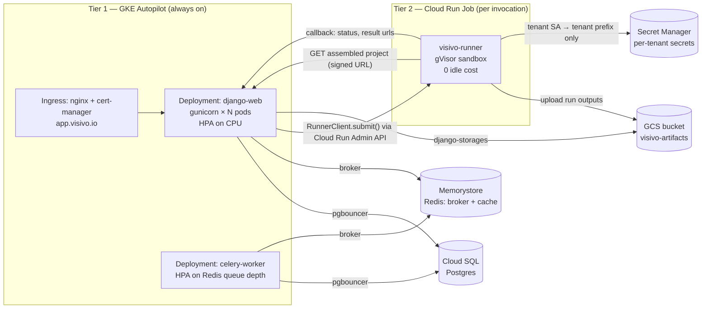

# Migrate `core` off App Engine: GKE Autopilot + Cloud Run runner + Celery, with API parity

## Context

The `core` Django app currently runs on Google App Engine Flex. Three problems compound:

1. **App Engine is opaque.** Failures hide behind the runtime, secret injection happens at import time in `gae.py`, scaling is a YAML knob with no introspection. The recent thumbnail-DB-pool incident took longer to diagnose than it should have.
2. **Job processing is duct-taped.** Cloud Tasks + a queue created out-of-band + a synchronous receiver in a web request handler + Playwright launched in-process. Every new async surface means more bespoke Cloud Tasks wiring.
3. **Cloud has no way to *run* a project.** The CLI publish flow already populates the database with the full project state — the project POST sends the entire serialized `project_json`, and per-entity rows are written for dashboards, insights, inputs, and models. Core can reassemble the project YAML from those rows. What's missing is the execution side: there's no sandboxed container to invoke `visivo run` / `visivo compile` against that reassembled project — including arbitrary subprocesses from `CsvScriptModel.insert_csv_to_duckdb` (`visivo/models/models/csv_script_model.py:170`). Today the cloud can store a project but can't refresh its data.

Two tiers: always-on services (Django web, Celery worker) on GKE Autopilot; per-invocation visivo runs on Cloud Run Jobs. Both provisioned by Pulumi. Portability is a structural requirement — every cloud-native dependency lives behind a swappable interface so AWS / Azure / self-hosted can be added as Pulumi modules later without touching application code or the Helm chart.

**Terminology.** "Deploy" in this plan means rolling out the Django application to its hosting environment (App Engine → GKE). It does *not* refer to the visivo CLI's `visivo deploy` command — that is the user-facing "publish a compiled project to core" flow (handled in `visivo/commands/deploy_phase.py`, which writes the full `project_json` plus per-entity rows to the database). The CLI publish flow is unchanged by this plan.

## Project provenance — three project lifecycles

The runner always reads the project from the database. How a project gets into the database (and whether it round-trips to a git repo) is a separate concern, and the cloud must support three lifecycles cleanly:

| Lifecycle | Origin | Edits flow | Notes |
|---|---|---|---|
| **A. Repo-linked, bidirectional** | `visivo deploy` from a git checkout | Edit in cloud → review → push back to the linked repo | The repo backs the published state; cloud edits stage as drafts until pushed. Linked repo URL + branch live on the `Project` row. |
| **B. Cloud-native, repo-seeded later** | Created in the cloud UI | Edit in cloud freely; user later "Export to GitHub" creates a new repo from the current project state | No linked repo at first; one appears the moment the user exports. |
| **C. Cloud-native, no repo** | Created in the cloud UI | Edit in cloud freely; never leaves the database | No repo at all; the DB is the only source of truth. |

The runner does not care which lifecycle a project is in — it reads the assembled project from the database in every case. Git linkage is purely a review/promotion workflow for users who want code-review on changes before they hit production.

Implications:
- `Project` gains a nullable `linked_repo` (url + branch + optional path-within-repo). NULL in lifecycles B and C; populated in A (set on `visivo deploy` from a git working tree) or in B (set on Export).
- A `Draft` table or equivalent represents "unpublished edits" — same in all three lifecycles. In A, publishing a draft also opens a PR against the linked repo (or generates a commit for the user to push). In B and C, publish just promotes the draft.
- A `CsvScriptModel` whose `args` reference local files (e.g., `["python", "create_processes_csv.py"]`) is a constraint that the cloud must check at publish time. The script file is not in the DB. Lifecycle A can resolve it from the linked repo; lifecycles B and C must either reject it or surface a UI for the user to upload the referenced file alongside the model. (Decide in the dedicated plan for project-provenance — see Out of scope.)

## Repo scope of this plan

| Repo | What changes |
|---|---|
| **`core`** (separate repo) | Everything: Django settings migration, Celery, `RunnerClient` abstraction, runner-callback view, project-assembly endpoint, plus the Pulumi/Helm/runner artifacts. New top-level dirs in `core`: `core/infra/` (Pulumi modules), `core/charts/` (Helm chart), `core/runner/` (runner Dockerfile + entrypoint). |
| **`visivo`** (this checkout) | No changes required for this migration. |

One repo. Project-provenance (git linkage, draft lifecycle, lifecycle B/C handling of script-model file refs) is a separate plan — see "Out of scope".

## Target architecture



### Decisions already settled
- IaC: Pulumi (Python).
- Tier 1: GKE Autopilot.
- Tier 2: Cloud Run Jobs (with `LocalDockerRunner` for dev parity).
- Celery broker: Cloud Memorystore Redis.
- v1 ships GCP only; AWS/Azure/self-hosted are deferred but the four portability investments below must not block them.

## Portability — four non-negotiable investments

Every cloud-native dependency goes behind an interface. The Helm chart and runner image are byte-identical across clouds; only the Pulumi module and a handful of env vars change.

1. **Settings via environment variables only.** New `config/settings/production.py` reads everything from env. Orchestrator (Pulumi → External Secrets Operator → K8s Secret → container env) decides where values come from. `gae.py`'s import-time Secret-Manager calls are gone.
2. **`django-storages` with runtime-selected backend.** `STORAGES["default"]["BACKEND"]` resolved from `STORAGE_BACKEND` env (`gcs` / `s3` / `azure` / `minio`). Bucket name + region via env.
3. **`RunnerClient` interface** in Django. v1: `CloudRunJobRunner` (production) + `LocalDockerRunner` (dev). `RUNNER_BACKEND` env selects. Future: AWS Batch, Azure Container Apps Jobs, in-cluster K8s Job — all drop in as new classes.
4. **Helm chart is the unit of deploy.** Pulumi provisions the cluster + cloud resources and renders a values file; `helm install/upgrade` applies the chart. Identical everywhere.

A per-cloud rollout matrix (cluster, Postgres, Redis, object storage, secrets, runner, registry, sandbox) is included in the design doc but is out of scope for v1.

---

## Phase 0 — Foundations (no production impact)

**Repo: `core`.**

### 0.1 New top-level dirs in `core`

```
core/
  api/                    # existing Django app (unchanged in this phase)
  infra/                  # NEW
    Pulumi.{yaml,dev.yaml,production.yaml}
    __main__.py
    modules/
      gcp/                # Cloud SQL, Memorystore, GCS, Secret Manager, GKE Autopilot,
                          # Cloud Run Job, Artifact Registry, Workload Identity bindings
      kubernetes/         # pulumi_kubernetes.helm.v3.Release of the core chart
      future_aws/  future_azure/   # stubs
  charts/core/            # NEW — Helm chart (see 0.3)
  runner/                 # NEW — Dockerfile + entrypoint (see 2.1)
```

The `kubernetes/` module is cloud-agnostic: takes a kubeconfig + values dict. The `gcp/` module produces both. Keeping everything in one repo lets a single PR change app code + infra atomically — important because the move off App Engine to GKE will require coordinated edits to both.

### 0.2 `config/settings/production.py` (replaces `gae.py`)

Every value from env: `DATABASE_URL`, `REDIS_URL`, `STORAGE_BACKEND`, `STORAGE_BUCKET`, `STORAGE_REGION`, `SECRET_KEY`, `STRIPE_*`, `SOCIAL_AUTH_*`, `CELERY_BROKER_URL`, `CELERY_RESULT_BACKEND`, `RUNNER_BACKEND` (default `cloud_run`), `ARTIFACT_BUCKET`. No Secret-Manager-at-import. Keep `gae.py` untouched until Phase 1 cutover; delete after.

### 0.3 Helm chart at `core/charts/core/`

Templates: `Deployment: django-web`, `Deployment: celery-worker`, `HPA` for each, `Service` (ClusterIP), `Ingress` (nginx + cert-manager), `ServiceAccount` (Workload Identity bound), `Job: django-migrate` (`helm.sh/hook: pre-upgrade`), `ExternalSecret` (pulls from Secret Manager). Image refs parameterized.

### 0.4 Local-parity story (optional but cheap)

`make local-up`: kind cluster + nginx-ingress + cert-manager + ESO + chart, with in-cluster Postgres + Redis + MinIO. Same chart as production.

**Phase 0 gate:** chart applies to kind; django-web + celery-worker pods reach Ready against in-cluster Postgres. No new application logic. No production impact.

---

## Phase 1 — GKE Autopilot for Tier 1

**Repo: `core`. Outcome: App Engine retired.**

### 1.1 Provision GCP resources via Pulumi (dev stack first)

- GKE Autopilot, regional `us-central1`, Workload Identity, GKE 1.30+.
- Artifact Registry repo for the django image.
- Memorystore Redis.
- WI binding: K8s SA `django-web` → GCP SA `core-django@...` with Cloud SQL Client + Secret Manager Accessor + Storage Object Admin (on artifact bucket) + Cloud Run Admin (to spawn runner jobs).
- External Secrets Operator installed via `pulumi_kubernetes.helm`.
- Cloud SQL Auth Proxy sidecar in the django-web Deployment (or IAM auth proxy).
- `ExternalSecret` resources map Secret Manager secrets → K8s Secrets the chart consumes.

### 1.2 Celery integration in `core`

- Add `celery` to `pyproject.toml`. New `core/api/config/celery.py`:
  ```python
  from celery import Celery
  app = Celery("core")
  app.config_from_object("django.conf:settings", namespace="CELERY")
  app.autodiscover_tasks()
  ```
- Move `apps/jobs/services.handle_dashboard_creation` from a synchronous Cloud Tasks send to `@shared_task generate_dashboard_thumbnail(dashboard_id, email)`. `apps/deploys/views/project.py::ProjectDetail.put`'s trigger becomes `.delay()`.
- Worker pod runs `celery -A config worker -l info --concurrency=$CELERY_CONCURRENCY`.
- Keep the per-pod Playwright semaphore (mirrors the prior thumbnail fix).

### 1.3 Dockerfile

Single fat image, three k8s manifests with three `CMD`s (django-web, celery-worker, runner uses a separate image — see 2.1). Drop `webkit` (chromium-only).

### 1.4 Migration playbook (dev → prod)

1. Deploy chart to GKE-dev. Verify pods, migrations, `/api/projects/`.
2. Feature flag: dual-write Cloud Tasks AND Celery for thumbnails. Diff results in logs.
3. Cut DNS for `app.development.visivo.io` from App Engine to the GKE Ingress.
4. Monitor 48h. Roll back via DNS swap.
5. Repeat for production.
6. Decommission App Engine: `gcloud app services delete default`, delete `app.{production,development}.yaml`, `dispatch.yaml`, `config/settings/gae.py`, the two `.github/workflows/deploy_*.yml`, the `api/queue.yaml` Cloud Tasks config.

### 1.5 CI/CD — on rwx, not GitHub Actions

Deploy on rwx for speed (matches the existing `.rwx/sync-dependencies.yml` pattern in this repo). New rwx run in `core/.rwx/deploy.yml`:

1. Build Docker image (web/worker fat image + runner image as a separate target).
2. Push both to Artifact Registry.
3. `pulumi up --stack <env>` from `core/infra/` (renders new image tag into chart values → `helm upgrade` triggers the pre-upgrade migrate Job → rolling pod replacement).
4. Slack notify on failure (reuse the existing webhook secret).

Triggers: push to `main` → dev stack; tagged release → production stack. Preserve the existing rwx Slack-on-failure setup.

The two existing `.github/workflows/deploy_{production,development}.yml` files are deleted in Phase 1.4 step 6 (already in the cleanup list).

**Phase 1 gate:** production on GKE ≥7 days, no regressions. App Engine services deleted. Cloud Tasks queue removed.

---

## Phase 2 — Cloud Run Jobs for the visivo runner

**Repo: `core`. The runner reads the project from the database (no tarball upload).**

### 2.1 Project assembly endpoint (`core`)

Add a Django endpoint that reassembles a runnable project from the database:

- `GET /api/projects/<id>/assembled/` returns a signed URL (or the bytes directly) for a freshly-assembled project tarball containing `project.visivo.yml` synthesized from the stored `project_json` plus per-entity rows (dashboards, charts, tables, insights, inputs, models), plus any uploaded file blobs the project references.
- Assembly logic lives in `apps/projects/assembly.py::assemble_project(project_id, draft_id=None)`. Reuses the existing reverse-serializer code path so the YAML round-trips with `visivo compile`.
- `draft_id` lets preview/edit flows assemble a project with unpublished overlay edits applied (used in Phase 4).
- Lifecycle-aware: in lifecycle A (repo-linked), assembly can optionally clone the linked repo for resources that live only on the filesystem (e.g. `CsvScriptModel` args referencing a Python file). In B and C the publish-time check from §"Project provenance" ensures no such references survive into the DB.

### 2.2 Runner image at `core/runner/`

- `python:3.12-slim-bookworm` + `build-essential git curl libpq-dev unixodbc-dev ca-certificates`.
- `pip install visivo[all-sources]==<pinned>` (every backend visivo supports: snowflake, bigquery, postgres, mysql, redshift, clickhouse, duckdb, sqlite — see `visivo/models/sources/`).
- Entrypoint `/usr/local/bin/runner`:
  1. Read env: `VISIVO_RUN_ID`, `VISIVO_PROJECT_ID`, `VISIVO_DRAFT_ID` (optional), `VISIVO_MODE` (`compile|run|preview`), `VISIVO_DAG_FILTER`, `ARTIFACT_BUCKET`, `ASSEMBLY_URL`, `CALLBACK_URL`.
  2. `GET ASSEMBLY_URL` → download assembled project tarball → extract to `/tmp/project`.
  3. `subprocess.run(["visivo", mode, "--working-dir", "/tmp/project", "--output-dir", f"/tmp/out/{run_id}", "--threads", "1", *dag_filter], check=True, timeout=...)`.
  4. Upload `/tmp/out/{run_id}/` → `gs://{ARTIFACT_BUCKET}/runs/{run_id}/`.
  5. `POST CALLBACK_URL` with signed JWT in `X-Runner-Token`; status `completed` or `failed` + `error.json`.

### 2.3 Cloud Run Job in Pulumi (`core/infra/modules/gcp/runner.py`)

- `gcp.cloudrunv2.Job` per env, image from Artifact Registry.
- SA `visivo-runner-sa@...` with Storage Object Admin (artifact bucket only) and Secret Manager Accessor narrowed to the per-tenant secret prefix via IAM conditions.
- Timeout 1800s default; max retries 3.
- Execution Gen 1 (gVisor). No Serverless VPC connector in v1 (add when a customer asks for private-network ingress).

### 2.4 `RunnerClient` interface + Cloud Run impl (`core`)

New Django app `apps/runner/`:

- `clients/base.py`:
  ```python
  class RunnerClient(abc.ABC):
      @abc.abstractmethod
      def submit(self, project_id, run_id, mode, dag_filter=None, draft_id=None, secret_refs=None): ...
      @abc.abstractmethod
      def status(self, execution_ref): ...
      @abc.abstractmethod
      def cancel(self, execution_ref): ...
  ```
- `clients/cloud_run.py`: `CloudRunJobRunner` using `google.cloud.run_v2`. Per-invocation `secret_refs` → `secrets` block in `container_overrides`. Passes a short-lived signed `ASSEMBLY_URL` to the job (signed for the specific `project_id` + `draft_id`).
- `clients/local_docker.py`: `LocalDockerRunner` shelling to `docker run` (dev parity).
- Factory in `clients/__init__.py` keyed off `RUNNER_BACKEND`.
- Model `Run(id, project, draft_id, mode, status, execution_ref, started_at, finished_at, error)`. Django writes the row before `submit()`; the callback updates it.
- View `RunnerCallbackView` (POST `/api/runs/<id>/callback/`) — auth via signed token in `X-Runner-Token`.

### 2.5 Smoke test

Admin endpoint `POST /api/projects/<id>/runs/` `{mode: "compile"}` → Django creates `Run`, calls `submit()` → Cloud Run hits `GET /api/projects/<id>/assembled/`, runs `visivo compile`, uploads `project.json`, posts callback. `GET /api/runs/<id>/` returns status + result URLs.

**Phase 2 gate:** smoke test green in dev. Assembled-project round-trip matches a locally-compiled equivalent. Per-tenant secret IAM verified by gcloud audit (runner SA reads tenant A's secret, cannot read tenant B's — Secret Manager IAM conditions on the resource path).

---

## Phase 3 — API parity completion (continues VIS-819)

**Repo: `core`. New branch — the old `tim-add-api-endpoints-to-core` branch / PR #261 is being abandoned; start fresh on top of the post-Phase-1 main.**

### 3.1 Land per-resource POST/PUT/DELETE on production

Rebuild the per-resource write endpoints on a new branch off the now-GKE main. The Phase E rollout sequence documented on VIS-819 still applies — release core #1 → release visivo CLI → release core #2 → flip viewer default routes — but freshly cherry-picked / rewritten rather than rebased from the stale branch.

### 3.2 New write endpoints powered by the runner

- `POST /api/charts/<name>/save/` writes a draft row + `runner_client.submit(mode="compile", dag_filter=f"+{name}+")` to refresh the affected `project.json`.
- `POST /api/charts/<name>/publish/` promotes draft → published, runs full `visivo run` against affected insights, atomically swaps the published artifact set.
- Same shape for tables, markdowns, inputs, insights, dashboards.

### 3.3 Project lineage

`Project` is append-only today (one row per deploy). With editing we need "current published state for project X." Option A (recommended, less disruptive): keep append-only + add `is_current_published BOOL` updated atomically. Decide in this phase's design doc.

**Phase 3 gate:** edit a chart in the cloud editor → save → preview renders updated chart (runner ran) → publish → dashboard viewers see new artifact.

---

## Phase 4 — Preview UI + script_model sandboxing

**Repo: `core` (preview endpoint + egress logging Pulumi changes).**

### 4.1 Preview-mode runner invocation

- `POST /api/preview/` `{project_id, mode, dag_filter, draft_id}`.
- Django writes the draft overlay (already persisted via Phase 3 save endpoints) and calls `runner_client.submit(mode="run", draft_id=draft_id, ...)`. The runner hits `/api/projects/<id>/assembled/?draft_id=<draft_id>` to get the project with draft overlay applied. Returns `{preview_id}`.
- Viewer polls `GET /api/preview/<id>/`.

### 4.2 Sandbox model for `CsvScriptModel.args` execution

The arbitrary-subprocess surface is `CsvScriptModel.insert_csv_to_duckdb` at `visivo/models/models/csv_script_model.py:170`: `subprocess.Popen(self.args, ..., cwd=working_dir)`. The user's project YAML supplies `args` directly. Per-invocation Cloud Run Gen 1 + gVisor handles:

- Filesystem isolation (host fs unreachable).
- Cross-tenant data leakage by construction (no shared state across invocations).
- OOM containment (Cloud Run enforces per-task memory, kills only that task).

What gVisor does **not** solve:

- **Network egress.** Default is open internet. Mitigate via VPC Flow Logs → BigQuery, daily per-tenant egress reports, per-tenant rate limits enforced by Celery throttling in Django before `submit()`.
- **Wall-clock abuse.** Cloud Run `container_timeout` + an inner `subprocess.run(timeout=...)` in the entrypoint. Default 5 min preview, 30 min full deploy run.

### 4.3 Per-tenant Workload Identity Federation

- One GCP SA per tenant: `runner-tenant-{tenant_id}@...`.
- IAM binding: SA can access only `secrets/tenants/{tenant_id}/*`.
- Runner invocation specifies the per-tenant SA in `--service-account` override.
- Tenant uploads source credentials via UI; Django writes to Secret Manager under the tenant prefix.

**Phase 4 gate:** preview UI round-trip green against a real Snowflake source under a tenant SA. Sandbox escape attempts fail (test `CsvScriptModel` that does `os.listdir("/")`, `requests.get("http://metadata.google.internal/")`, attempts to read another tenant's secret).

---

## Critical files / new files

**`core` (the only repo touched):**
- `config/settings/production.py` (new) — env-var-only.
- `config/settings/gae.py` (deleted after Phase 1.4).
- `config/celery.py` (new).
- `apps/jobs/services.py` — Cloud Tasks → Celery `@shared_task`.
- `apps/jobs/jobs.py` — Playwright invoked from Celery task, not HTTP receiver.
- `apps/runner/` (new app) — `RunnerClient`, `Run` model, `RunnerCallbackView`.
- `apps/projects/assembly.py` (new) — `assemble_project(project_id, draft_id=None)` reverse-serializer.
- `apps/projects/views.py` — new `GET /api/projects/<id>/assembled/` endpoint.
- `apps/deploys/views/project.py` — `.delay()` for thumbnails.

**`core` new top-level dirs:** `core/infra/` (Pulumi), `core/charts/core/` (Helm), `core/runner/` (Dockerfile + entrypoint). New rwx run at `core/.rwx/deploy.yml`. All listed in §0.1 and §1.5.

**Deleted after Phase 1.4 (`core`):** `app.{production,development}.yaml`, `dispatch.yaml`, `config/settings/gae.py`, `.github/workflows/deploy_{production,development}.yml`, the Cloud Tasks send plumbing in `apps/jobs/services.py`, `api/queue.yaml`.

---

## Sequencing + risk

| Phase | Weeks | Customer impact | Rollback |
|---|---|---|---|
| 0 — Foundations | 1–2 | None | Revert the new dirs |
| 1 — GKE Tier 1 | 3–4 | DNS cutover window | DNS swap to App Engine |
| 2 — Runner infra | 1–2 (parallel to 1) | None until used | Disable RunnerClient |
| 3 — API parity completion | 2–3 | Per VIS-819 sequencing | Per existing E.x rollout |
| 4 — Preview + sandbox | 4–6 | New feature, behind flag | Flag off |

All phases are `core`-only.

**Largest risks:**
- Workload Identity setup is fiddly (django-web SA reading Secret Manager; runner SA reading per-tenant secrets only). Bake in extra time in Phase 0/1.
- Celery task discovery + dual-write window for thumbnails. The flag in 1.4 step 2 covers this.
- Reverse-serializer fidelity. The assembly endpoint must produce YAML that round-trips through `visivo compile` identically to a locally-compiled project. Cover with a property test: take any factory project → serialize to DB rows → assemble → compile → diff against a direct compile.
- Projects with hardcoded credentials in stored YAML can't be re-run in the cloud. Surface this on the published-state view as a "this project will not run in the cloud" warning (cheap pre-check using the `StringOrEnvVar` discriminator in `visivo/models/base/base_model.py`).

---

## Test Strategy

Per the project's CLAUDE.md ("Plans without a Test Strategy section are incomplete").

**Layers per phase:**

- **Phase 0:** Unit. Pulumi `preview` succeeds. `helm template` lints clean. No app behavior change.
- **Phase 1:** Sandbox + load. Load test GKE-dev with the existing app traffic profile; p95 latency within 20% of App Engine baseline; no DB pool exhaustion. Celery task latency for thumbnails ≤ Cloud Tasks baseline.
- **Phase 2:**
  - Unit: `apps/projects/tests/test_assembly.py` — round-trip every factory project (`tests/factories/*`) through `assemble_project()` + `visivo compile` and diff against a direct compile.
  - Smoke: `POST /api/projects/<id>/runs/` against dev → assert `project.json` artifact in GCS matches the same `visivo compile` output run locally.
  - IAM audit: gcloud `policy-troubleshoot` verifies cross-tenant secret read denied.
- **Phase 3:** Existing VIS-819 verification checklist (Phase E gates) carries forward unchanged. Plus an integration test that a `POST /api/charts/<name>/save/` triggers a runner invocation and the resulting `project.json` includes the draft.
- **Phase 4:** Preview-edit-publish E2E in the viewer. Three sandbox-escape probes as `CsvScriptModel` args:
  - `python -c "import os; print(os.listdir('/'))"` — assert run succeeds but output is the sandbox fs, not the host.
  - `curl http://metadata.google.internal/computeMetadata/v1/instance/service-accounts/default/token` — assert blocked/empty.
  - Attempt to read another tenant's Secret Manager secret — assert IAM denial in logs.

**Story / user-facing coverage (Phase 3+):** the existing `viewer/e2e/stories/*.spec.mjs` flow that exercises chart-save and dashboard-publish is the canary; rerun against the new cloud-backed endpoints.

---

## Verification

- **Phase 0:** `pulumi up --stack local` on kind brings up chart; `curl localhost/api/projects/` returns 200 against in-cluster Postgres.
- **Phase 1:** see Phase 1 gate.
- **Phase 2:** see Phase 2 gate. Specifically: take any factory project, serialize → DB rows → `assemble_project()` → tarball → `visivo compile --working-dir <extracted>` and produce a `project.json` byte-identical to the locally-compiled equivalent.
- **Phase 3:** existing VIS-819 verification.
- **Phase 4:** see Phase 4 gate.

---

## Out of scope for v1

- **Project-provenance plan (separate doc).** Lifecycle A/B/C handling, linked-repo metadata, draft → PR generation for lifecycle A, "Export to GitHub" for lifecycle B, publish-time validation that lifecycle B/C projects don't reference filesystem-only resources (e.g. `CsvScriptModel.args` pointing at a local `.py` file).
- AWS / Azure / private-cloud rollouts (foundations exist; no work in v1).
- Replacing `django-rest-framework-simplejwt`.
- Crossplane / GitOps replacement for Pulumi.
- dbt-Cloud integration in the runner (dbt phase still runs locally; revisit when a customer asks).
- Flask viewer's IDE editing surface — cloud-side editing routes through the per-resource POST/PUT endpoints in Phase 3.
