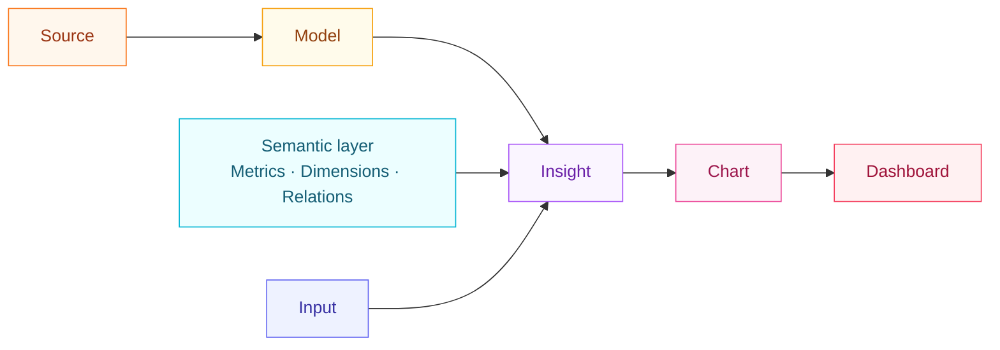
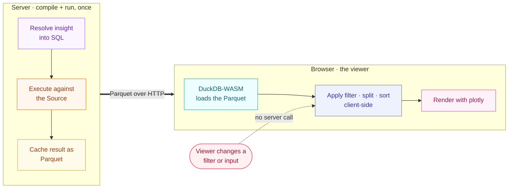

# Architecture

Visivo runs in three phases (**compile**, **run**, and **serve**) that turn YAML into a live, interactive dashboard, with the heavy lifting split between a server that prepares data once and a browser that explores it instantly.

This page is the mental model for how those pieces fit together. For the worked example with real data, see [How It Works](../how_it_works.md); for the individual objects, start at the [Concepts overview](index.md).

## The three-phase model

`compile` builds the plan, `run` executes it, and `serve` ships the result to a browser. Each phase is a distinct CLI step, and `visivo serve` chains all three for you while watching your files.

```mermaid
flowchart LR
    YAML[*.visivo.yml<br/>+ dbt™ models]:::input --> C1

    subgraph C [compile]
        direction TB
        C1[Parse YAML]
        C2[Build object DAG]
        C3[Resolve refs ·<br/>write queries]
        C1 --> C2 --> C3
    end

    subgraph R [run]
        direction TB
        R1[Execute job DAG]
        R2[Query each source]
        R3[Write Parquet<br/>per insight]
        R1 --> R2 --> R3
    end

    subgraph S [serve]
        direction TB
        S1[Flask server]
        S2[Serve the viewer]
        S3[Hot reload on<br/>file change]
        S1 --> S2 --> S3
    end

    C3 -->|target/project.json| R1
    R3 -->|target/.../files/*.parquet| S1

    classDef input fill:#eef2ff,stroke:#6366f1,color:#3730a3;
    classDef phase fill:#f9f6f8,stroke:#713b57,color:#432334;
    class C,R,S phase;
```

On a file change, `serve` re-runs the compile and run phases for the affected
objects, then hot-reloads the open dashboard.

-   __Compile__

    ---

    Parses every `*.visivo.yml` file, validates it against the
    [JSON schema](https://docs.visivo.io/assets/visivo_schema.json), builds the
    object DAG, and resolves `${ref(...)}` references into runnable SQL. **No
    queries execute here.** It writes `target/project.json` (plus
    `explorer.json` for the lineage view).

-   __Run__

    ---

    Executes the job DAG: each insight's prepared query runs against its
    [Source](source.md), and the result is cached as a Parquet file at
    `target/<run-id>/files/<insight>.parquet`, alongside an
    `insights/<insight>.json` describing the client-side step.

-   __Serve__

    ---

    Starts a Flask server that serves the [viewer](insight.md) and the run
    artifacts, then watches your project files. Saving a change triggers a
    re-compile and re-run, so the open dashboard hot-reloads with fresh data.

!!! note "Three commands, or one"
    `visivo compile`, `visivo run`, and `visivo serve` can be run on their own,
    but `visivo serve` runs all three for you. When it detects a file change it
    re-compiles and re-runs the affected objects, then hot-reloads the open
    dashboard. The same compile and run phases power
    [Visivo Cloud](../cloud/index.md) deploys.

## The object DAG

Every Visivo project is a directed acyclic graph of objects whose dependencies flow in one direction: a **Source** feeds a **Model**, the **semantic layer** and **Inputs** enrich an **Insight**, and Insights are arranged by **Charts** into a **Dashboard**.

This is the same lineage Visivo computes during compile and renders in the
Explorer. The object-type colors are fixed across the docs, the marketing site,
and Visivo Cloud, so a Source always reads orange and a Dashboard always reads
rose. Each object links down into its [concept page](index.md) and the generated
[configuration reference](../reference/configuration/Dashboards/Dashboard/index.md).

!!! visivo "Insights, not traces"
    On the 2.0 line, an [Insight](insight.md) is the unit of visualization. It
    binds a Model's columns to plotly props and carries its own interactions. A
    [Chart](../reference/configuration/Chart/index.md) is a container that arranges
    one or more Insights, and the same Insight can be reused across many Charts
    and Dashboards. Visivo computes the underlying data exactly once.

## Insights: server prep, client interactivity

Visivo computes each insight's data **once on the server**, then does all filtering, splitting, and sorting **in the browser**, so interactions update instantly with no server round-trip.

The split keeps dashboards fast and cheap:

-   __On the server (once)__

    ---

    During run, an insight's resolved query is executed against its Source and
    the result is written to a Parquet file. This is the only time your warehouse
    is touched for that insight, no matter how many people open the dashboard.

-   __In the browser (every interaction)__

    ---

    The viewer ships [DuckDB-WASM](https://duckdb.org/docs/api/wasm/overview),
    which loads the Parquet file and runs the
    [interactions](../reference/configuration/Insight/InsightInteraction/index.md)
    (`filter`, `split`, and `sort`) as local SQL. Changing an
    [Input](input.md) re-queries the in-browser data, with no call back to the
    server.

## Where to go next

- Walk through the phases with real data in [How It Works](../how_it_works.md).
- Learn each object on its [concept page](index.md).
- Ship a project to a shared URL with [Visivo Cloud](../cloud/index.md).
