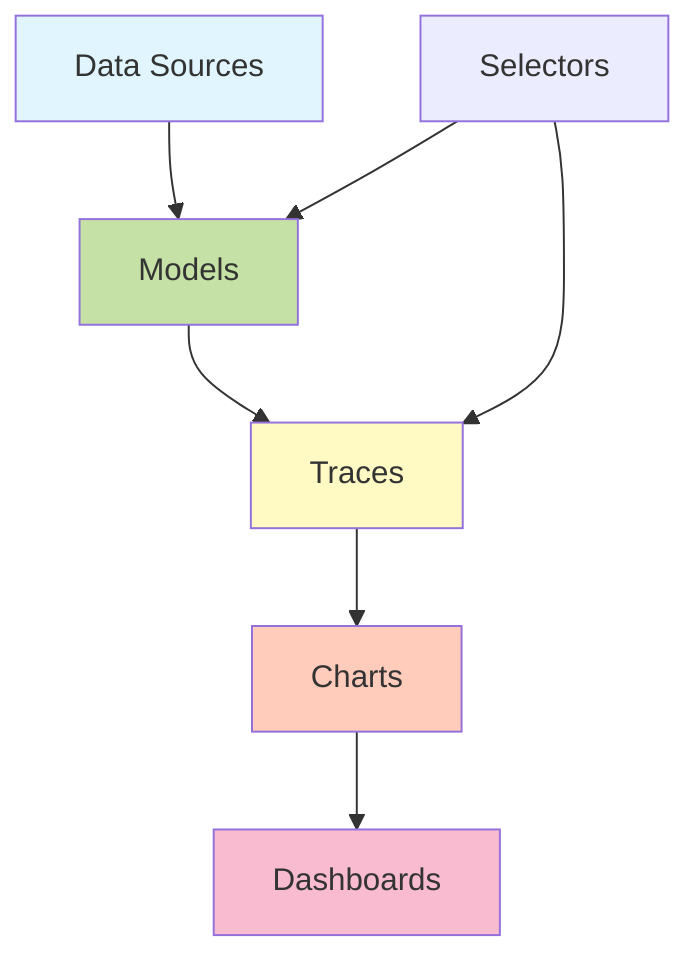

# Sources & Models

Understanding how data flows through Visivo is crucial for building efficient dashboards. This guide explains the data pipeline from raw sources to final visualizations.

## Data Flow Overview



## Sources

Sources are connections to your databases and data warehouses. Each source represents a single database connection that can be reused across models.

### Source Types

Visivo supports these database types:
- PostgreSQL
- MySQL
- Snowflake
- BigQuery
- DuckDB
- SQLite

### Configuration

```yaml
sources:
  - name: main_db
    type: postgresql
    host: ${env_var('DB_HOST')}
    database: analytics
    username: ${env_var('DB_USER')}
    password: ${env_var('DB_PASSWORD')}
    
  - name: warehouse
    type: snowflake
    account: ${env_var('SNOWFLAKE_ACCOUNT')}
    warehouse: ANALYTICS_WH
    database: PROD
```

### Best Practices

1. **One source per logical database** - Don't create multiple sources for the same database
2. **Use environment variables** - Never hardcode credentials
3. **Name sources meaningfully** - Use names that indicate purpose (e.g., `sales_db`, `analytics_warehouse`)
4. **Set appropriate timeouts** - Configure based on query complexity

## Models

Models define how to query and transform your data. They're the bridge between raw database tables and visualizations.

### Model Types

#### 1. SQL Models
Most common type - direct SQL queries:

```yaml
models:
  - name: daily_revenue
    source_name: main_db
    sql: |
      SELECT 
        date_trunc('day', created_at) as date,
        SUM(amount) as revenue
      FROM orders
      WHERE status = 'completed'
      GROUP BY 1
```

#### 2. SQL File Models
For complex queries, use external files:

```yaml
models:
  - name: customer_cohorts
    source_name: main_db
    sql_file: models/customer_cohorts.sql
```

#### 3. CSV Script Models
Execute scripts that output CSV data:

```yaml
models:
  - name: ml_predictions
    type: csv_script
    args:
      - python
      - scripts/predict_churn.py
      - --start-date
      - ${selector(date_range.start)}
```

#### 4. Local Merge Models
Combine data from multiple sources:

```yaml
models:
  - name: unified_sales
    type: local_merge
    sql: |
      SELECT 
        'online' as channel,
        order_date,
        revenue
      FROM ${ref(online_sales)}
      
      UNION ALL
      
      SELECT 
        'retail' as channel,
        sale_date as order_date,
        total as revenue
      FROM ${ref(retail_sales)}
```

### Model References

Models can reference other models using `${ref()}`:

```yaml
models:
  - name: base_orders
    sql: SELECT * FROM orders WHERE year = 2024
    
  - name: order_summary
    sql: |
      SELECT 
        customer_id,
        COUNT(*) as order_count,
        SUM(total) as revenue
      FROM ${ref(base_orders)}
      GROUP BY customer_id
```

### Model Execution

Models are executed in dependency order:
1. Visivo builds a DAG of model dependencies
2. Models with no dependencies run first
3. Dependent models run after their dependencies complete
4. Results are cached for the session

## Query Generation

Visivo uses the `?{}` syntax to build queries dynamically:

### Basic Selection

```yaml
traces:
  - name: revenue_line
    model: ${ref(daily_revenue)}
    props:
      x: ?{date}        # SELECT date
      y: ?{revenue}     # SELECT revenue
```

Generated SQL:
```sql
SELECT date, revenue 
FROM (
  -- Model SQL here
) AS model_subquery
```

### Aggregations

```yaml
props:
  x: ?{category}
  y: ?{sum(revenue)}
```

Generated SQL:
```sql
SELECT category, sum(revenue)
FROM (...)
GROUP BY category
```

### Conditional Logic

```yaml
props:
  color: ?{case when revenue > 1000 then 'high' else 'low' end}
```

### Complex Expressions

```yaml
props:
  x: ?{date_trunc('month', created_at)}
  y: ?{sum(revenue) / count(distinct customer_id)}
```

## Performance Optimization

### 1. Push Filters to Models

Instead of:
```yaml
# Inefficient - filters after query
traces:
  - name: recent_orders
    model: ${ref(all_orders)}
    filters:
      - created_at >= '2024-01-01'
```

Do this:
```yaml
# Efficient - filters in model
models:
  - name: recent_orders
    sql: |
      SELECT * FROM orders 
      WHERE created_at >= '2024-01-01'
```

### 2. Pre-aggregate in Models

```yaml
models:
  - name: daily_summary
    sql: |
      -- Pre-aggregate at daily level
      SELECT 
        date_trunc('day', created_at) as date,
        category,
        SUM(revenue) as revenue,
        COUNT(*) as order_count
      FROM orders
      GROUP BY 1, 2
```

### 3. Use Materialized Views

For expensive calculations:
```yaml
models:
  - name: customer_lifetime_value
    sql: |
      SELECT * FROM analytics.mv_customer_ltv
      -- Materialized view refreshed nightly
```

### 4. Implement Caching

```yaml
models:
  - name: expensive_calculation
    cache: true
    cache_duration: 3600  # 1 hour
    sql: |
      -- Complex query here
```

## Multi-Source Patterns

### Pattern 1: Federation

Query multiple databases in one dashboard:

```yaml
models:
  - name: postgres_sales
    source_name: postgres_db
    sql: SELECT * FROM sales
    
  - name: mysql_inventory
    source_name: mysql_db
    sql: SELECT * FROM inventory
    
  - name: combined_view
    type: local_merge
    sql: |
      SELECT s.*, i.stock_level
      FROM ${ref(postgres_sales)} s
      LEFT JOIN ${ref(mysql_inventory)} i
        ON s.product_id = i.product_id
```

### Pattern 2: Data Warehouse + Operational

```yaml
sources:
  - name: warehouse
    type: snowflake
    # Historical data
    
  - name: operational
    type: postgresql
    # Real-time data

models:
  - name: historical_trends
    source_name: warehouse
    sql: SELECT * FROM fact_sales WHERE date < CURRENT_DATE
    
  - name: today_sales
    source_name: operational
    sql: SELECT * FROM orders WHERE date = CURRENT_DATE
    
  - name: complete_view
    type: local_merge
    sql: |
      SELECT * FROM ${ref(historical_trends)}
      UNION ALL
      SELECT * FROM ${ref(today_sales)}
```

## Error Handling

### Connection Errors

```yaml
models:
  - name: safe_query
    sql: SELECT * FROM sales
    on_error: return_empty  # Don't fail dashboard
    timeout: 30  # Seconds
```

### Data Quality

```yaml
models:
  - name: validated_orders
    sql: |
      SELECT * FROM orders
      WHERE amount > 0
        AND amount < 1000000  -- Sanity check
        AND customer_id IS NOT NULL
    tests:
      - row_count > 0
      - amount >= 0
```

## Best Practices Summary

1. **Model Organization**
   - Use folders: `models/staging/`, `models/marts/`
   - Follow naming conventions: `stg_`, `fct_`, `dim_`
   - Document complex logic

2. **Performance**
   - Filter early in models
   - Aggregate at appropriate level
   - Use indexes on filtered/joined columns

3. **Maintainability**
   - Keep models focused (single responsibility)
   - Use CTEs for readability
   - Comment complex calculations

4. **Testing**
   - Add data quality tests
   - Validate business logic
   - Check for nulls and duplicates

---

_Next:_ [Configuration as Code](config-as-code.md) | [Testing Strategy](testing.md)