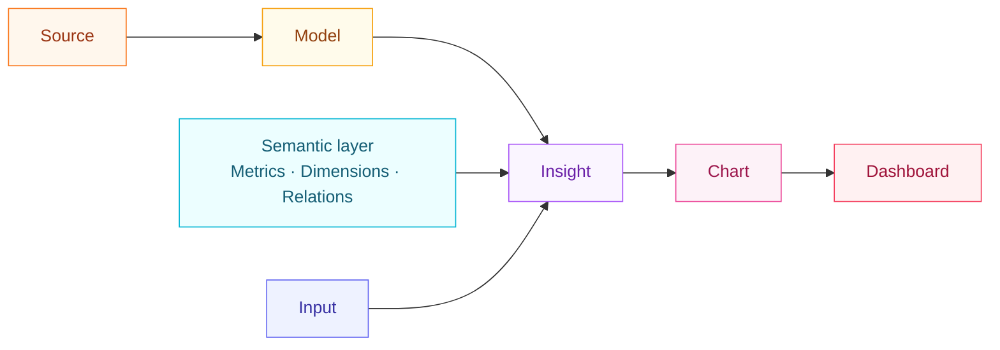

# Concepts

Visivo is BI-as-code: you describe your dashboards in YAML, version them in git, and
render them with the CLI or in [Visivo Cloud](../cloud/index.md). Almost everything you build
is one of **six core objects**. Learn these and the rest of the documentation falls into place.

!!! visivo "The object-type rainbow"
    Each Visivo object has a fixed color, from Sources (orange) through to
    Dashboards (rose). You'll see the same glyphs and colors across these docs,
    [the marketing site](https://visivo.io), and the lineage graph in
    [Visivo Cloud](../cloud/index.md) — so an object reads the same everywhere.

-   :visivo-source:{ .lg .middle .vz-source } **Source**
    { .vz-accent-source }

    ---

    A connection to where your data lives — Postgres, Snowflake, BigQuery,
    DuckDB, a local file, and more.

    [:octicons-arrow-right-24: Source](source.md)

-   :visivo-model:{ .lg .middle .vz-model } **Model**
    { .vz-accent-model }

    ---

    A named SQL query (or dbt™ model) that shapes a Source into the table an
    Insight reads from.

    [:octicons-arrow-right-24: Model](model.md)

-   :visivo-metric:{ .lg .middle .vz-metric } **Semantic layer**
    { .vz-accent-metric }

    ---

    Reusable **Metrics**, **Dimensions**, and **Relations** defined once and
    shared across every Insight.

    [:octicons-arrow-right-24: Semantic layer](semantic-layer.md)

-   :visivo-insight:{ .lg .middle .vz-insight } **Insight**
    { .vz-accent-insight }

    ---

    The unit of visualization — it binds a Model's columns to plotly props and
    carries client-side interactions.

    [:octicons-arrow-right-24: Insight](insight.md)

-   :visivo-input:{ .lg .middle .vz-input } **Input**
    { .vz-accent-input }

    ---

    A dashboard control — dropdown, multi-select, range slider — whose value
    flows into your Insight queries.

    [:octicons-arrow-right-24: Input](input.md)

-   :visivo-dashboard:{ .lg .middle .vz-dashboard } **Dashboard**
    { .vz-accent-dashboard }

    ---

    The page your team actually opens — a grid of rows and items that arrange
    your charts, tables, and inputs.

    [:octicons-arrow-right-24: Dashboard](dashboard.md)

## How they fit together

A **Source** connects to your data. A **Model** turns that Source into a query result.
An **Insight** reads a Model (optionally pulling reusable definitions from the
**Semantic layer**) and produces a chart. **Inputs** let viewers filter and slice
those charts. A **Dashboard** arranges the charts, tables, and inputs into a page.

!!! note "How many concepts are there, really?"
    Six. These six objects are the canonical concept set across the docs, and
    every page uses them consistently. Charts and Tables are not a seventh and
    eighth concept; they are containers that arrange Insights on a Dashboard, so
    they live inside the Dashboard concept rather than alongside it.

## Where to go next

- New to Visivo? Start with [Get Started](../index.md) and run your first dashboard.
- Want field-by-field detail? Every concept page links down into the generated
  [Configuration reference](../reference/configuration/Dashboards/Dashboard/index.md).
- Curious how it all executes? See the [Architecture](architecture.md) page for the
  compile → run → serve model, or [How It Works](../how_it_works.md) for a worked example.
