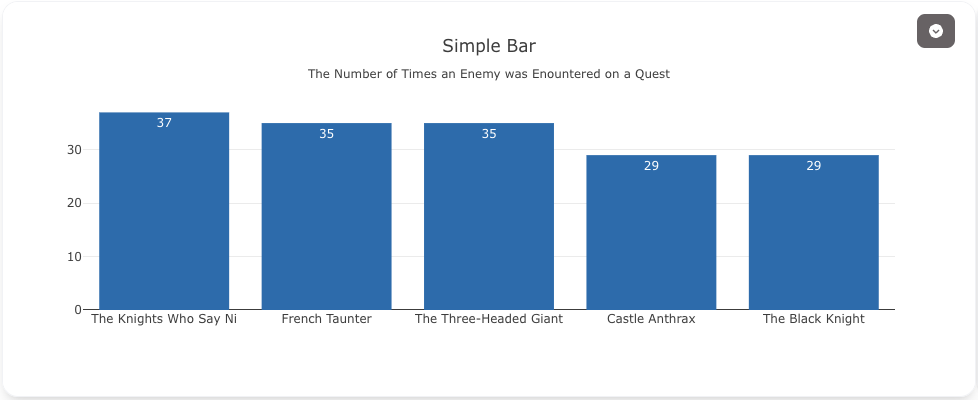

# Bar Charts

Bar charts are perfect for comparing values across categories. Visivo supports vertical bars, horizontal bars, grouped bars, and stacked bars with extensive customization options.

## Quick Examples

<div class="grid cards" markdown>

-   __Simple Bar Chart__

    ---
    
    Basic vertical bar chart for category comparison.
    
    
    
    ```yaml
    props:
      type: bar
      x: ?{category}
      y: ?{value}
    ```

-   __Grouped Bars__

    ---
    
    Compare multiple series side by side.
    
    
    
    ```yaml
    props:
      type: bar
      x: ?{month}
      y: ?{sales}
    cohort_on: product
    ```

-   __Horizontal Bars__

    ---
    
    Better for long category names.
    
    
    
    ```yaml
    props:
      type: bar
      x: ?{value}
      y: ?{category}
      orientation: "h"
    ```

</div>

## When to Use

### Bar Charts are ideal for:
- **Comparing quantities** across different categories
- **Showing rankings** or ordered data
- **Displaying survey results** or ratings
- **Time-based comparisons** with discrete periods (months, quarters)

### Choose orientation based on:
- **Vertical bars**: Standard comparisons, time series
- **Horizontal bars**: Long category names, many categories, rankings

## Complete Examples

### Basic Bar Chart

Simple bar chart with custom colors:


```yaml
models:
  - name: sales-by-category
    args:
      - echo
      - |
        category,sales,profit_margin
        Electronics,45000,0.15
        Clothing,32000,0.22
        Food,28000,0.08
        Books,15000,0.18
        Sports,22000,0.20

traces:
  - name: Category Sales
    model: ${ref(sales-by-category)}
    props:
      type: bar
      x: ?{category}
      y: ?{sales}
      marker:
        color: ?{case 
          when profit_margin >= 0.20 then '#2ca02c'
          when profit_margin >= 0.15 then '#ff7f0e' 
          else '#d62728' 
        end}
      text: ?{sales}
      textposition: "outside"
      texttemplate: "$%{text:,.0f}"

charts:
  - name: Sales by Category
    traces:
      - ${ref(Category Sales)}
    layout:
      title: "Sales Performance by Category"
      xaxis:
        title: "Product Category"
      yaxis:
        title: "Sales ($)"
        tickformat: "$,.0f"
```

### Grouped Bar Chart

Compare multiple metrics across categories:


```yaml
models:
  - name: quarterly-metrics
    args:
      - echo
      - |
        quarter,metric,value
        Q1,Revenue,100000
        Q1,Cost,70000
        Q1,Profit,30000
        Q2,Revenue,120000
        Q2,Cost,75000
        Q2,Profit,45000
        Q3,Revenue,110000
        Q3,Cost,72000
        Q3,Profit,38000
        Q4,Revenue,140000
        Q4,Cost,85000
        Q4,Profit,55000

traces:
  - name: Quarterly Metrics
    model: ${ref(quarterly-metrics)}
    cohort_on: metric
    props:
      type: bar
      x: ?{quarter}
      y: ?{value}
      name: ?{metric}
      text: ?{value}
      textposition: "inside"
      texttemplate: "$%{text:,.0f}"

charts:
  - name: Quarterly Financial Metrics
    traces:
      - ${ref(Quarterly Metrics)}
    layout:
      title: "Financial Metrics by Quarter"
      xaxis:
        title: "Quarter"
      yaxis:
        title: "Amount ($)"
      barmode: "group"  # Options: group, stack, relative, overlay
```

### Stacked Bar Chart

Show composition and totals:

```yaml
charts:
  - name: Stacked Revenue
    traces:
      - ${ref(Product A Revenue)}
      - ${ref(Product B Revenue)}
      - ${ref(Product C Revenue)}
    layout:
      barmode: "stack"
      title: "Revenue Composition by Month"
      xaxis:
        title: "Month"
      yaxis:
        title: "Total Revenue ($)"
```

### Horizontal Bar Chart

Perfect for rankings and long labels:


```yaml
models:
  - name: top-customers
    args:
      - echo
      - |
        customer,revenue,order_count
        "Acme Corporation International",85000,142
        "Global Tech Solutions Ltd",78000,98
        "Premier Manufacturing Co",72000,167
        "Advanced Systems Group",65000,89
        "Digital Innovations Inc",58000,201

traces:
  - name: Customer Revenue
    model: ${ref(top-customers)}
    props:
      type: bar
      x: ?{revenue}
      y: ?{customer}
      orientation: "h"
      marker:
        color: "#1f77b4"
      text: ?{revenue}
      textposition: "inside"
      texttemplate: "$%{text:,.0f}"
      hovertemplate: |
        <b>%{y}</b><br>
        Revenue: $%{x:,.0f}<br>
        Orders: %{customdata}
        <extra></extra>
      customdata: ?{order_count}

charts:
  - name: Top Customers
    traces:
      - ${ref(Customer Revenue)}
    layout:
      title: "Top 5 Customers by Revenue"
      xaxis:
        title: "Revenue ($)"
        tickformat: "$,.0f"
      yaxis:
        title: ""
        autorange: "reversed"  # Highest value at top
      height: 400
      margin:
        l: 200  # Extra left margin for long names
```

## Advanced Features

### Custom Bar Colors

Color bars based on values or categories:

```yaml
marker:
  color: ?{case 
    when value > target then 'green'
    when value > target * 0.8 then 'yellow'
    else 'red'
  end}
  line:
    color: "black"
    width: 1
```

### Bar Patterns

Add patterns for accessibility:

```yaml
marker:
  pattern:
    shape: ?{case when category = 'A' then '/' else '+' end}
    size: 8
    solidity: 0.3
```

### Dynamic Bar Width

Adjust bar width based on data:

```yaml
props:
  type: bar
  width: ?{case when is_important then 0.9 else 0.7 end}
```

### Waterfall Effect

Create waterfall charts using base:

```yaml
props:
  type: bar
  base: ?{running_total - value}
  y: ?{value}
  marker:
    color: ?{case when value >= 0 then 'green' else 'red' end}
```

## Common Patterns

### Bar with Target Line

Add reference lines for targets:

```yaml
charts:
  - name: Sales vs Target
    traces:
      - ${ref(actual-sales)}
      - name: Target Line
        props:
          type: scatter
          mode: "lines"
          y: [50000, 50000, 50000, 50000]
          line:
            color: "red"
            dash: "dash"
```

### Percentage Bar Chart

Show percentages instead of absolute values:

```yaml
traces:
  - name: Market Share
    props:
      type: bar
      y: ?{value / sum(value) over() * 100}
      text: ?{round(value / sum(value) over() * 100, 1)}
      texttemplate: "%{text}%"
      hovertemplate: "%{label}: %{text}%<extra></extra>"
```

### Grouped and Stacked Combination

Create complex comparisons:

```yaml
traces:
  - name: Product A - Online
    props:
      type: bar
      offsetgroup: 1
      base: 0
      
  - name: Product A - Retail
    props:
      type: bar
      offsetgroup: 1
      base: ?{product_a_online}  # Stack on top
```

## Tips & Best Practices

!!! tip "Design Guidelines"
    - Keep bars the same width unless width encodes data
    - Start y-axis at zero for accurate comparisons
    - Use horizontal bars when labels are long
    - Limit colors to 5-7 for clarity

!!! warning "Common Mistakes"
    - Don't use 3D effects - they distort perception
    - Avoid too many categories (>15-20)
    - Don't use bars for continuous time series (use lines instead)

!!! info "Performance"
    - For many bars (>100), consider aggregating data
    - Use `bargap` and `bargroupgap` to control spacing
    - Set explicit `width` for consistent appearance

## Styling Options

### Layout Properties

Control bar appearance at the chart level:

```yaml
layout:
  barmode: "group"      # group, stack, relative, overlay
  bargap: 0.15         # Gap between bars (0-1)
  bargroupgap: 0.1     # Gap between groups (0-1)
  uniformtext:
    mode: "hide"       # hide, show
    minsize: 8
```

### Color Scales

Use continuous color scales:

```yaml
marker:
  color: ?{profit_margin}
  colorscale: "RdYlGn"  # Red-Yellow-Green
  showscale: true
  colorbar:
    title: "Profit Margin"
    tickformat: ".0%"
```

## Related Chart Types

- [Waterfall Charts](waterfall.md) - For showing cumulative changes
- [Histogram](histogram.md) - For frequency distributions
- [Box Plots](box.md) - For statistical comparisons
- [Scatter Plots](scatter.md) - For continuous relationships

## Full Configuration Reference

For a complete list of all available properties, see the [Bar Trace Configuration](../reference/configuration/Trace/Props/Bar/index.md).

---

_Need help with complex bar chart layouts?_ Check our [Layout Guide](../howto/layout.md) or [Cookbook Examples](../cookbook/index.md).