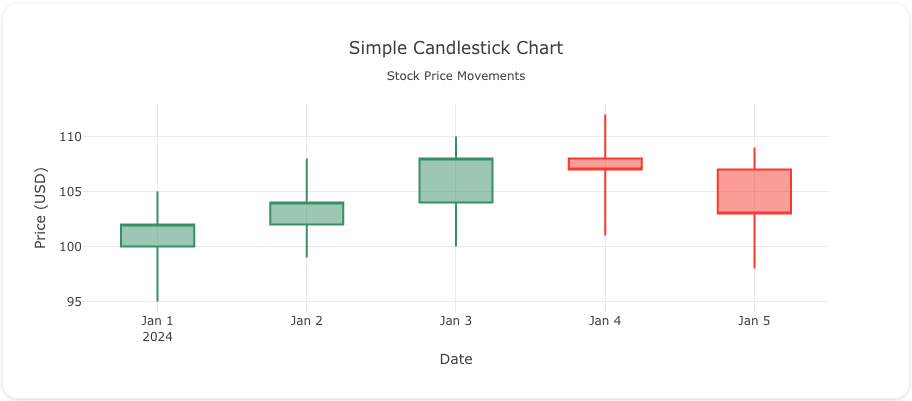
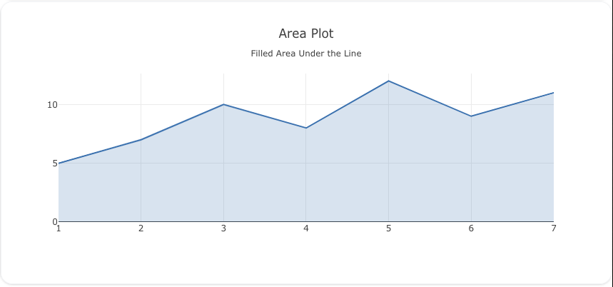
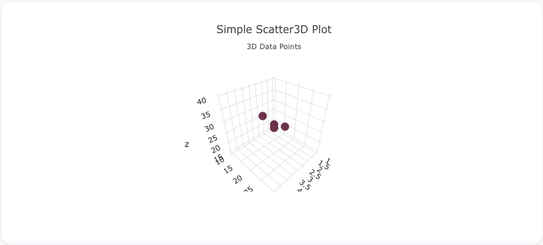
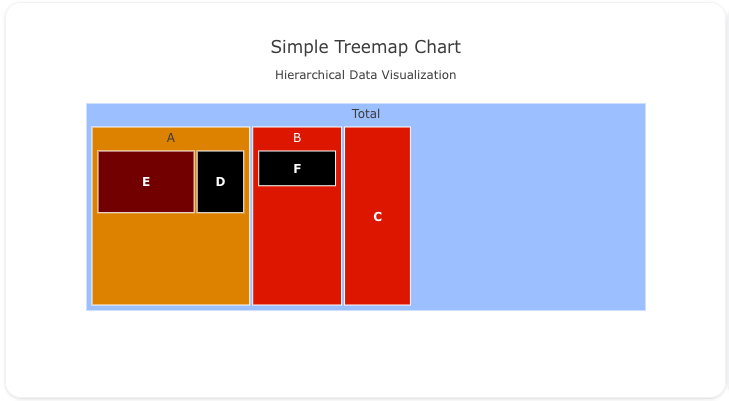

# Chart Gallery

Explore our comprehensive collection of chart types with live examples and code snippets. Each chart type includes multiple examples showing different configurations and use cases.

## Quick Chart Selector

!!! tip "Not sure which chart to use?"
    Use our [Chart Selection Guide](#chart-selection-guide) below to find the perfect visualization for your data.

### Basic Charts

-   :material-chart-scatter-plot: __Scatter & Line__

    ---
    
    Create scatter plots, line charts, and area charts. Perfect for showing trends and relationships.
    
    {: style="height:150px"}
    
    [:octicons-arrow-right-24: View Examples](scatter.md)

-   :material-chart-bar: __Bar Charts__

    ---
    
    Visualize categorical data with vertical or horizontal bars. Great for comparisons.
    
    {: style="height:150px"}
    
    [:octicons-arrow-right-24: View Examples](bar.md)

-   :material-chart-pie: __Pie Charts__

    ---
    
    Show proportions and percentages. Ideal for displaying parts of a whole.
    
    {: style="height:150px"}
    
    [:octicons-arrow-right-24: View Examples](pie.md)

### Statistical Charts

-   :material-chart-box-outline: __Box Plots__

    ---
    
    Display statistical distributions with quartiles and outliers.
    
    {: style="height:150px"}
    
    [:octicons-arrow-right-24: View Examples](box.md)

-   :material-chart-histogram: __Histograms__

    ---
    
    Show frequency distributions of continuous data.
    
    {: style="height:150px"}
    
    [:octicons-arrow-right-24: View Examples](histogram.md)

-   :material-violin: __Violin Plots__

    ---
    
    Combine box plots with kernel density estimation.
    
    {: style="height:150px"}
    
    [:octicons-arrow-right-24: View Examples](violin.md)

### Time Series

-   :material-candlestick-chart: __Candlestick__

    ---
    
    Financial charts showing open, high, low, and close values.
    
    {: style="height:150px"}
    
    [:octicons-arrow-right-24: View Examples](candlestick.md)

-   :material-chart-timeline: __OHLC__

    ---
    
    Open-High-Low-Close charts for financial data.
    
    {: style="height:150px"}
    
    [:octicons-arrow-right-24: View Examples](ohlc.md)

-   :material-chart-areaspline: __Area Charts__

    ---
    
    Filled line charts showing cumulative totals over time.
    
    {: style="height:150px"}
    
    [:octicons-arrow-right-24: View Examples](area.md)

### Advanced Visualizations

-   :material-cube-scan: __3D Charts__

    ---
    
    Three-dimensional scatter, surface, and mesh visualizations.
    
    {: style="height:150px"}
    
    [:octicons-arrow-right-24: View Examples](3d.md)

-   :material-earth: __Geographic Maps__

    ---
    
    Choropleth maps, scatter maps, and density maps.
    
    {: style="height:150px"}
    
    [:octicons-arrow-right-24: View Examples](maps.md)

-   :material-file-tree: __Hierarchical__

    ---
    
    Treemaps, sunbursts, and icicle charts for nested data.
    
    {: style="height:150px"}
    
    [:octicons-arrow-right-24: View Examples](hierarchical.md)

### Specialized Charts

-   :material-chart-sankey: __Flow Diagrams__

    ---
    
    Sankey diagrams and parallel coordinates for flow visualization.
    
    {: style="height:150px"}
    
    [:octicons-arrow-right-24: View Examples](flow.md)

-   :material-heat-wave: __Heatmaps__

    ---
    
    2D color-coded matrices for correlation and density.
    
    {: style="height:150px"}
    
    [:octicons-arrow-right-24: View Examples](heatmap.md)

-   :material-gauge: __Indicators__

    ---
    
    KPI indicators, gauges, and bullet charts.
    
    {: style="height:150px"}
    
    [:octicons-arrow-right-24: View Examples](indicator.md)

## Chart Selection Guide

Use this decision tree to find the right chart for your data:

### What are you trying to show?

=== "Comparison"

    **Comparing values across categories?**
    
    - Few categories → [Bar Chart](bar.md)
    - Many categories → [Horizontal Bar Chart](bar.md#horizontal-bars)
    - Over time → [Line Chart](scatter.md#line-charts)
    - Part-to-whole → [Pie Chart](pie.md) or [Stacked Bar](bar.md#stacked-bars)

=== "Distribution"

    **Showing data distribution?**
    
    - Single variable → [Histogram](histogram.md)
    - With statistics → [Box Plot](box.md)
    - Detailed shape → [Violin Plot](violin.md)
    - 2D distribution → [2D Histogram](histogram.md#2d-histograms) or [Heatmap](heatmap.md)

=== "Relationship"

    **Exploring relationships between variables?**
    
    - Two variables → [Scatter Plot](scatter.md)
    - Three variables → [3D Scatter](3d.md#scatter-3d)
    - Multiple variables → [Parallel Coordinates](flow.md#parallel-coordinates)
    - Correlation matrix → [Heatmap](heatmap.md)

=== "Time Series"

    **Showing change over time?**
    
    - Single series → [Line Chart](scatter.md#line-charts)
    - Multiple series → [Multi-line Chart](scatter.md#multiple-lines)
    - With range → [Area Chart](area.md)
    - Financial data → [Candlestick](candlestick.md) or [OHLC](ohlc.md)

=== "Geographical"

    **Displaying geographic data?**
    
    - Regional values → [Choropleth Map](maps.md#choropleth)
    - Point locations → [Scatter Map](maps.md#scatter-maps)
    - Density → [Density Map](maps.md#density-maps)

=== "Hierarchical"

    **Showing hierarchical or nested data?**
    
    - Space-efficient → [Treemap](hierarchical.md#treemap)
    - With path → [Sunburst](hierarchical.md#sunburst)
    - Linear hierarchy → [Icicle](hierarchical.md#icicle)

## All Chart Types

For a complete reference of all available chart types and their properties, see the [Configuration Reference](../reference/configuration/Trace/Props/Scatter/index.md).

### Complete List

| Chart Type | Best For | Key Features |
|------------|----------|--------------|
| [Scatter](scatter.md) | Relationships, correlations | Points, bubbles, trend lines |
| [Line](scatter.md#line-charts) | Trends over time | Multiple series, smoothing |
| [Area](area.md) | Cumulative values | Stacked, overlaid, gradient fills |
| [Bar](bar.md) | Category comparison | Grouped, stacked, horizontal |
| [Pie](pie.md) | Parts of whole | Donut, exploded slices |
| [Box](box.md) | Statistical distribution | Quartiles, outliers, whiskers |
| [Violin](violin.md) | Distribution shape | Kernel density, split violins |
| [Histogram](histogram.md) | Frequency distribution | Bins, cumulative, normalized |
| [Heatmap](heatmap.md) | 2D patterns | Color scales, annotations |
| [Contour](contour.md) | Continuous surfaces | Filled, lines, custom levels |
| [3D Scatter](3d.md#scatter-3d) | 3D relationships | Rotation, perspective |
| [3D Surface](3d.md#surface) | 3D continuous data | Mesh, wireframe |
| [Choropleth](maps.md#choropleth) | Geographic regions | Country/state level |
| [Scattergeo](maps.md#scatter-maps) | Geographic points | Markers, lines on maps |
| [Treemap](hierarchical.md#treemap) | Hierarchical proportions | Nested rectangles |
| [Sunburst](hierarchical.md#sunburst) | Hierarchical with path | Radial hierarchy |
| [Sankey](flow.md#sankey) | Flow between stages | Links, nodes |
| [Parallel Coordinates](flow.md#parallel-coordinates) | Multivariate patterns | Brushing, reordering |
| [Candlestick](candlestick.md) | Financial OHLC | Trading patterns |
| [Waterfall](waterfall.md) | Cumulative changes | Increases, decreases |
| [Funnel](funnel.md) | Process stages | Conversion rates |
| [Gauge](indicator.md#gauge) | Single KPI | Ranges, thresholds |
| [Indicator](indicator.md) | Metrics display | Delta, reference |

---

_Can't find what you're looking for?_ Check our [How-To Guides](../howto/index.md) for specific visualization scenarios.