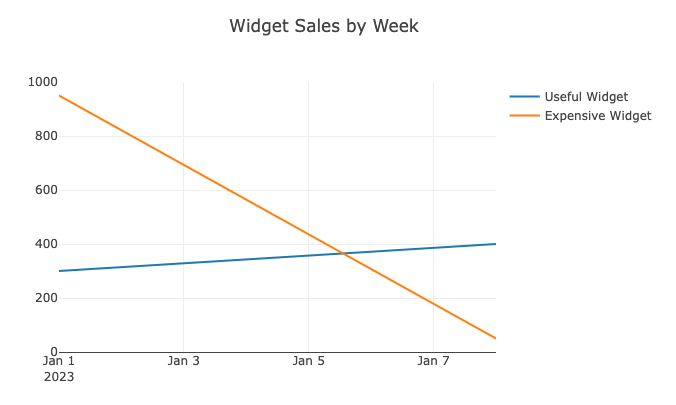

# How Visivo Works
Say you have a model called `widget_sales` that looks like this: 

| widget           | quantity | completed_at |
|------------------|----------|--------------|
| Useful Widget    | 300      | 2023-01-01   |
| Useful Widget    | 250      | 2023-01-07   |
| Useful Widget    | 150      | 2023-01-08   |
| Expensive Widget | 900      | 2023-01-02   |
| Expensive Widget | 50       | 2023-01-03   |
| Expensive Widget | 50       | 2023-01-09   |

You can generate a trace in a yml file directly your project. The trace can be just a few lines or get more complex if you want to customize it. Here's an example of a fairly simple trace that builds on the `widget_sales` model: 

=== "Relational Db"

    ``` yaml title="project_dir/visivo_project.yml"
    traces:
      - name: simple_trace
        base_sql: "Select * from widget_sales"
        cohort_on: query( widget )
        x: query( date_trunc('week', completed_at) )
        y: query( sum(amount) )
        marker: 
          color: query( case sum(amount) > 200 then 'green' else 'blue' end )
          shape: square
        mode: 'lines'
    charts:
      - name: simple_chart
        traces:
          - ref('simple_trace')
        layout:
          - title: Widget Sales by Week
    ```
=== "dbt"

    ``` yaml title="project_dir/models/schema.yml" 
    traces:
      - name: simple_trace
        base_sql: ref('widget_sales')
        cohort_on: query( widget )
        x: query( date_trunc('week', completed_at) )
        y: query( sum(amount) )
        marker: 
          color: query( case sum(amount) > 200 then 'green' else 'blue' end )
          shape: square
        mode: 'lines'
    charts:
      - name: simple_chart
        traces:
          - ref('simple_trace')
        layout:
          - title: Widget Sales by Week
    models:
      - name: widget_sales
        description: "A table containing widgets sales sourced from the CRM"
        columns:
          - name: widget
            description: The type of widget sold
            tests: 
              - not_null
          - name: quantity
            description: The number of widgets sold
          - name: completed_at
            description: Timestamp of when the transaction occurred
    ```
    Where the dbt model is defined like this:
    ``` sql title="project_dir/models/widget_sales.sql" 
    SELECT 
      widget, 
      quantity, 
      completed_at
    FROM {{ source('crm', 'sales_of_widgets') }}
    ```

Using that context, Visivo will produce this query and store it in your target directory:
``` sql title="project_dir/target/traces/simple_trace/query.sql"
WITH 
base_sql as (
select * from widget_sales --context set to target.database & target.schema
)
select 
  widget as "cohort_on",
  date_trunc('week', completed_at) as "x", 
  sum(amount) as "y", 
  case sum(amount) > 300 then 'green' else 'blue' end as "marker.color"
from base_sql 
GROUP BY 
  "cohort_on",
  "x"
```
After small transformations on the output of the query you get this `data.json` which is stored in the target directly next to the query to enable debugging:
``` json title="project_dir/target/traces/simple_trace/data.json"
{
"Useful Widget": {
  "x": ["2023-01-01", "2023-01-08"],
  "y": [300, 400],
  "marker.color": ["blue", "green"]
  },
"Expensive Widget": {
  "x": ["2023-01-01", "2023-01-08"],
  "y": [950, 50],
  "marker.color": ["green", "blue"]
  }
}
```
Next Visivo generates the plotly chart configuration:
``` js title="project_dir/target/charts/simple_chart/chart.js"
...

var traces = [
  {
    name: "Useful Widget",
    x: data["Useful Widget"]["x"],
    y: data["Useful Widget"]["y"],
    marker: {
      color: data["Useful Widget"]["marker.color"],
      shape: "square"
    },
    mode: "lines"
  },
  {
    name: "Expensive Widget",
    x: data["Expensive Widget"]["x"],
    y: data["Expensive Widget"]["y"],
    marker: {
      color: data["Expensive Widget"]["marker.color"],
      shape: "square"
    },
    mode: "lines"
  },
]
var layout = {title: "Widget Sales by Week" }

Plotly.newPlot('aDiv', data, layout);
```
The compiled JS produces a chart! Now you can mix and match traces with the one we outlined here or deploy this chart to 1 or more dashboards without having to do any duplicate work.  


