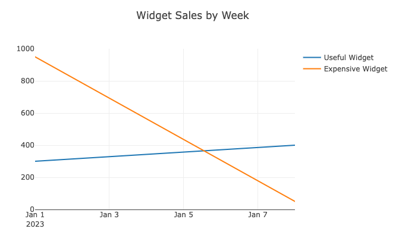

# How Visivo Works

When you work with Visivo, you write YAML configurations and run a few CLI commands. Visivo handles everything else automatically so you and your team can focus on what matters. The walkthrough below isn't exactly what happens under the hood, but it's a solid approximation.

Say you have a model called `widget_sales` that looks like this:

| widget           | quantity | completed_at |
| ---------------- | -------- | ------------ |
| Useful Widget    | 300      | 2023-01-01   |
| Useful Widget    | 250      | 2023-01-07   |
| Useful Widget    | 150      | 2023-01-08   |
| Expensive Widget | 900      | 2023-01-02   |
| Expensive Widget | 50       | 2023-01-03   |
| Expensive Widget | 50       | 2023-01-09   |

You can declare an [insight](reference/configuration/Insight/index.md) in any `*.visivo.yml` file in your project. The insight binds plotly props to the columns of one or more models using `?{ ... }` slot expressions and `${ref(model).column}` field references:

=== "Relational Db"

    ``` yaml title="project_dir/project.visivo.yml"
    models:
      - name: widget_sales
        sql: select * from widget_sales

    insights:
      - name: weekly_widget_sales
        props:
          type: scatter
          mode: lines
          x: ?{ date_trunc('week', ${ref(widget_sales).completed_at}) }
          y: ?{ sum(${ref(widget_sales).quantity}) }
          marker:
            color: ?{ case when sum(${ref(widget_sales).quantity}) > 200 then 'green' else 'blue' end }
        interactions:
          - split: ?{${ref(widget_sales).widget}}

    charts:
      - name: simple_chart
        insights:
          - ${ref(weekly_widget_sales)}
        layout:
          title:
            text: Widget Sales by Week
    ```

=== "dbt"

    ``` yaml title="project_dir/models/schema.yml"
    insights:
      - name: weekly_widget_sales
        props:
          type: scatter
          mode: lines
          x: ?{ date_trunc('week', ${ref(widget_sales).completed_at}) }
          y: ?{ sum(${ref(widget_sales).quantity}) }
          marker:
            color: ?{ case when sum(${ref(widget_sales).quantity}) > 200 then 'green' else 'blue' end }
        interactions:
          - split: ?{${ref(widget_sales).widget}}

    charts:
      - name: simple_chart
        insights:
          - ${ref(weekly_widget_sales)}
        layout:
          title:
            text: Widget Sales by Week

    models:
      - name: widget_sales
        description: "A table containing widget sales sourced from the CRM"
        columns:
          - name: widget
            description: The type of widget sold
          - name: quantity
            description: The number of widgets sold
          - name: completed_at
            description: Timestamp of when the transaction occurred
    ```

    Where the dbt model itself is defined like this:

    ``` sql title="project_dir/models/widget_sales.sql"
    SELECT
      widget,
      quantity,
      completed_at
    FROM {{ source('crm', 'sales_of_widgets') }}
    ```

## Compile

`visivo compile` parses your YAML, validates the project against the [JSON schema](https://docs.visivo.io/assets/visivo_schema.json), and writes `target/project.json` plus per-insight metadata. The `?{ ... }` slots and `${ref(...)}` references are resolved into a SQL query that the source can execute, captured in the insight's metadata file.

## Run

`visivo run` executes the model query against your source and writes a Parquet file per insight to `target/<run-id>/files/<insight-name>.parquet`. It also writes an `insights/<insight-name>.json` describing the prop-to-column mapping and any post-query (the part that runs client-side in the browser).

```text title="target/main/files/weekly_widget_sales.parquet"
widget,         x,           y,    marker.color
Useful Widget,  2023-01-01,  300,  green
Useful Widget,  2023-01-08,  400,  green
Expensive Widget, 2023-01-01, 950, green
Expensive Widget, 2023-01-08,  50, blue
```

## Render

When the dashboard is opened in the browser, the Visivo viewer loads the Parquet file with [DuckDB-WASM](https://duckdb.org/docs/api/wasm/overview), applies any [interactions](reference/configuration/Insight/InsightInteraction/index.md) (`split`, `sort`, `filter`) client-side, maps the result columns onto the insight's plotly props, and hands the assembled series data to plotly to render.

That same insight can now be reused across as many [charts](reference/configuration/Chart/index.md) and [dashboards](reference/configuration/Dashboards/Dashboard/index.md) as you like — Visivo computes the underlying data exactly once.


