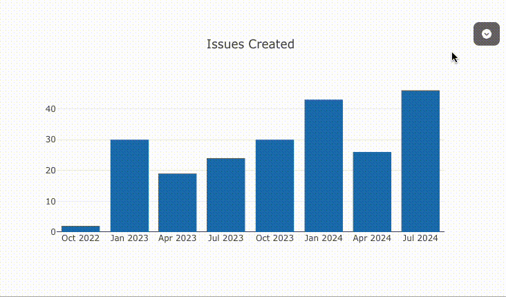

# Quick Start

## 🚀 Data to Dashboard in 90 Seconds

Visivo is BI-as-code: your dashboards are YAML you can read, diff, and review. The fastest way to see what that looks like is to start from an example that already works.

### 1. Install Visivo

```bash
curl -fsSL https://visivo.sh | bash
```

The script installs the `visivo` binary to `~/.visivo/bin` and adds it to your `PATH`. On Windows, run it inside [WSL](https://learn.microsoft.com/en-us/windows/wsl/install), or use the [pip installation](installation.md#python-package-pip) instead.

Confirm it landed:

```bash
visivo --version
```

### 2. Start From a Bundled Example

```bash
visivo init --example ev-sales
```

That single command:

1. Copies the `ev-sales` sample into the current directory — a `project.visivo.yml`, the DuckDB file it queries, and the CSV that data came from.
2. Names the project after the directory you ran it in.
3. Compiles the project and runs every model and insight query.
4. Starts the dev server at `http://localhost:8000` and opens your browser.

!!! success "No downloads, no database to set up"
    The examples ship inside the Visivo package and query a small bundled DuckDB file, so this works offline and the YAML always matches the version of Visivo you just installed.

Three examples ship with the CLI:

| `--example` value | What it builds | Chart types it shows |
| --- | --- | --- |
| `ev-sales` | Electric-vehicle units and revenue by region, powertrain, and quarter | `indicator`, `bar`, `pie` |
| `github-releases` | Release counts, downloads over time, and contributors per repo | `indicator`, `bar`, `scatter` |
| `college-football` | 2024 game scores and attendance by team and conference | `indicator`, `bar`, `box` |

Each one is deliberately small — one source, one model, five insights, five charts, one dashboard — so you can read the whole file in a couple of minutes.

!!! tip "Useful `init` flags"
    - `--bare` — write the project files and stop, without launching the dev server.
    - `--headless` — start the dev server but don't open a browser.
    - `-p, --port` — serve on a port other than `8000`.
    - `-pd, --project-dir` — initialize into a subdirectory instead of the current one.

    So the fully scripted version of the walkthrough is:

    ```bash
    visivo init --example ev-sales --project-dir ev-demo --bare
    cd ev-demo
    visivo run     # build the data once
    visivo serve   # then watch and hot-reload; prints the URL to open
    ```

### 3. Read the Project

Open `project.visivo.yml`. Every Visivo project is the same five-object chain, and the example is a complete, working instance of it:

```yaml
name: ev-demo

sources:
  # Where the data lives.
  - name: ev_sales_db
    type: duckdb
    database: ev_sales.duckdb

defaults:
  source_name: ev_sales_db

models:
  # A named SQL query against that source.
  - name: ev_sales
    sql: SELECT * FROM ev_sales

insights:
  # A chart definition, written against the model's columns.
  - name: units_by_quarter
    props:
      type: bar
      x: ?{ ${ref(ev_sales).quarter} }
      y: ?{ SUM(${ref(ev_sales).units_sold}) }
    interactions:
      - sort: ?{ ${ref(ev_sales).quarter} ASC }

charts:
  # A chart wraps one or more insights and owns the Plotly layout.
  - name: units_by_quarter_chart
    insights:
      - ${ref(units_by_quarter)}
    layout:
      title:
        text: "EV units sold by quarter"

dashboards:
  # Rows of items place the charts on a page.
  - name: EV Sales
    rows:
      - height: medium
        items:
          - chart: ${ref(units_by_quarter_chart)}
```

!!! warning "A dashboard item takes a chart, not an insight"
    A dashboard item holds a `chart`, `table`, `markdown`, or `input` (plus `rows`, `path`, and `file_path` for composition) — never a bare `insight`. The `Item` model rejects unknown keys, so `insight:` inside a dashboard row is a validation error. Wrap insights in a chart first, exactly as above. See [Insight](concepts/insight.md) for why charts are the wrapper, and [Dashboard](concepts/dashboard.md) for the full row/item vocabulary.

### 4. Edit It and Watch It Reload

With the dev server running, find `units_by_quarter_chart` in `project.visivo.yml` and change its title:

```yaml
charts:
  - name: units_by_quarter_chart
    layout:
      title:
        text: "Quarterly EV demand"
```

Save the file (Cmd+S / Ctrl+S). That's it — no build command, no page refresh. Visivo recompiles the project, re-runs the queries, and pushes the result to the open browser tab.

<figure markdown>
  
  <figcaption>Every save triggers an instant update. Watch your dashboard evolve in real-time!</figcaption>
</figure>

!!! tip "Pro Tip: Split Screen Development"
    Open your editor and browser side-by-side. As you type and save, watch your dashboard transform in real-time. It's like having a conversation with your data!

---

## Starting From Scratch Instead

If you'd rather not start from an example, run `init` with no flags:

```bash
visivo init
```

This writes a `project.visivo.yml` scaffold of commented examples, plus a `.gitignore` and a `.env.example` if you don't already have them, and then opens the in-browser setup wizard so you can add a source without hand-writing connection details.

!!! note "The scaffold is empty on purpose"
    Everything in the scaffold is commented out, so `visivo run` reports `No jobs run. Ensure your filter contains nodes that are runnable.` until you define a real source and model. That message is expected here — it means there is nothing to build yet, not that something failed. Uncomment the examples in the file, or add a source through the wizard.

## What `visivo serve` Does

`visivo serve` is the command for a directory that **already has a project**. It compiles and runs the project on launch, watches your files, and hot-reloads the browser on every save.

Run it in an empty directory, or pass `--new`, and it starts an empty in-memory project and opens the in-browser setup wizard. In that mode it writes no project file, and the initial build logs `No jobs run.` because there is nothing to build. It does **not** offer to install an example — that's what `visivo init --example` is for.

---

## Alternative: AI-Powered Development

**Want a more conversational approach?** Try using AI agents like Claude Code to build your dashboard through natural language. AI can analyze your data, suggest visualizations, and write the complete configuration for you.

[:material-robot: Explore AI-powered dashboard creation](ai-usage.md){ .md-button }

---

## What's Next?

Now that you have a running dashboard, explore what's possible:

<div class="grid cards" markdown>

-   :material-palette:{ .lg .middle } **Customize Your Dashboard**

    ---

    Learn how to modify layouts, rows, items, and styling
    
    [:octicons-arrow-right-24: Dashboard reference](reference/configuration/Dashboards/Dashboard/index.md)

-   :material-chart-line:{ .lg .middle } **Add Charts & Visualizations**

    ---

    Explore 40+ insight types with rich customization options
    
    [:octicons-arrow-right-24: Insight props](reference/configuration/Insight/Props/index.md)

-   :material-database:{ .lg .middle } **Connect Your Data**

    ---

    Set up connections to your production databases
    
    [:octicons-arrow-right-24: Data sources](topics/sources.md)

-   :material-tune:{ .lg .middle } **Make It Interactive**

    ---

    Add filters, splits, sorts, and dropdown inputs
    
    [:octicons-arrow-right-24: Interactivity](topics/interactivity.md)

-   :material-cloud-upload:{ .lg .middle } **Deploy & Share**

    ---

    Share your dashboards with your team
    
    [:octicons-arrow-right-24: Deployment guide](topics/deployments.md)

-   :material-console:{ .lg .middle } **Every Command & Flag**

    ---

    The full CLI reference, generated from the code itself
    
    [:octicons-arrow-right-24: CLI reference](reference/cli.md)

</div>

---

**Questions?** [Contact us](mailto:jared@visivo.io) - we're here to help!

---

!!! quote "Why Visivo?"
    "Unlike other tools that require complex setup and configuration, Visivo gets you from zero to dashboard in 90 seconds. Start from a bundled example, from a blank scaffold, or hand the YAML to an AI agent — any of the three gets you a working dashboard before your coffee gets cold."

---

<div class="vz-button-row" markdown>
[:octicons-star-16: Star us on GitHub](https://github.com/visivo-io/visivo){ .md-button .md-button--primary }
[:material-cloud: Try Visivo Cloud](https://app.visivo.io){ .md-button }
</div>
