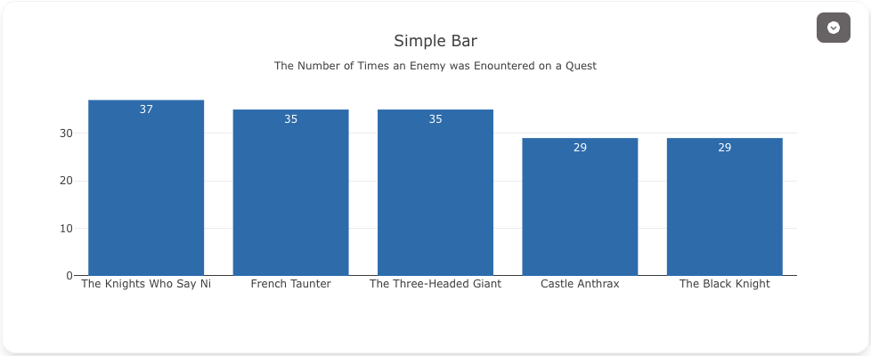
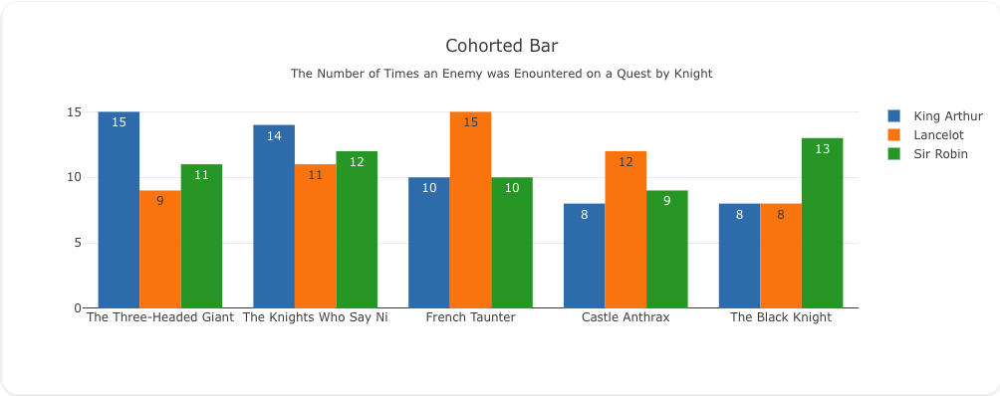
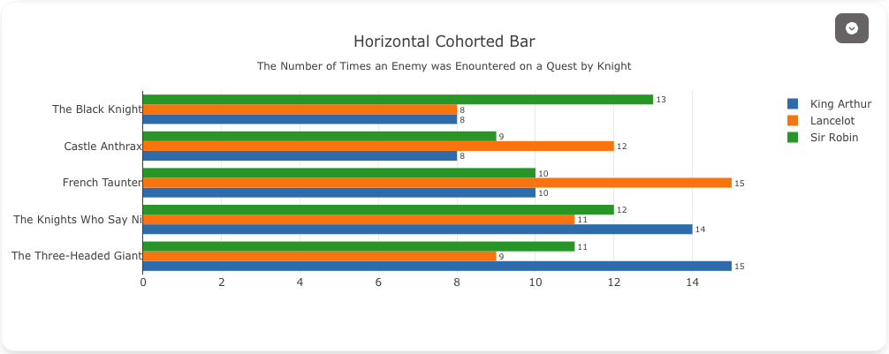

---
search:
  exclude: true
---
<!--start-->
## Overview
The bar trace type is used to display data as bars. 

You have pretty broad control over the appearance of the bars via the `marker` attributes. You can set the fill color, opacity, pattern, line color, width, etc. You can also configure display the bars as either grouped or stacked. 

!!! tip "Common Uses"

    - **Categorical Data Comparison**: Visualizing data across distinct categories (e.g., sales by product type).
    - **Grouped Bar Charts**: Comparing multiple series side by side (e.g., monthly sales by region).
    - **Stacked Bar Charts**: Showing cumulative data (e.g., revenue breakdown by product within a year).
    - **Horizontal Bar Charts**: Comparing data where horizontal labels are more readable (e.g., ranking of countries by population).
    - **Time-Series Data (Categorical)**: Displaying data changes over time with categories as the x-axis (e.g., yearly revenue growth by product).

_**Checkout the [Attributes](../configuration/Trace/Props/Bar/#attributes) for the full set of configuration options**_

## Examples 

!!! example "Common Configurations" 

    === "Simple Bar"

        Here's a really simple bar chart:
        
        You can copy this code below to create this chart in your project: 
        ``` yaml
        models:
          - name: monty-python-quest-data
            args:
              - curl
              - "https://raw.githubusercontent.com/visivo-io/data/refs/heads/main/monty_python_quests.csv"
        traces:
          - name: Count Enemies Encountered by Knight
            model: ${ref(monty-python-quest-data)}
            cohort_on: "person"
            props:
              type: bar 
              x: ?{enemy_encountered}
              y: ?{ count(*) }
              text: ?{ count(*) }
            order_by: 
              - ?{ count(*) desc}
        charts: 
          - name: Count Times Enemy Was Encountered by Knight
            traces: 
              - ${ref(Count Enemies Encountered by Knight)}
            layout: 
              title: 
                text: Cohorted Bar<br><sub>The Number of Times an Enemy was Enountered on a Quest by Knight</sub>
        ```

    === "Cohorted Bar"

        You can use the `trace.cohort_on` key to create facets in your bar chart.
        
        Here's the code: 
        ``` yaml 
        models:
          - name: monty-python-quest-data
            args:
              - curl
              - "https://raw.githubusercontent.com/visivo-io/data/refs/heads/main/monty_python_quests.csv"
        traces:
          - name: Count Enemies Encountered by Knight
            model: ${ref(monty-python-quest-data)}
            cohort_on: "person"
            props:
              type: bar 
              x: ?{enemy_encountered}
              y: ?{ count(*) }
              text: ?{ count(*) }
            order_by: 
              - ?{ count(*) desc}

        charts: 
          - name: Count Times Enemy Was Encountered by Knight
            traces: 
              - ${ref(Count Enemies Encountered by Knight)}
            layout: 
              title: 
                text: Cohorted Bar<br><sub>The Number of Times an Enemy was Enountered on a Quest by Knight</sub>

        ```
    
    === "Horizontal Cohorted Bar"
        
        It can be useful to view some data horizontally. 

        
        Here's the code: 
        ``` yaml
        models:
          - name: monty-python-quest-data-h
            args:
              - curl
              - "https://raw.githubusercontent.com/visivo-io/data/refs/heads/main/monty_python_quests.csv"
        traces:
          - name: Count Enemies Encountered by Knight H
            model: ${ref(monty-python-quest-data-h)}
            cohort_on: "person"
            props:
              type: bar 
              y: ?{enemy_encountered}
              x: ?{ count(*) }
              text: ?{ count(*) }
              textposition: outside
              textfont:
                size: 15
              orientation: h
            order_by: 
              - ?{ count(*) desc}

        charts: 
          - name: Count Times Enemy Was Encountered by Knight H
            traces: 
              - ${ref(Count Enemies Encountered by Knight H)}
            layout: 
              title: 
                text: Horizontal Cohorted Bar<br><sub>The Number of Times an Enemy was Enountered on a Quest by Knight</sub>
              margin: 
                l: 160
        ```


<!--end-->