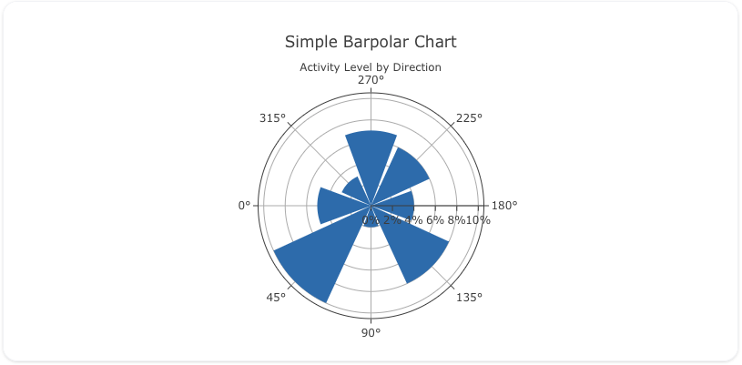
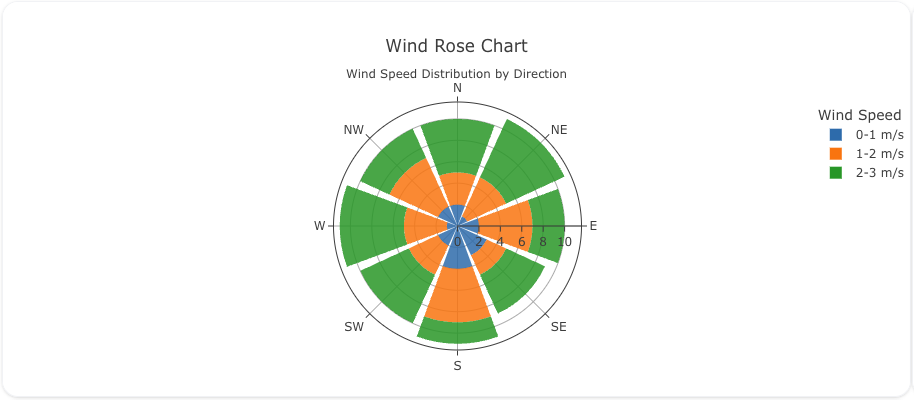
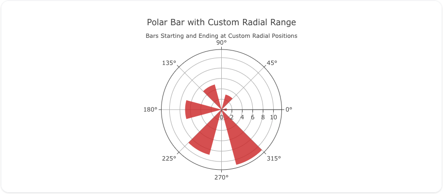

---
search:
  exclude: true
---
<!--start-->
## Overview

The `barpolar` trace type is used to create bar charts in polar coordinates. This is particularly useful for displaying data that is cyclical or directional in nature, such as wind directions, time-of-day activities, or any phenomena that repeats over a circular dimension.

You have extensive control over the appearance of the bars through the `marker` and `insidetextfont` attributes. You can set colors, opacity, line styles, and more. The bars can be customized to start at a specific radial axis and extend to another, allowing for flexible representations.

!!! tip "Common Uses"

    - **Wind Rose Charts**: Visualizing wind speed and direction distributions.
    - **Circular Histograms**: Displaying the frequency of events over a circular variable like time of day or compass direction.
    - **Directional Data Representation**: Showcasing data that has a directional component (e.g., animal migration patterns).
    - **Cyclical Phenomena Visualization**: Illustrating patterns that repeat over a cycle (e.g., seasonal sales data).

_**Check out the [Attributes](../configuration/Trace/Props/Barpolar/#attributes) for the full set of configuration options**_

## Examples


!!! example "Common Configurations"

    === "Simple Barpolar"

        Here's a simple `barpolar` chart showing activities over different compass directions:

        

        You can copy this code below to create this chart in your project:

        ```yaml
        models:
          - name: activity-data
            args:
              - echo
              - |
                direction,activity_level
                0,5
                45,10
                90,2
                135,8
                180,4
                225,6
                270,7
                315,3
        traces:
          - name: Activity Level by Direction
            model: ref(activity-data)
            props:
              type: barpolar
              r: ?{activity_level}
              theta: ?{direction}
              marker:
                color: "#1f77b4"
            order_by:
              - ?{direction}
        charts:
          - name: Activity Level Polar Chart
            traces:
              - ref(Activity Level by Direction)
            layout:
              polar:
                radialaxis:
                  ticksuffix: "%"
                  tickangle: 360
                  tick0: 0
                  dtick: 2
                angularaxis:
                  rotation: 180
              margin: 
                l: 0 
                r: 0 
                b: 40
              title:
                text: Simple Barpolar Chart<br><sub>Activity Level by Direction</sub>
        ```

    === "Wind Rose Chart"

        A wind rose chart is a common use of `barpolar` to display wind speed and direction frequencies:

        

        Here's the updated code:

        ```yaml
        models:
          - name: wind-data
            args:
              - echo
              - |
                cardinal_order,direction,speed,count
                1,N,0-1 m/s,2
                1,N,1-2 m/s,3
                1,N,2-3 m/s,5
                2,NE,0-1 m/s,1
                2,NE,1-2 m/s,4
                2,NE,2-3 m/s,6
                3,E,0-1 m/s,2
                3,E,1-2 m/s,5
                3,E,2-3 m/s,3
                4,SE,0-1 m/s,3
                4,SE,1-2 m/s,2
                4,SE,2-3 m/s,4
                5,S,0-1 m/s,4
                5,S,1-2 m/s,5
                5,S,2-3 m/s,2
                6,SW,0-1 m/s,2
                6,SW,1-2 m/s,3
                6,SW,2-3 m/s,5
                7,W,0-1 m/s,1
                7,W,1-2 m/s,4
                7,W,2-3 m/s,6
                8,NW,0-1 m/s,2
                8,NW,1-2 m/s,5
                8,NW,2-3 m/s,3
        traces:
          - name: Wind Rose
            model: ref(wind-data)
            columns:
              bar_color: | 
                CASE speed 
                  when '0-1 m/s' THEN '#1f77b4' 
                  when '1-2 m/s' then '#ff7f0e' 
                  when '2-3 m/s' then '#2ca02c' 
                end 
            props:
              type: barpolar
              r: ?{count}
              theta: ?{direction}
              text: ?{speed}
              marker:
                color: column(bar_color)
                opacity: .85
              hoverinfo: "theta+r+name"
            order_by: 
              - ?{cardinal_order}
        charts:
          - name: Wind Rose Chart
            traces:
              - ref(Wind Rose)
            layout:
              polar:
                radialaxis:
                  ticksuffix: ""
                  angle: 0
                angularaxis:
                  direction: "clockwise"
                  period: 8

              legend:
                title:
                  text: "Wind Speed"
              title:
                text: Wind Rose Chart<br><sub>Wind Speed Distribution by Direction</sub>
        ```

    === "Polar Bar with Custom Radial Range"

        You can customize the radial range to represent data starting and ending at specific radial positions:

        

        Here's the code:

        ```yaml
        models:
          - name: custom-radial-data
            args:
              - echo
              - |
                direction,radial_start,radial_end
                0,1,3
                60,2,5
                120,3,6
                180,1,4
                240,2,7
                300,3,5
        traces:
          - name: Custom Radial Barpolar
            model: ref(custom-radial-data)
            props:
              type: barpolar
              theta: ?{direction}
              width: 30
              marker:
                color: "#d62728"
              opacity: 0.8
            order_by:
              - ?{direction}
        charts:
          - name: Custom Radial Barpolar Chart
            traces:
              - ref(Custom Radial Barpolar)
            layout:
              polar:
                radialaxis:
                  visible: true
              title:
                text: Polar Bar with Custom Radial Range<br><sub>Bars Starting and Ending at Custom Radial Positions</sub>
        ```


<!--end-->