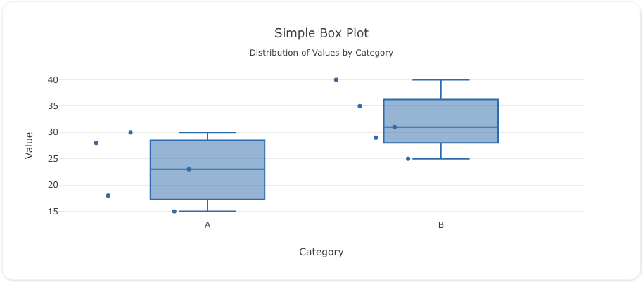

## Overview

The `box` trace type is used to display data as a box plot, which shows the distribution of data based on their quartiles, medians, and potential outliers. It's useful for statistical visualizations, as it highlights data spread and central tendency while accounting for variability.

You can control various aspects of the plot, such as the orientation, box and whisker styles, marker symbols, and points display. Additionally, you can show or hide outliers and configure hover labels for enhanced interaction.

!!! tip "Common Uses"

    - **Distribution Analysis**: Understanding the distribution of quest-related data.
    - **Outlier Detection**: Identifying outliers in quest performance metrics.
    - **Comparative Analysis**: Comparing the performance of knights on different quests.

_**Check out the [Attributes](../configuration/Trace/Props/Box/#attributes) for the full set of configuration options**_

## Examples


!!! example "Common Configurations"

    === "Simple Box Plot"

        Here's a simple `box` plot showing the distribution of sample data:

        

        You can copy this code below to create this chart in your project:

        ```yaml
        models:
          - name: sample-data
            args:
              - echo
              - |
                category,value
                A,23
                A,15
                A,18
                A,30
                A,28
                B,40
                B,35
                B,31
                B,25
                B,29
        traces:
          - name: Sample Box Plot
            model: ref(sample-data)
            props:
              type: box
              x: query(category)
              y: query(value)
              boxpoints: "all"
              jitter: 1
              pointpos: -1.1
        charts:
          - name: Sample Box Plot Chart
            traces:
              - ref(Sample Box Plot)
            layout:
              title:
                text: Simple Box Plot<br><sub>Distribution of Values by Category</sub>
              xaxis:
                title:
                  text: "Category"
              yaxis:
                title:
                  text: "Value"
        ```

    === "Horizontal Box Plot"

        Here's a `box` plot showing the distribution of rewards earned by knights across different quests:

        

        You can copy this code below to create this chart in your project:

        ```yaml
        models:
          - name: monty-python-quest-data-unique
            args:
              - curl
              - "https://raw.githubusercontent.com/visivo-io/data/refs/heads/main/monty_python_quests.csv"
        traces:
          - name: Rewards Distribution by Quest
            model: ref(monty-python-quest-data-unique)
            cohort_on: "person"
            props:
              type: box
              y: query(person)
              x: query(reward_gbp)
              boxpoints: "all"
              jitter: 1
              pointpos: -1.1
              orientation: h
        charts:
          - name: Rewards Distribution Box Plot
            traces:
              - ref(Rewards Distribution by Quest)
            layout:
              title:
                text: Horizontal Box Plot<br><sub>GBP Rewards Earned Across Quests</sub>
              xaxis:
                title:
                  text: "Reward (GBP)"
        ```

    === "Cohorted Box Plot"

        In this example, we show how to display a box plot for the number of proclamations mades:

        

        Here's the code:

        ```yaml
        models:
          - name: monty-python-quest-proclamations
            args:
              - curl
              - "https://raw.githubusercontent.com/visivo-io/data/refs/heads/main/monty_python_quests.csv"
        traces:
          - name: Proclamations Box Plot
            model: ref(monty-python-quest-proclamations)
            cohort_on: "person"
            props:
              type: box
              y: query(proclamations_made)
              x: query(enemy_encountered) 

        charts:
          - name: Proclamations Box Plot with Outliers
            traces:
              - ref(Proclamations Box Plot)
            layout:
              title:
                text: Cohorted Box Plot<br><sub>Proclamations Made Across Quests by Enemy</sub>
              xaxis:
                title:
                  text: "Enemy"
              boxmode: group
              yaxis:
                title:
                  text: "Proclamations Made"
        ```


