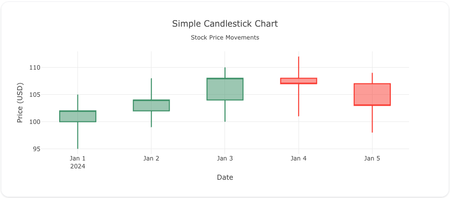
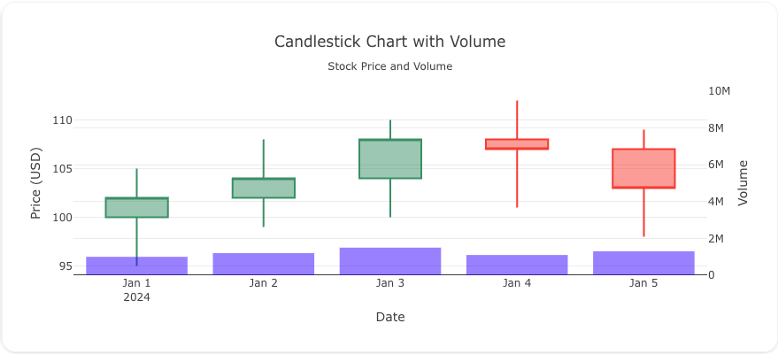
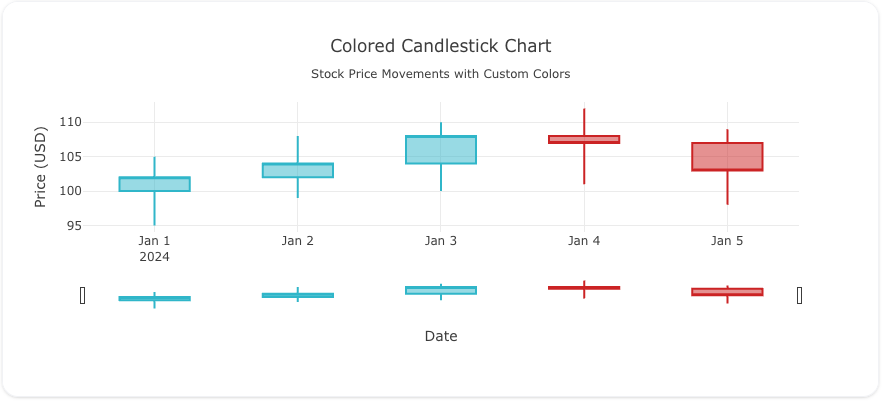

---
search:
  exclude: true
---
<!--start--> 
## Overview

The `candlestick` trace type is commonly used in financial analysis to visualize the price movements of a stock or asset over time. It requires open, high, low, and close (OHLC) data and is useful for tracking the performance of a stock or identifying market trends.

You can control the appearance of candlestick charts through attributes such as `increasing`, `decreasing`, `line`, `fillcolor`, and more to highlight upward and downward trends in the market.

!!! tip "Common Uses"

    - **Stock Market Analysis**: Visualizing the performance of stocks over time.
    - **Trend Identification**: Identifying market trends such as uptrends, downtrends, or reversals.
    - **Price Fluctuation Visualization**: Showing how stock prices move within a specific time period (daily, weekly, etc.).

_**Check out the [Attributes](../configuration/Trace/Props/Candlestick/#attributes) for the full set of configuration options**_

## Examples


!!! example "Common Configurations"

    === "Simple Candlestick Plot"

        Here's a simple `candlestick` plot showing stock price movements over a period:

        

        You can copy this code below to create this chart in your project:

        ```yaml
        models:
          - name: stock-data
            args:
              - echo
              - |
                date,open,high,low,close
                2024-01-01,100,105,95,102
                2024-01-02,102,108,99,104
                2024-01-03,104,110,100,108
                2024-01-04,108,112,101,107
                2024-01-05,107,109,98,103
        traces:
          - name: Simple Candlestick Plot
            model: ref(stock-data)
            props:
              type: candlestick
              x: ?{date}
              open: ?{open}
              high: ?{high}
              low: ?{low}
              close: ?{close}
        charts:
          - name: Simple Candlestick Chart
            traces:
              - ref(Simple Candlestick Plot)
            layout:
              title:
                text: Simple Candlestick Chart<br><sub>Stock Price Movements</sub>
              xaxis:
                rangeslider:
                  visible: false
                title:
                  text: "Date"
              yaxis:
                title:
                  text: "Price (USD)"
        ```

    === "Candlestick Plot with Volume"

        This example includes both candlestick data and volume, providing additional insights into the market activity:

        

        Here's the code:

        ```yaml
        models:
          - name: stock-data-with-volume
            args:
              - echo
              - |
                date,open,high,low,close,volume
                2024-01-01,100,105,95,102,1000000
                2024-01-02,102,108,99,104,1200000
                2024-01-03,104,110,100,108,1500000
                2024-01-04,108,112,101,107,1100000
                2024-01-05,107,109,98,103,1300000
        traces:
          - name: Candlestick Plot with Volume
            model: ref(stock-data-with-volume)
            props:
              type: candlestick
              x: ?{date}
              open: ?{open}
              high: ?{high}
              low: ?{low}
              close: ?{close}
          - name: Volume Trace
            model: ref(stock-data-with-volume)
            props:
              type: bar
              x: ?{date}
              y: ?{volume}
              yaxis: "y2"
              marker:
                opacity: .5
                color: 'blue'
        charts:
          - name: Candlestick Chart with Volume
            traces:
              - ref(Candlestick Plot with Volume)
              - ref(Volume Trace)
            layout:
              showlegend: false
                
              title:
                text: Candlestick Chart with Volume<br><sub>Stock Price and Volume</sub>
              xaxis:
                title:
                  text: "Date"
                rangeslider: 
                  visible: false
              yaxis:
                title:
                  text: "Price (USD)"

              yaxis2:
                title:
                  text: "Volume"
                overlaying: "y"
                side: "right"
                range: [0, 10000000]
        ```

    === "Colored Candlestick Plot"

        Here's a candlestick chart with customized colors for increasing and decreasing stock prices:

        

        You can copy this code below to create this chart in your project:

        ```yaml
        models:
          - name: stock-data-colored
            args:
              - echo
              - |
                date,open,high,low,close
                2024-01-01,100,105,95,102
                2024-01-02,102,108,99,104
                2024-01-03,104,110,100,108
                2024-01-04,108,112,101,107
                2024-01-05,107,109,98,103
        traces:
          - name: Colored Candlestick Plot
            model: ref(stock-data-colored)
            props:
              type: candlestick
              x: ?{date}
              open: ?{open}
              high: ?{high}
              low: ?{low}
              close: ?{close}
              increasing:
                line:
                  color: "#17becf"
              decreasing:
                line:
                  color: "#d62728"
        charts:
          - name: Candlestick with Custom Colors
            traces:
              - ref(Colored Candlestick Plot)
            layout:
              title:
                text: Colored Candlestick Chart<br><sub>Stock Price Movements with Custom Colors</sub>
              xaxis:
                title:
                  text: "Date"
              yaxis:
                title:
                  text: "Price (USD)"
        ```


<!--end-->