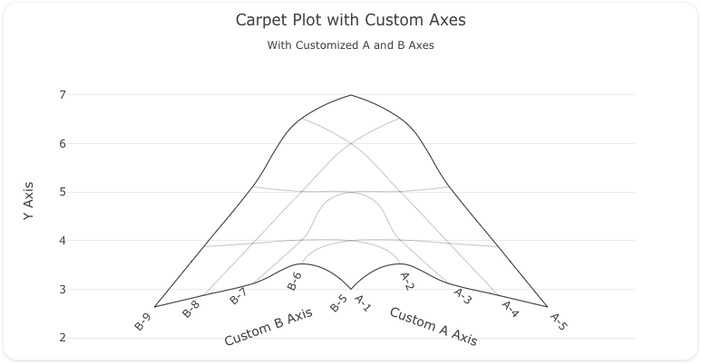

---
search:
  exclude: true
---
<!--start-->
## Overview

The `carpet` trace type is used to create carpet plots, which can be useful for visualizing data across irregular spaces or non-grid-like arrangements. Carpet plots are **commonly employed in complex datasets** that span two independent variables, such as pressure and temperature or other bivariate datasets.

Carpet traces provide you with control over the X and Y axes, as well as customization of the A and B axes (the independent variables). You can also use a variety of formatting options, including line, color, and axis ticks to enhance the visualization.

!!! tip "Common Uses"

    - **Distortion Analysis**: Visualizing data across irregular spaces, such as in physics or engineering.
    - **Bivariate Data Visualization**: Displaying complex relationships between two independent variables.
    - **Gridless Data Representation**: Visualizing data that doesn't fit neatly into grid-like structures.

_**Check out the [Attributes](../configuration/Trace/Props/Carpet/#attributes) for the full set of configuration options**_

## Examples


!!! example "Common Configurations"

    === "Carpet Grid"

        Here's a simple(ish) `carpet` plot showing data across two independent variables (A and B):

        

        You can copy this code below to create this chart in your project:

        ```yaml
        models:
          - name: carpet-data-axes
            args:
              - echo
              - |
                a,b,x,y
                1,5,2,3
                2,6,3,4
                3,7,4,5
                4,8,5,6
                5,9,6,7
        traces:
          - name: Carpet Plot with Custom Axes
            model: ${ref(carpet-data-axes)}
            props:
              type: carpet
              a: ?{a}
              b: ?{b}
              y: ?{y}
              aaxis:
                title:
                  text: "Custom A Axis"
                tickprefix: "A-"
              baxis:
                title:
                  text: "Custom B Axis"
                tickprefix: "B-"
        charts:
          - name: Simple Carpet Chart
            traces:
              - ${ref(Carpet Plot with Custom Axes)}
            layout:
              title:
                text: Carpet Plot with Custom Axes<br><sub>With Customized A and B Axes</sub>
              xaxis:
                title:
                  text: "X Axis"
              yaxis:
                title:
                  text: "Y Axis"
              margin: 
                b: 0
                r: 70
                l: 70
                t: 50
        ```


<!--end-->