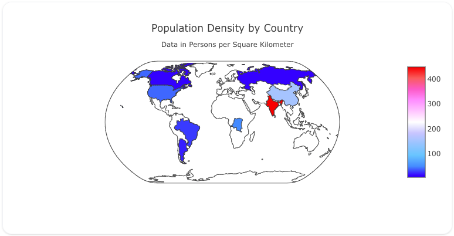

## Overview

The `choropleth` trace type is used to create choropleth maps, which represent data through color intensity across different geographic regions. This trace is commonly used to display data such as population density, election results, or any data that can be associated with geographic regions.

The `choropleth` trace allows you to control the region coloring based on a variable, and you can customize the map's appearance using color scales, hover labels, and other styling options.

!!! tip "Common Uses"

    - **Geographic Data Visualization**: Showing data distributions across countries, states, or other regions.
    - **Density Mapping**: Displaying population or other density metrics across regions.
    - **Thematic Mapping**: Creating maps that represent different data points based on a color gradient (e.g., GDP, COVID-19 cases).

_**Check out the [Attributes](../configuration/Trace/Props/Choropleth/#attributes) for the full set of configuration options**_

## Examples


!!! example "Common Configurations"

    === "Simple Choropleth Map"

        Here's a simple `choropleth` map showing population density across different countries:

        

        You can copy this code below to create this chart in your project:

        ```yaml
        models:
          - name: country-population-data
            args:
              - echo
              - |
                country,population_density
                USA,38 
                BRA,25
                ARG,17
                UK,286
                CAN,4
                RUS,9
                CHN,153
                IND,450
                COD,48
        traces:
          - name: Simple Choropleth Map Trace
            model: ref(country-population-data)
            props:
              type: choropleth
              locations: query(country)
              z: query(population_density)
              colorscale: "Picnic"
        charts:
          - name: Simple Choropleth Map
            traces:
              - ref(Simple Choropleth Map Trace)
            layout:
              title:
                text: Population Density by Country<br><sub>Data in Persons per Square Kilometer</sub>
              geo:
                showcoastlines: true
                projection:
                  type: "natural earth"
        ```



