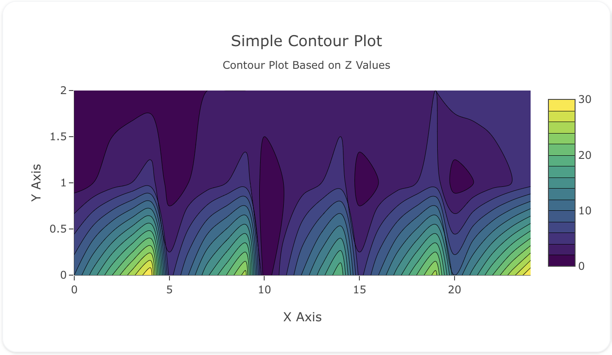
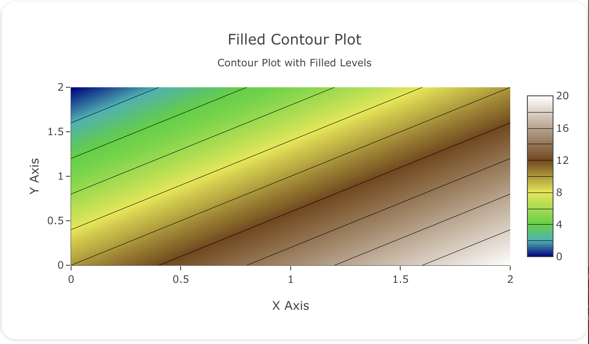
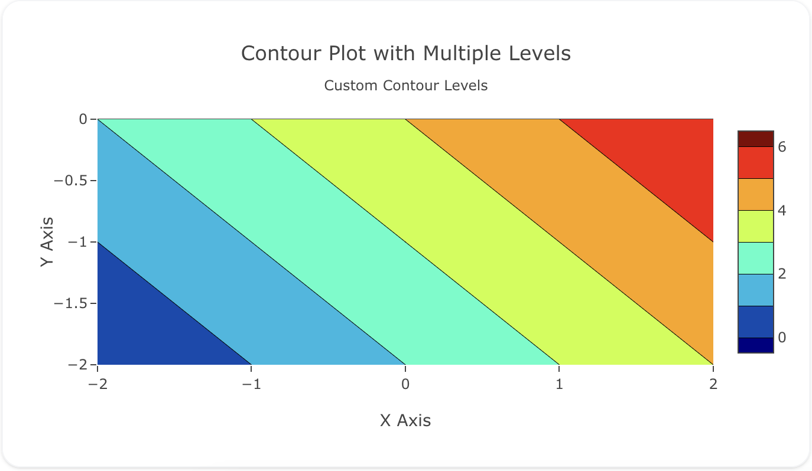

---
search:
  exclude: true
---
<!--start-->
## Overview

The `contour` trace type is used to create contour plots, which are useful for visualizing three-dimensional data in two dimensions. Contour plots are often used to represent things like elevation, temperature, or pressure distributions. The trace uses a matrix of Z values and optional X and Y coordinates to create a continuous representation of the data.

Contour traces allow you to customize line colors, fill colors, and the number of contour levels to highlight data variation.

!!! tip "Common Uses"
    - **Topographic Maps**: Visualizing elevation levels across a geographic area.
    - **Heat or Temperature Maps**: Displaying temperature distributions over a surface.
    - **Electromagnetic Fields**: Representing the strength of a field at various points.
    - **Pressure Levels**: Visualizing pressure across different areas in meteorology.

_**Check out the [Attributes](../configuration/Trace/Props/Contour/#attributes) for the full set of configuration options**_

## Examples


!!! example "Common Configurations"

    === "Simple Contour Plot"

        Here's a simple `contour` plot showing a basic grid of Z values, where X and Y represent spatial data:

        

        You can copy this code below to create this chart in your project:

        ```yaml
        models:
          - name: contour-data
            args:
              - echo
              - |
                x,y,z
                1,1,10
                2,1,15
                3,1,20
                4,1,25
                5,1,30
                1,2,5
                2,2,10
                3,2,15
                4,2,20
                5,2,25
                1,3,0
                2,3,5
                3,3,10
                4,3,15
                5,3,20
                1,4,5
                2,4,10
                3,4,15
                4,4,20
                5,4,25
                1,5,10
                2,5,15
                3,5,20
                4,5,25
                5,5,30
        traces:
          - name: Simple Contour Plot
            model: ref(contour-data)
            props:
              type: contour
              z: 
                - ?{x}
                - ?{y}
                - ?{z}
              colorscale: "Viridis"
              ncontours: 20
        charts:
          - name: Simple Contour Chart
            traces:
              - ref(Simple Contour Plot)
            layout:
              title:
                text: Simple Contour Plot<br><sub>Contour Plot Based on Z Values</sub>
              xaxis:
                title:
                  text: "X Axis"
              yaxis:
                title:
                  text: "Y Axis"
        ```

    === "Filled Contour Plot"

        This example shows a contour plot with filled contours, where each level is shaded with a different color:

        

        Here's the code:

        ```yaml
        models:
          - name: contour-data-filled
            args:
              - echo
              - |
                x,y,z
                0,0,10
                1,0,15
                2,0,20
                3,0,25
                4,0,30
                0,1,5
                1,1,10
                2,1,15
                3,1,20
                4,1,25
                0,2,0
                1,2,5
                2,2,10
                3,2,15
                4,2,20
                0,3,5
                1,3,10
                2,3,15
                3,3,20
                4,3,25
                0,4,10
                1,4,15
                2,4,20
                3,4,25
                4,4,30
        traces:
          - name: Filled Contour Plot
            model: ref(contour-data-filled)
            props:
              type: contour
              x: ?{x}
              y: ?{y}
              z: ?{z}
              colorscale: "Earth"
              contours:
                coloring: "heatmap"
                showlines: true
              ncontours: 25
        charts:
          - name: Filled Contour Chart
            traces:
              - ref(Filled Contour Plot)
            layout:
              title:
                text: Filled Contour Plot<br><sub>Contour Plot with Filled Levels</sub>
              xaxis:
                title:
                  text: "X Axis"
              yaxis:
                title:
                  text: "Y Axis"
        ```

    === "Contour Plot with Multiple Levels"

        This example demonstrates how to customize the contour levels by specifying a set number of levels:

        

        Here's the code:

        ```yaml
        models:
          - name: contour-data-multi
            args:
              - echo
              - |
                x,y,z
                -3,-3,0
                -2,-3,1
                -1,-3,2
                0,-3,3
                1,-3,4
                2,-3,5
                3,-3,6
                -3,-2,1
                -2,-2,2
                -1,-2,3
                0,-2,4
                1,-2,5
                2,-2,6
                3,-2,7
                -3,-1,2
                -2,-1,3
                -1,-1,4
                0,-1,5
                1,-1,6
                2,-1,7
                3,-1,8
                -3,0,3
                -2,0,4
                -1,0,5
                0,0,6
                1,0,7
                2,0,8
                3,0,9
                -3,1,4
                -2,1,5
                -1,1,6
                0,1,7
                1,1,8
                2,1,9
                3,1,10
                -3,2,5
                -2,2,6
                -1,2,7
                0,2,8
                1,2,9
                2,2,10
                3,2,11
                -3,3,6
                -2,3,7
                -1,3,8
                0,3,9
                1,3,10
                2,3,11
                3,3,12
        traces:
          - name: Contour Plot with Multiple Levels
            model: ref(contour-data-multi)
            props:
              type: contour
              x: ?{x}
              y: ?{y}
              z: ?{z}
              colorscale: "Jet"
              contours:
                start: 0
                end: 12
                size: 0.5
              ncontours: 24
        charts:
          - name: Contour Chart with Multiple Levels
            traces:
              - ref(Contour Plot with Multiple Levels)
            layout:
              title:
                text: Contour Plot with Multiple Levels<br><sub>Custom Contour Levels</sub>
              xaxis:
                title:
                  text: "X Axis"
              yaxis:
                title:
                  text: "Y Axis"
        ```


<!--end-->