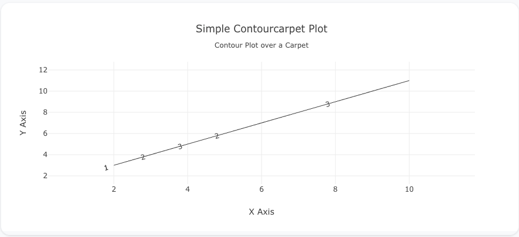
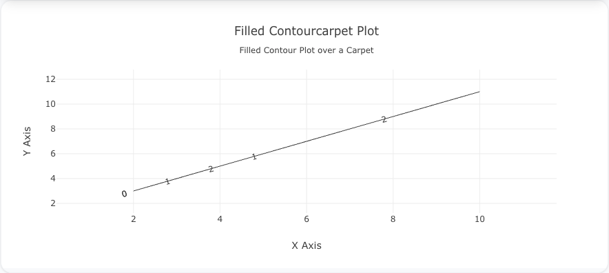
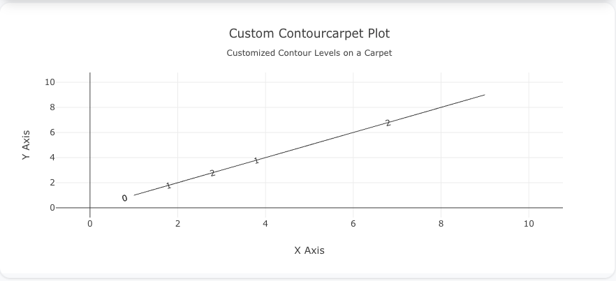

---
search:
  exclude: true
---
<!--start-->
## Overview

The `contourcarpet` trace type is used to create contour plots over a carpet plot. It combines the advantages of contour plots with the flexible grid system of carpet plots. This trace is useful for visualizing 3D data on non-uniform or irregular grids, often seen in engineering, physics, or other technical applications.

You can control contour levels, colors, and other properties to display data patterns over an underlying carpet plot.

!!! tip "Common Uses"
    - **Distorted Grids**: Visualizing data over irregular grids or non-linear spaces.
    - **Engineering Data**: Representing data that spans across irregular dimensions.
    - **Multivariate Visualization**: Handling data with multiple independent variables.

_**Check out the [Attributes](../configuration/Trace/Props/ContourCarpet/#attributes) for the full set of configuration options**_

## Examples


!!! example "Common Configurations"

    === "Simple Contourcarpet Plot"

        Here's a simple `contourcarpet` plot showing a contour over a basic carpet plot:

        

        You can copy this code below to create this chart in your project:

        ```yaml
        models:
          - name: contourcarpet-data
            args:
              - echo
              - |
                a,b,x,y,z
                1,1,2,3,10
                2,1,3,4,15
                3,1,4,5,20
                1,2,5,6,25
                2,2,6,7,30
                3,2,7,8,35
                1,3,8,9,40
                2,3,9,10,45
                3,3,10,11,50
        traces:
          - name: Carpet Plot
            model: ref(contourcarpet-data)
            props:
              type: carpet
              a: ?{a}
              b: ?{b}
              x: ?{x}
              y: ?{y}
          - name: Simple Contourcarpet Plot
            model: ref(contourcarpet-data)
            props:
              type: contourcarpet
              carpet: ref(Carpet Plot)
              z: ?{z}
              colorscale: "Viridis"
        charts:
          - name: Simple Contourcarpet Chart
            traces:
              - ref(Simple Contourcarpet Plot)
              - ref(Carpet Plot)
            layout:
              title:
                text: Simple Contourcarpet Plot<br><sub>Contour Plot over a Carpet</sub>
              xaxis:
                title:
                  text: "X Axis"
              yaxis:
                title:
                  text: "Y Axis"
        ```

    === "Filled Contourcarpet Plot"

        This example shows a filled contourcarpet plot, where the contours are filled with colors:

        

        Here's the code:

        ```yaml
        models:
          - name: contourcarpet-data-filled
            args:
              - echo
              - |
                a,b,x,y,z
                0,0,2,3,5
                1,0,3,4,10
                2,0,4,5,15
                0,1,5,6,20
                1,1,6,7,25
                2,1,7,8,30
                0,2,8,9,35
                1,2,9,10,40
                2,2,10,11,45
        traces:
          - name: Carpet Plot Filled
            model: ref(contourcarpet-data-filled)
            props:
              type: carpet
              a: ?{a}
              b: ?{b}
              x: ?{x}
              y: ?{y}
          - name: Filled Contourcarpet Plot
            model: ref(contourcarpet-data-filled)
            props:
              type: contourcarpet
              carpet: ref(Carpet Plot Filled)
              z: ?{z}
              colorscale: "Earth"
              contours:
                coloring: "heatmap"
                showlines: true
        charts:
          - name: Filled Contourcarpet Chart
            traces:
              - ref(Filled Contourcarpet Plot)
              - ref(Carpet Plot Filled)
            layout:
              title:
                text: Filled Contourcarpet Plot<br><sub>Filled Contour Plot over a Carpet</sub>
              xaxis:
                title:
                  text: "X Axis"
              yaxis:
                title:
                  text: "Y Axis"
        ```

    === "Contourcarpet with Custom Contour Levels"

        This example demonstrates how to customize contour levels and coloring in a `contourcarpet` plot:

        

        Here's the code:

        ```yaml
        models:
          - name: contourcarpet-data-custom
            args:
              - echo
              - |
                a,b,x,y,z
                0,0,1,1,10
                1,0,2,2,20
                2,0,3,3,30
                0,1,4,4,40
                1,1,5,5,50
                2,1,6,6,60
                0,2,7,7,70
                1,2,8,8,80
                2,2,9,9,90
        traces:
          - name: Carpet Plot Custom
            model: ref(contourcarpet-data-custom)
            props:
              type: carpet
              a: ?{a}
              b: ?{b}
              x: ?{x}
              y: ?{y}
          - name: Custom Contourcarpet Plot
            model: ref(contourcarpet-data-custom)
            props:
              type: contourcarpet
              carpet: ref(Carpet Plot Custom)
              z: ?{z}
              colorscale: "Jet"
              contours:
                start: 10
                end: 90
                size: 10
        charts:
          - name: Custom Contourcarpet Chart
            traces:
              - ref(Custom Contourcarpet Plot)
              - ref(Carpet Plot Custom)
            layout:
              title:
                text: Custom Contourcarpet Plot<br><sub>Customized Contour Levels on a Carpet</sub>
              xaxis:
                title:
                  text: "X Axis"
              yaxis:
                title:
                  text: "Y Axis"
        ```


<!--end-->