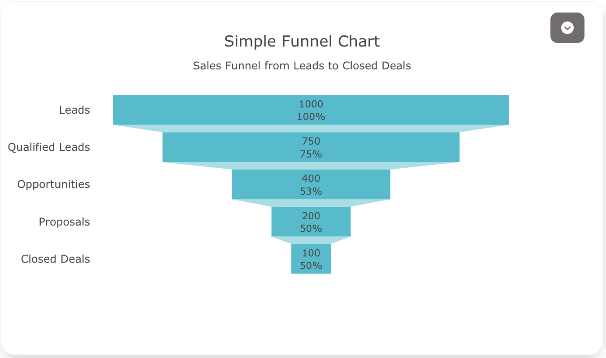
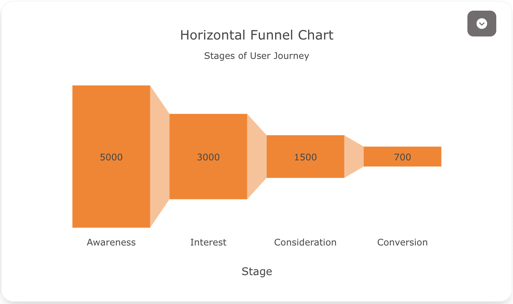
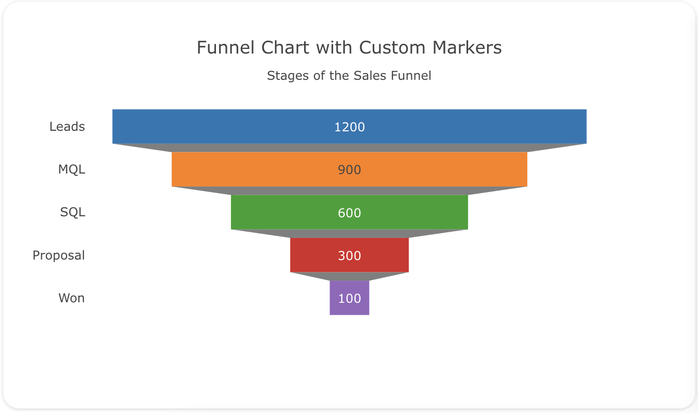
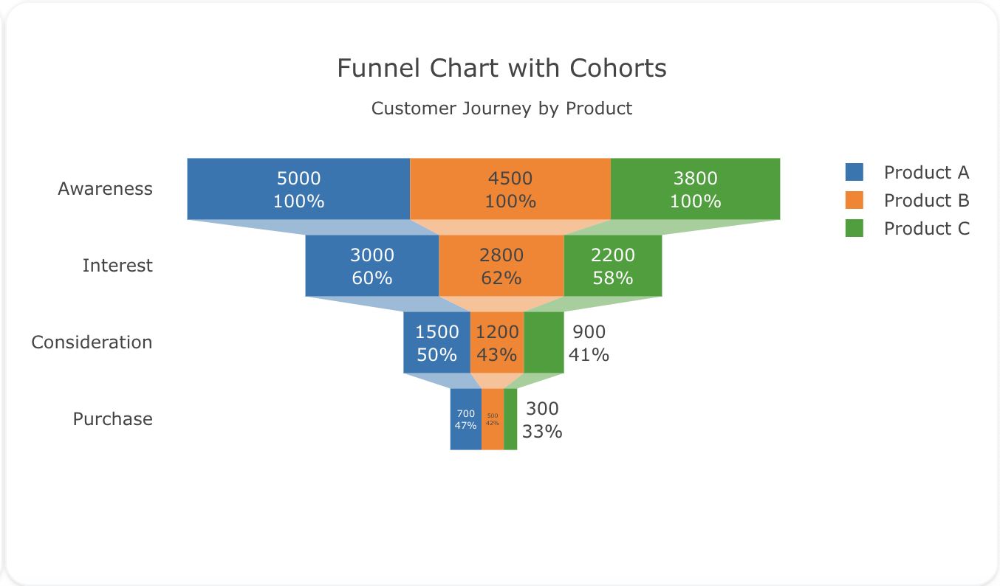

---
search:
  exclude: true
---
<!--start-->
## Overview

The `funnel` trace type is used to create funnel charts, which visualize data across stages in a process. Funnel charts are often used in sales or marketing to show how data decreases as it passes through each stage (e.g., from leads to closed deals).

You can control the orientation, marker styles, and colors to better represent your data flow. Funnel charts help in identifying bottlenecks or drop-off points in a process.

!!! tip "Common Uses"
    - **Sales Funnels**: Tracking the stages from lead generation to closing a deal.
    - **Conversion Funnels**: Visualizing the steps in a user journey and where drop-offs occur.
    - **Progression Through Stages**: Representing data at different stages of a sequential process.

_**Check out the [Attributes](../configuration/Trace/Props/Funnel/#attributes) for the full set of configuration options**_

## Examples


!!! example "Common Configurations"

    === "Simple Funnel Plot"

        Here's a simple `funnel` chart showing data as it moves through various stages:

        

        You can copy this code below to create this chart in your project:

        ```yaml
        models:
          - name: funnel-data
            args:
              - echo
              - |
                stage,value
                Leads,1000
                Qualified Leads,750
                Opportunities,400
                Proposals,200
                Closed Deals,100
        traces:
          - name: Simple Funnel Plot
            model: ${ref(funnel-data)}
            props:
              type: funnel
              y: ?{stage}
              x: ?{value}
              textinfo: "value+percent previous"
              marker:
                color: "#17becf"
            order_by: 
              - ?{value desc}
        charts:
          - name: Simple Funnel Chart
            traces:
              - ${ref(Simple Funnel Plot)}
            layout:
              title:
                text: Simple Funnel Chart<br><sub>Sales Funnel from Leads to Closed Deals</sub>
              xaxis:
                title:
                  text: "Stage"
              margin: 
                l: 100
        ```

    === "Horizontal Funnel Chart"

        This example demonstrates a horizontal funnel chart, with stages represented along the x-axis:

        

        Here's the code:

        ```yaml
        models:
          - name: funnel-data-horizontal
            args:
              - echo
              - |
                stage,value
                Awareness,5000
                Interest,3000
                Consideration,1500
                Conversion,700
        traces:
          - name: Horizontal Funnel Chart Trace
            model: ${ref(funnel-data-horizontal)}
            props:
              type: funnel
              orientation: v
              x: ?{stage}
              y: ?{value}
              marker:
                color: "#ff7f0e"
            order_by: 
              - ?{value desc}
        charts:
          - name: Horizontal Funnel Chart
            traces:
              - ${ref(Horizontal Funnel Chart Trace)}
            layout:
              title:
                text: Horizontal Funnel Chart<br><sub>Stages of User Journey</sub>
              xaxis:
                title:
                  text: "Stage"
        ```

    === "Funnel Chart with Custom Markers"

        Here's a funnel chart where each stage has a different color to highlight distinct phases in the process:

        

        You can copy this code below to create this chart in your project:

        ```yaml
        models:
          - name: funnel-data-custom
            args:
              - echo
              - |
                stage,value,color
                Leads,1200,"#1f77b4"
                MQL,900,"#ff7f0e"
                SQL,600,"#2ca02c"
                Proposal,300,"#d62728"
                Won,100,"#9467bd"
        traces:
          - name: Custom Markers Funnel Chart
            model: ${ref(funnel-data-custom)}
            props:
              type: funnel
              y: ?{stage}
              x: ?{value}
              marker:
                color: ?{color}
              textinfo: "value+percent"
              orientation: h
            order_by: 
              - ?{value desc}
        charts:
          - name: Funnel Chart with Custom Markers
            traces:
              - ${ref(Custom Markers Funnel Chart)}
            layout:
              title:
                text: Funnel Chart with Custom Markers<br><sub>Stages of the Sales Funnel</sub>
              xaxis:
                title:
                  text: "Stage"
        ```

    === "Funnel Chart with Cohorts"

        This example demonstrates a funnel chart using cohorts to compare the customer journey across different products:

        

        Here's the code:

        ```yaml
        models:
          - name: funnel-data-cohorts
            args:
              - echo
              - |
                stage,value,product
                Awareness,5000,Product A
                Interest,3000,Product A
                Consideration,1500,Product A
                Purchase,700,Product A
                Awareness,4500,Product B
                Interest,2800,Product B
                Consideration,1200,Product B
                Purchase,500,Product B
                Awareness,3800,Product C
                Interest,2200,Product C
                Consideration,900,Product C
                Purchase,300,Product C
        traces:
          - name: Cohort Funnel Chart
            model: ${ref(funnel-data-cohorts)}
            cohort_on: product
            props:
              type: funnel
              y: ?{stage}
              x: ?{value}
              textinfo: "value+percent previous"
              marker:
                colorscale: "Viridis"
            order_by: 
              - ?{ product }
              - ?{ value desc}
        charts:
          - name: Funnel Chart with Cohorts
            traces:
              - ${ref(Cohort Funnel Chart)}
            layout:
              title:
                text: Funnel Chart with Cohorts<br><sub>Customer Journey by Product</sub>
              margin: 
                l: 100
        ```

        This example uses the `cohort_on` attribute to create separate funnel charts for each product, allowing for easy comparison of the customer journey across different products.


<!--end-->