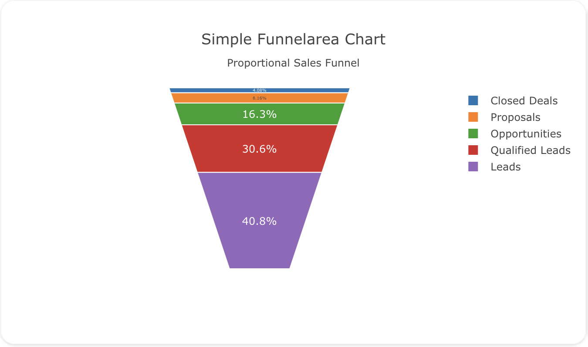
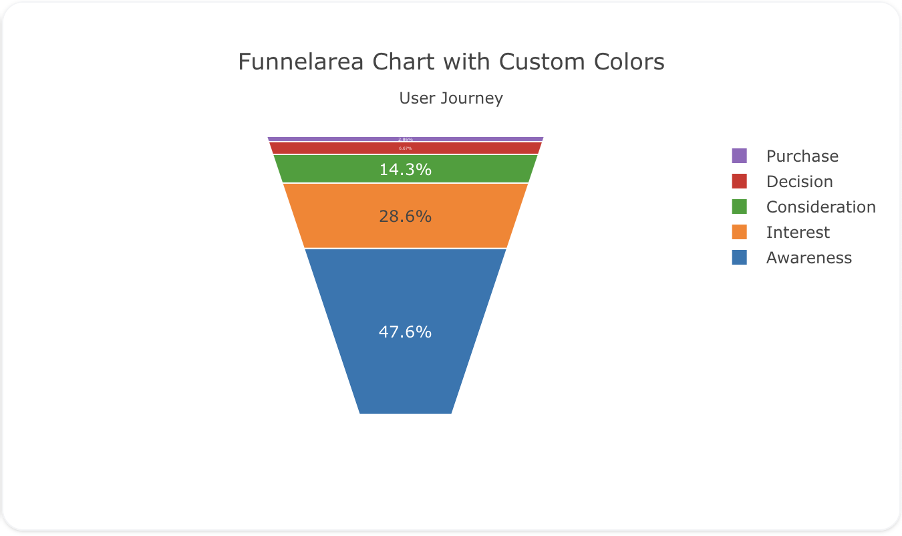
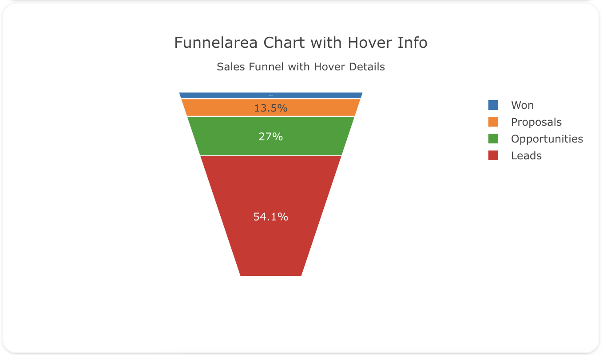

---
search:
  exclude: true
---
<!--start-->
## Overview

The `funnelarea` trace type is used to create funnel area charts, which are similar to funnel charts but are represented as a circular area instead of a linear progression. Funnel area charts are useful for comparing stages in a process with proportional sizes. Each stage is represented as a sector of a circle, and its size represents the magnitude of the data.

You can control the colors, labels, and orientation of the funnel area sections to visualize proportional data across different stages.

!!! tip "Common Uses"
    - **Proportional Stages**: Showing the proportion of data at each stage in a circular format.
    - **Conversion Rates**: Visualizing the drop-off rates in different stages of a process.
    - **Sales and Marketing Funnels**: Representing funnels like leads-to-sales in a circular format.

_**Check out the [Attributes](../configuration/Trace/Props/Funnelarea/#attributes) for the full set of configuration options**_

## Examples


!!! example "Common Configurations"

    === "Simple Funnelarea Plot"

        Here's a simple `funnelarea` plot showing data in a circular funnel format:

        

        You can copy this code below to create this chart in your project:

        ```yaml
        models:
          - name: funnelarea-data
            args:
              - echo
              - |
                stage,value
                Leads,1000
                Qualified Leads,750
                Opportunities,400
                Proposals,200
                Closed Deals,100
        traces:
          - name: Simple Funnelarea Plot
            model: ${ref(funnelarea-data)}
            props:
              type: funnelarea
              labels: ?{stage}
              values: ?{value}
        charts:
          - name: Simple Funnelarea Chart
            traces:
              - ${ref(Simple Funnelarea Plot)}
            layout:
              title:
                text: Simple Funnelarea Chart<br><sub>Proportional Sales Funnel</sub>
        ```

    === "Funnelarea with Custom Colors"

        This example shows a `funnelarea` plot where each stage has a custom color for better differentiation:

        

        Here's the code:

        ```yaml
        models:
          - name: funnelarea-data-custom
            args:
              - echo
              - |
                stage,value,color
                Awareness,5000,"#1f77b4"
                Interest,3000,"#ff7f0e"
                Consideration,1500,"#2ca02c"
                Decision,700,"#d62728"
                Purchase,300,"#9467bd"
        traces:
          - name: Custom Colors Funnelarea Plot
            model: ${ref(funnelarea-data-custom)}
            props:
              type: funnelarea
              labels: ?{stage}
              values: ?{value}
              marker:
                colors: ?{color}
        charts:
          - name: Funnelarea Chart with Custom Colors
            traces:
              - ${ref(Custom Colors Funnelarea Plot)}
            layout:
              title:
                text: Funnelarea Chart with Custom Colors<br><sub>User Journey</sub>
        ```

    === "Funnelarea with Hover Info"

        This example demonstrates a `funnelarea` plot with hover information to show the value and percentage for each stage:

        

        Here's the code:

        ```yaml
        models:
          - name: funnelarea-data-hover
            args:
              - echo
              - |
                stage,value
                Leads,1000
                Opportunities,500
                Proposals,250
                Won,100
        traces:
          - name: Funnelarea Plot with Hover Info
            model: ${ref(funnelarea-data-hover)}
            props:
              type: funnelarea
              labels: ?{stage}
              values: ?{value}
              hoverinfo: "label+value+percent"
        charts:
          - name: Funnelarea Chart with Hover Info
            traces:
              - ${ref(Funnelarea Plot with Hover Info)}
            layout:
              title:
                text: Funnelarea Chart with Hover Info<br><sub>Sales Funnel with Hover Details</sub>
        ```


<!--end-->