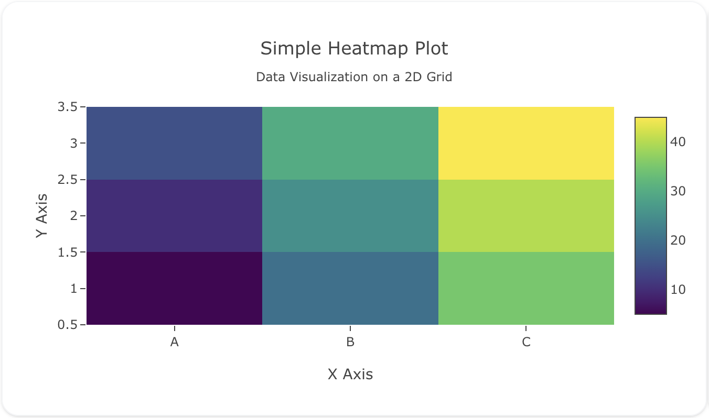
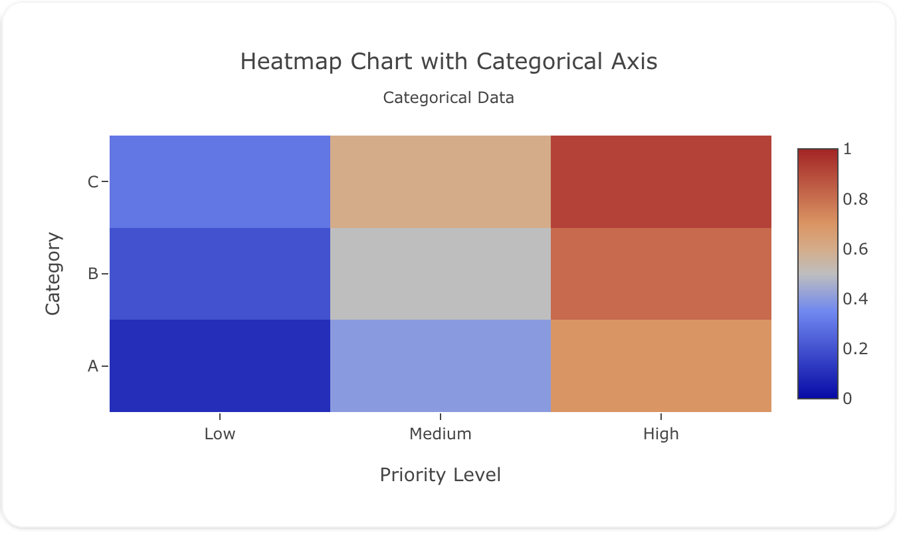
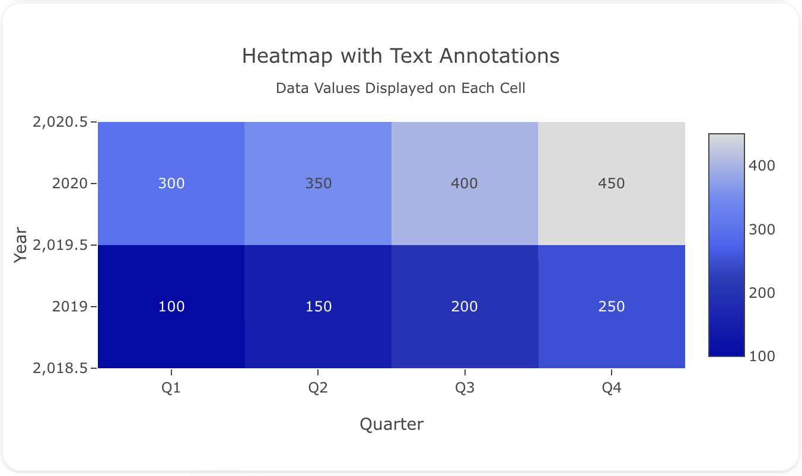

## Overview

The `heatmap` trace type is used to create heatmaps, which represent data using a grid where values are mapped to colors. Heatmaps are commonly used to visualize matrix-like data, such as correlations, intensity, or frequency distributions.

You can customize the colorscale, gridlines, and other properties to fit your data and visualization needs.

!!! tip "Common Uses"
    - **Correlation Matrices**: Visualizing relationships between variables.
    - **Frequency Distributions**: Showing how frequently data points occur across categories.
    - **Geospatial Heatmaps**: Visualizing the density or intensity of occurrences in a 2D space.

_**Check out the [Attributes](../configuration/Trace/Props/Heatmap/#attributes) for the full set of configuration options**_

## Examples


!!! example "Common Configurations"

    === "Simple Heatmap Plot"

        Here's a simple `heatmap` plot showing data values on a 2D grid:

        

        You can copy this code below to create this chart in your project:

        ```yaml
        models:
          - name: heatmap-data
            args:
              - echo
              - |
                x,y,z
                A,1,5
                A,2,10
                A,3,15
                B,1,20
                B,2,25
                B,3,30
                C,1,35
                C,2,40
                C,3,45
        traces:
          - name: Simple Heatmap Plot
            model: ref(heatmap-data)
            props:
              type: heatmap
              x: query(x)
              y: query(y)
              z: query(z)
              colorscale: "Viridis"
        charts:
          - name: Simple Heatmap Chart
            traces:
              - ref(Simple Heatmap Plot)
            layout:
              title:
                text: Simple Heatmap Plot<br><sub>Data Visualization on a 2D Grid</sub>
              xaxis:
                title:
                  text: "X Axis"
              yaxis:
                title:
                  text: "Y Axis"
        ```

    === "Heatmap with Categorical Axis"

        This example shows a `heatmap` plot with non-numeric x and y axis. 

        

        Here's the code:

        ```yaml
        models:
          - name: heatmap-data-custom
            args:
              - echo
              - |
                x,y,z
                Low,A,0.1
                Low,B,0.2
                Low,C,0.3
                Medium,A,0.4
                Medium,B,0.5
                Medium,C,0.6
                High,A,0.7
                High,B,0.8
                High,C,0.9
        traces:
          - name: Heatmap with Custom Colorscale
            model: ref(heatmap-data-custom)
            props:
              type: heatmap
              x: query(x)
              y: query(y)
              z: query(z)
              zmin: 0
              zmax: 1
        charts:
          - name: Heatmap Chart with Categorical Axis
            traces:
              - ref(Heatmap with Custom Colorscale)
            layout:
              title:
                text: Heatmap Chart with Categorical Axis<br><sub>Categorical Data</sub>
              xaxis:
                title:
                  text: "Priority Level"
                type: "category"
              yaxis:
                title:
                  text: "Category"
                type: "category"
        ```

    === "Heatmap with Text Annotations"

        This example demonstrates a heatmap with text annotations, showing the data values on top of each heatmap cell:

        

        Here's the code:

        ```yaml
        models:
          - name: heatmap-data-annotations
            args:
              - echo
              - |
                x,y,z
                Q1,2019,100
                Q2,2019,150
                Q3,2019,200
                Q4,2019,250
                Q1,2020,300
                Q2,2020,350
                Q3,2020,400
                Q4,2020,450
        traces:
          - name: Heatmap with Text Annotations
            model: ref(heatmap-data-annotations)
            props:
              type: heatmap
              x: query(x)
              y: query(y)
              z: query(z)
              text: query(z)
              texttemplate: "%{text}"
              textfont:
                size: 12
              colorscale: "Blues"
        charts:
          - name: Heatmap Chart with Text Annotations
            traces:
              - ref(Heatmap with Text Annotations)
            layout:
              title:
                text: Heatmap with Text Annotations<br><sub>Data Values Displayed on Each Cell</sub>
              xaxis:
                title:
                  text: "Quarter"
              yaxis:
                title:
                  text: "Year"
        ```


