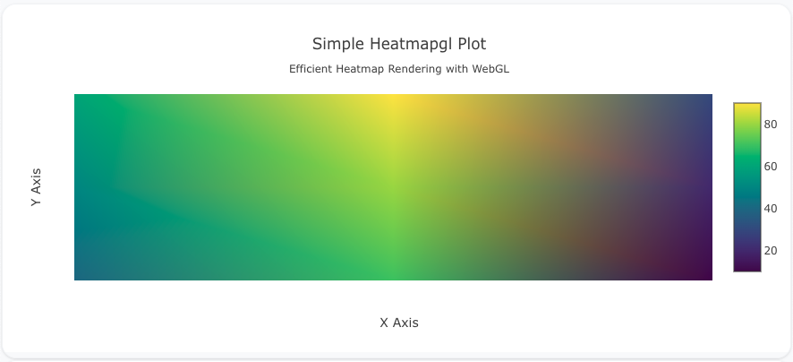
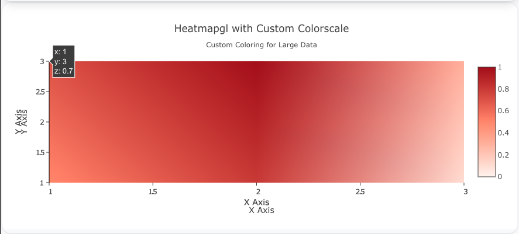
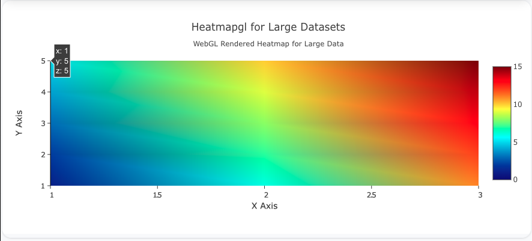

## Overview

The `heatmapgl` trace type is similar to the regular `heatmap` but is rendered using WebGL for faster and more performant rendering of large datasets. This trace type is ideal for heatmaps with many data points, as it leverages GPU acceleration.

You can customize the colorscale, text annotations, and other properties to create high-performance heatmaps for large-scale data.

!!! tip "Common Uses"
    - **High-Performance Heatmaps**: Visualizing large datasets efficiently.
    - **Big Data Visualization**: Rendering heatmaps with thousands or millions of points.
    - **Correlation Matrices & Density Maps**: Displaying data where relationships or density are critical to analyze.

_**Check out the [Attributes](../configuration/Trace/Props/Heatmapgl/#attributes) for the full set of configuration options**_

## Examples


!!! example "Common Configurations"

    === "Simple Heatmapgl Plot"

        Here's a simple `heatmapgl` plot, showing a grid of data values efficiently rendered using WebGL:

        

        You can copy this code below to create this chart in your project:

        ```yaml
        models:
          - name: heatmapgl-data
            args:
              - echo
              - |
                x,y,z
                A,1,10
                A,2,20
                A,3,30
                B,1,40
                B,2,50
                B,3,60
                C,1,70
                C,2,80
                C,3,90
        traces:
          - name: Simple Heatmapgl Plot
            model: ref(heatmapgl-data)
            props:
              type: heatmapgl
              x: query(x)
              y: query(y)
              z: query(z)
              colorscale: "Viridis"
        charts:
          - name: Simple Heatmapgl Chart
            traces:
              - ref(Simple Heatmapgl Plot)
            layout:
              title:
                text: Simple Heatmapgl Plot<br><sub>Efficient Heatmap Rendering with WebGL</sub>
              xaxis:
                title:
                  text: "X Axis"
              yaxis:
                title:
                  text: "Y Axis"
        ```

    === "Heatmapgl with Custom Colorscale"

        This example shows a `heatmapgl` plot with a custom colorscale, providing fine-grained control over the color mapping:

        

        Here's the code:

        ```yaml
        models:
          - name: heatmapgl-data-custom
            args:
              - echo
              - |
                x,y,z
                1,1,0.5
                1,2,0.6
                1,3,0.7
                2,1,0.8
                2,2,0.9
                2,3,1.0
                3,1,0.1
                3,2,0.2
                3,3,0.3
        traces:
          - name: Heatmapgl with Custom Colorscale
            model: ref(heatmapgl-data-custom)
            props:
              type: heatmapgl
              x: query(x)
              y: query(y)
              z: query(z)
              colorscale: [[0, "rgb(255,245,240)"], [0.5, "rgb(252,146,114)"], [1, "rgb(165,15,21)"]]
              zmin: 0
              zmax: 1
        charts:
          - name: Heatmapgl Chart with Custom Colorscale
            traces:
              - ref(Heatmapgl with Custom Colorscale)
            layout:
              title:
                text: Heatmapgl with Custom Colorscale<br><sub>Custom Coloring for Large Data</sub>
              xaxis:
                title:
                  text: "X Axis"
              yaxis:
                title:
                  text: "Y Axis"
        ```

    === "Heatmapgl for Large Datasets"

        Here's a `heatmapgl` plot that demonstrates how WebGL allows efficient rendering of large datasets. This example simulates a larger data set with many points:

        

        Here's the code:

        ```yaml
        models:
          - name: heatmapgl-data-large
            args:
              - echo
              - |
                x,y,z
                1,1,1
                1,2,2
                1,3,3
                1,4,4
                1,5,5
                2,1,6
                2,2,7
                2,3,8
                2,4,9
                2,5,10
                3,1,11
                3,2,12
                3,3,13
                3,4,14
                3,5,15
        traces:
          - name: Heatmapgl for Large Datasets
            model: ref(heatmapgl-data-large)
            props:
              type: heatmapgl
              x: query(x)
              y: query(y)
              z: query(z)
              colorscale: "Jet"
              zmin: 0
              zmax: 15
        charts:
          - name: Heatmapgl Chart for Large Datasets
            traces:
              - ref(Heatmapgl for Large Datasets)
            layout:
              title:
                text: Heatmapgl for Large Datasets<br><sub>WebGL Rendered Heatmap for Large Data</sub>
              xaxis:
                title:
                  text: "X Axis"
              yaxis:
                title:
                  text: "Y Axis"
        ```


