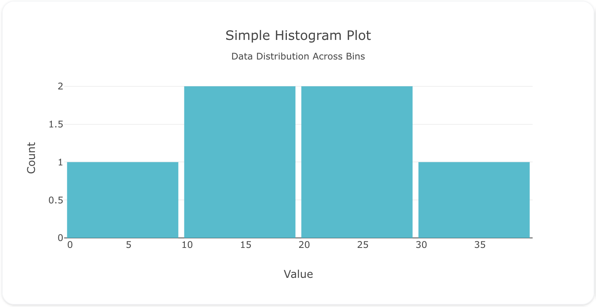
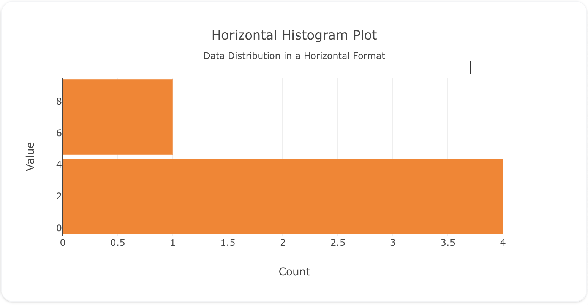
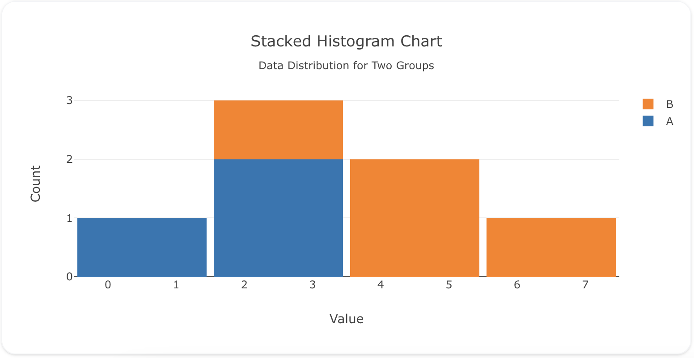

---
search:
  exclude: true
---
<!--start-->
## Overview

The `histogram` trace type is used to create histograms, which represent the distribution of numerical data by dividing the data into bins and counting the number of occurrences in each bin. Histograms are great for understanding data distribution, variability, and patterns.

You can customize bin size, orientation, and colors to fit your data. Histograms are especially useful in statistical analysis, data science, and exploratory data analysis.

!!! tip "Common Uses"
    - **Data Distribution**: Visualizing how data points are distributed across different ranges.
    - **Frequency Analysis**: Showing the frequency of values within specific intervals.
    - **Statistical Summaries**: Understanding the spread, central tendency, and outliers in data.

_**Check out the [Attributes](../configuration/Trace/Props/Histogram/#attributes) for the full set of configuration options**_

## Examples


!!! example "Common Configurations"

    === "Simple Histogram Plot"

        Here's a simple `histogram` plot showing the distribution of data across different bins:

        

        You can copy this code below to create this chart in your project:

        ```yaml
        models:
          - name: histogram-data
            args:
              - echo
              - |
                value
                10
                20
                15
                10
                5
                25
                30
                15
                20
                10
        traces:
          - name: Simple Histogram Plot
            model: ref(histogram-data)
            props:
              type: histogram
              x: ?{value}
              nbinsx: 5
              marker:
                color: "#17becf"
        charts:
          - name: Simple Histogram Chart
            traces:
              - ref(Simple Histogram Plot)
            layout:
              title:
                text: Simple Histogram Plot<br><sub>Data Distribution Across Bins</sub>
              xaxis:
                title:
                  text: "Value"
              yaxis:
                title:
                  text: "Count"
              bargap: 0.05
        ```

    === "Horizontal Histogram Plot"

        This example shows a horizontal `histogram` plot, where the bins are displayed along the y-axis:

        

        Here's the code:

        ```yaml
        models:
          - name: histogram-data-horizontal
            args:
              - echo
              - |
                value
                1
                3
                2
                5
                4
                3
                3
                3
                3
                4
                1
                3
                4
                3
                3
                4
                1
                2
                3
                5
                2
                3
                4
        traces:
          - name: Horizontal Histogram Plot
            model: ref(histogram-data-horizontal)
            props:
              type: histogram
              y: ?{value}
              nbinsy: 2
              marker:
                color: "#ff7f0e"
              orientation: h
        charts:
          - name: Horizontal Histogram Chart
            traces:
              - ref(Horizontal Histogram Plot)
            layout:
              title:
                text: Horizontal Histogram Plot<br><sub>Data Distribution in a Horizontal Format</sub>
              yaxis:
                title:
                  text: "Value"
              xaxis:
                title:
                  text: "Count"
              bargap: 0.05
        ```

    === "Stacked Histogram Plot"

        Here's a stacked `histogram` plot showing the distribution of two different datasets stacked on top of each other:

        

        Here's the code:

        ```yaml
        models:
          - name: histogram-data-stacked
            args:
              - echo
              - |
                group,value
                A,1
                A,2
                A,2
                A,3
                B,3
                B,4
                B,5
                B,5
                B,6
        traces:
          - name: Histogram Groups
            model: ref(histogram-data-stacked)
            cohort_on: '"group"'
            columns: 
              color: |
                case 
                  when "group" = 'A' Then '#1f77b4' 
                  when "group" = 'B' THEN '#ff7f0e' 
                  else null 
                end 
            props:
              type: histogram
              x: ?{value}
              marker:
                color: column(color) 
        charts:
          - name: Stacked Histogram Chart
            traces:
              - ref(Histogram Groups)
            layout:
              title:
                text: Stacked Histogram Chart<br><sub>Data Distribution for Two Groups</sub>
              xaxis:
                title:
                  text: "Value"
              yaxis:
                title:
                  text: "Count"
              barmode: "stack"
              bargap: .05
        ```


<!--end-->