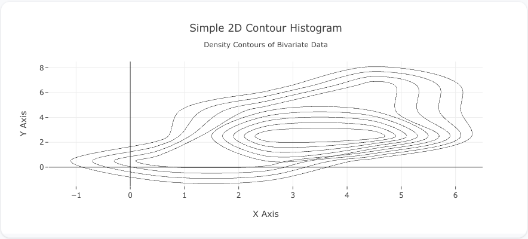
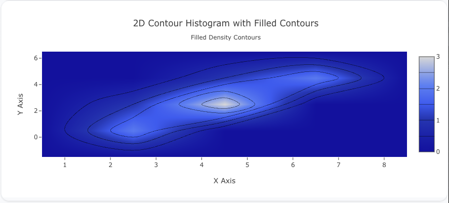
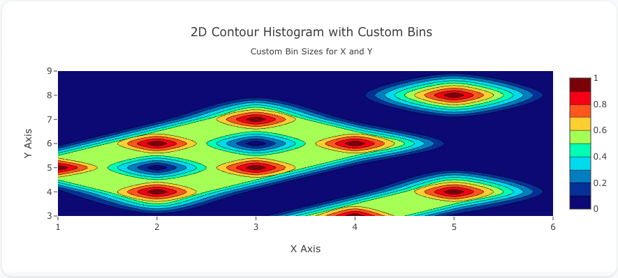

---
search:
  exclude: true
---
<!--start-->
## Overview

The `histogram2dcontour` trace type is used to create 2D contour plots that represent the density of data points across two dimensions. Similar to a 2D histogram, this plot type bins data along the x and y axes but visualizes the density using contour lines instead of filled colors. 

You can customize the binning along both axes, contour lines, and the color mapping to suit your data. This trace type is useful for visualizing patterns and clusters in bivariate data.

!!! tip "Common Uses"
    - **Density Contours**: Showing how data points are distributed and clustered.
    - **Joint Distribution Analysis**: Visualizing the relationship between two variables with density contours.
    - **Bivariate Statistical Analysis**: Analyzing two variables and their joint behavior.

_**Check out the [Attributes](../configuration/Trace/Props/Histogram2DContour/#attributes) for the full set of configuration options**_

## Examples


!!! example "Common Configurations"

    === "Simple 2D Contour Histogram"

        Here's a simple `histogram2dcontour` plot showing the density of data points using contour lines:

        

        You can copy this code below to create this chart in your project:

        ```yaml
        models:
          - name: histogram2dcontour-data
            args:
              - echo
              - |
                x,y
                1,1
                2,3
                3,4
                4,5
                2,1
                3,2
                5,6
                4,2
                5,3
        traces:
          - name: Simple 2D Contour Histogram
            model: ${ref(histogram2dcontour-data)}
            props:
              type: histogram2dcontour
              x: ?{x}
              y: ?{y}
              colorscale: "Viridis"
              contours:
                coloring: "none"
        charts:
          - name: Simple 2D Contour Histogram
            traces:
              - ${ref(Simple 2D Contour Histogram)}
            layout:
              title:
                text: Simple 2D Contour Histogram<br><sub>Density Contours of Bivariate Data</sub>
              xaxis:
                title:
                  text: "X Axis"
              yaxis:
                title:
                  text: "Y Axis"
        ```

    === "2D Contour Histogram with Filled Contours"

        This example demonstrates a `histogram2dcontour` plot with filled contour regions to better visualize data density:

        

        Here's the code:

        ```yaml
        models:
          - name: histogram2dcontour-data-filled
            args:
              - echo
              - |
                x,y
                2,1
                3,2
                4,3
                5,4
                6,5
                3,1
                4,2
                5,3
                6,4
        traces:
          - name: 2D Contour Histogram with Filled Contours
            model: ${ref(histogram2dcontour-data-filled)}
            props:
              type: histogram2dcontour
              x: ?{x}
              y: ?{y}
              colorscale: "Blues"
              contours:
                coloring: "heatmap"
        charts:
          - name: 2D Contour Histogram with Filled Contours
            traces:
              - ${ref(2D Contour Histogram with Filled Contours)}
            layout:
              title:
                text: 2D Contour Histogram with Filled Contours<br><sub>Filled Density Contours</sub>
              xaxis:
                title:
                  text: "X Axis"
              yaxis:
                title:
                  text: "Y Axis"
        ```

    === "2D Contour Histogram with Custom Bins"

        Here's a `histogram2dcontour` plot with custom bin sizes for both the x and y axes, allowing more control over the granularity of the plot:

        

        Here's the code:

        ```yaml
        models:
          - name: histogram2dcontour-data-bins
            args:
              - echo
              - |
                x,y
                1,5
                2,6
                3,7
                2,4
                3,5
                4,6
                5,8
                4,3
                5,4
        traces:
          - name: 2D Contour Histogram with Custom Bins
            model: ${ref(histogram2dcontour-data-bins)}
            props:
              type: histogram2dcontour
              x: ?{x}
              y: ?{y}
              xbins:
                size: 1
              ybins:
                size: 1
              colorscale: "Jet"
        charts:
          - name: 2D Contour Histogram with Custom Bins
            traces:
              - ${ref(2D Contour Histogram with Custom Bins)}
            layout:
              title:
                text: 2D Contour Histogram with Custom Bins<br><sub>Custom Bin Sizes for X and Y</sub>
              xaxis:
                title:
                  text: "X Axis"
              yaxis:
                title:
                  text: "Y Axis"
        ```


<!--end-->