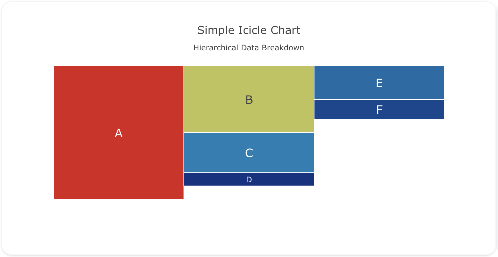
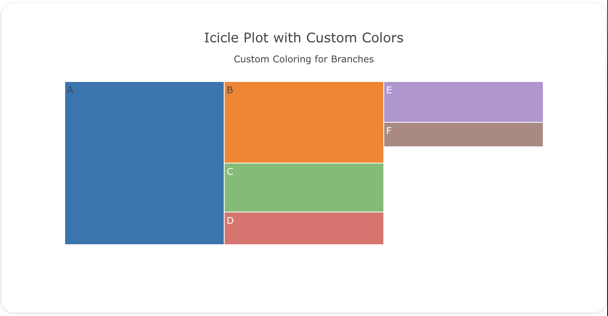
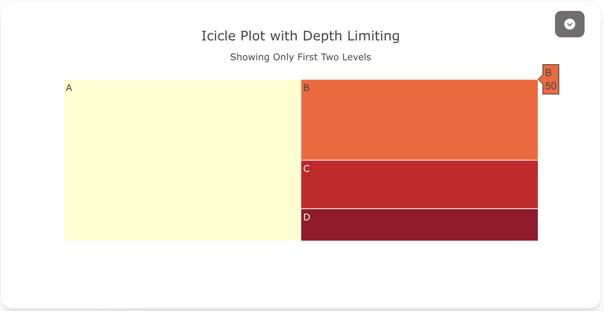

---
search:
  exclude: true
---
<!--start-->
## Overview

The `icicle` trace type is used to create icicle charts, which are a variation of treemap charts but arranged vertically. Icicle charts are useful for visualizing hierarchical data, where each branch represents a part of the whole, and you can drill down into sub-categories.

You can customize the colors, labels, and depth of the icicle chart to represent your hierarchical data effectively.

!!! tip "Common Uses"
    - **Hierarchical Data Representation**: Visualizing categories and subcategories in a hierarchy.
    - **Part-to-Whole Relationships**: Showing how parts relate to the whole, with breakdowns for subcategories.
    - **Drill-Down Analysis**: Allowing users to explore different levels of data.

_**Check out the [Attributes](../configuration/Trace/Props/Icicle/#attributes) for the full set of configuration options**_

## Examples


!!! example "Common Configurations"

    === "Simple Icicle Plot"

        Here's a simple `icicle` plot showing hierarchical data, with branches representing categories:

        

        You can copy this code below to create this chart in your project:

        ```yaml
        models:
          - name: icicle-data
            args:
              - echo
              - |
                category,parent,value
                A,,100
                B,A,50
                C,A,30
                D,A,10
                E,B,25
                F,B,15
        traces:
          - name: Simple Icicle Plot
            model: ref(icicle-data)
            props:
              type: icicle
              labels: ?{category}
              parents: ?{parent}
              values: ?{value}
              branchvalues: "total"
              marker: 
                colorscale: "Portland"
              textposition: "middle center"
              textfont: 
                size: 18
        charts:
          - name: Simple Icicle Chart
            traces:
              - ref(Simple Icicle Plot)
            layout:
              title:
                text: Simple Icicle Chart<br><sub>Hierarchical Data Breakdown</sub>
        ```

    === "Icicle Plot with Custom Colors"

        This example demonstrates a `icicle` plot with custom colors for each branch and leaf node:

        

        Here's the code:

        ```yaml
        models:
          - name: icicle-data-custom
            args:
              - echo
              - |
                category,parent,value,color
                A,,100,"#1f77b4"
                B,A,50,"#ff7f0e"
                C,A,30,"#2ca02c"
                D,A,20,"#d62728"
                E,B,25,"#9467bd"
                F,B,15,"#8c564b"
        traces:
          - name: Custom Colors Icicle Plot
            model: ref(icicle-data-custom)
            props:
              type: icicle
              labels: ?{category}
              parents: ?{parent}
              values: ?{value}
              marker:
                colors: ?{color}
              branchvalues: "total"
        charts:
          - name: Custom Colors Icicle Chart
            traces:
              - ref(Custom Colors Icicle Plot)
            layout:
              title:
                text: Icicle Plot with Custom Colors<br><sub>Custom Coloring for Branches</sub>
        ```

    === "Icicle Plot with Depth Limiting"

        This example shows an `icicle` plot with depth limiting, allowing the user to only see the first two levels of the hierarchy:

        

        Here's the code:

        ```yaml
        models:
          - name: icicle-data-depth
            args:
              - echo
              - |
                category,parent,value
                A,,100
                B,A,50
                C,A,30
                D,A,20
                E,B,25
                F,B,15
        traces:
          - name: Icicle Plot with Depth Limiting Trace
            model: ref(icicle-data-depth)
            props:
              type: icicle
              labels: ?{category}
              parents: ?{parent}
              values: ?{value}
              maxdepth: 2
              branchvalues: "total"
              marker: 
                colorscale: "YlOrRd"
        charts:
          - name: Icicle Plot with Depth Limiting
            traces:
              - ref(Icicle Plot with Depth Limiting Trace)
            layout:
              title:
                text: Icicle Plot with Depth Limiting<br><sub>Showing Only First Two Levels</sub>
        ```

<!--end-->