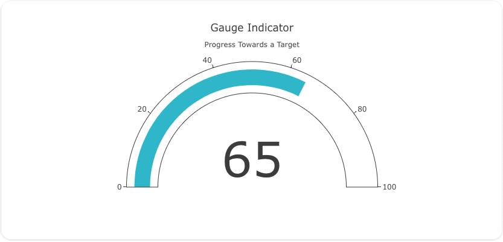
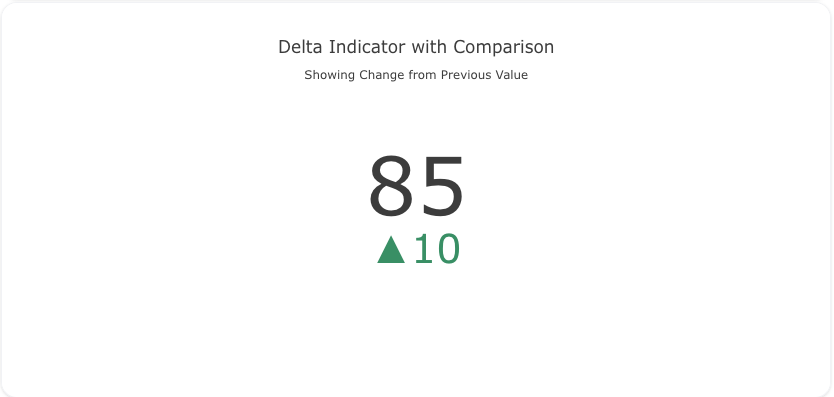

## Overview

The `indicator` trace type is used to create key performance indicator (KPI) visualizations, allowing you to display single or aggregated values in a gauge or numeric format. Indicators are great for showing metrics like progress, performance, or key values at a glance.

You can customize the gauge, delta values, colors, and text annotations to represent your data effectively. Indicator plots are widely used in dashboards and reporting.

!!! tip "Common Uses"
    - **KPI Dashboards**: Displaying key metrics, progress, or performance indicators.
    - **Gauges**: Visualizing values as a gauge to track goals or targets.
    - **Highlighting Change**: Showing the difference between two points in time.

_**Check out the [Attributes](../configuration/Trace/Props/Indicator/#attributes) for the full set of configuration options**_

## Examples


!!! example "Common Configurations"

    === "Simple Numeric Indicator"

        Here's a simple `indicator` plot displaying a single numeric value:

        

        You can copy this code below to create this chart in your project:

        ```yaml
        models:
          - name: indicator-data
            args:
              - echo
              - |
                value
                75
        traces:
          - name: Simple Numeric Indicator
            model: ref(indicator-data)
            props:
              type: indicator
              mode: "number"
              value: query(value)
        charts:
          - name: Simple Numeric Indicator Chart
            traces:
              - ref(Simple Numeric Indicator)
            layout:
              title:
                text: Simple Numeric Indicator<br><sub>Displaying a Single Value</sub>
        ```

    === "Gauge Indicator"

        This example shows a `gauge` indicator to represent a value and its progress toward a goal:

        

        Here's the code:

        ```yaml
        models:
          - name: indicator-data-gauge
            args:
              - echo
              - |
                value
                65
        traces:
          - name: Gauge Indicator
            model: ref(indicator-data-gauge)
            props:
              type: indicator
              mode: "gauge+number"
              value: query(value)
              gauge:
                axis:
                  range: [0, 100]
                bar:
                  color: "#17becf"
        charts:
          - name: Gauge Indicator Chart
            traces:
              - ref(Gauge Indicator)
            layout:
              title:
                text: Gauge Indicator<br><sub>Progress Towards a Target</sub>
        ```

    === "Delta Indicator with Comparison"

        This example demonstrates an `indicator` plot with delta values, comparing the current value to a previous value:

        

        Here's the code:

        ```yaml
        models:
          - name: indicator-data-delta
            args:
              - echo
              - |
                current,previous
                85,75
        traces:
          - name: Delta Indicator with Comparison
            model: ref(indicator-data-delta)
            props:
              type: indicator
              mode: "number+delta"
              value: query(current)
              delta:
                reference: query(previous)
        charts:
          - name: Delta Indicator with Comparison Chart
            traces:
              - ref(Delta Indicator with Comparison)
            layout:
              title:
                text: Delta Indicator with Comparison<br><sub>Showing Change from Previous Value</sub>
        ```


