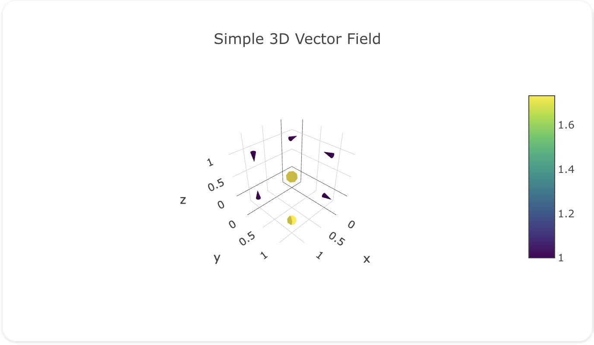
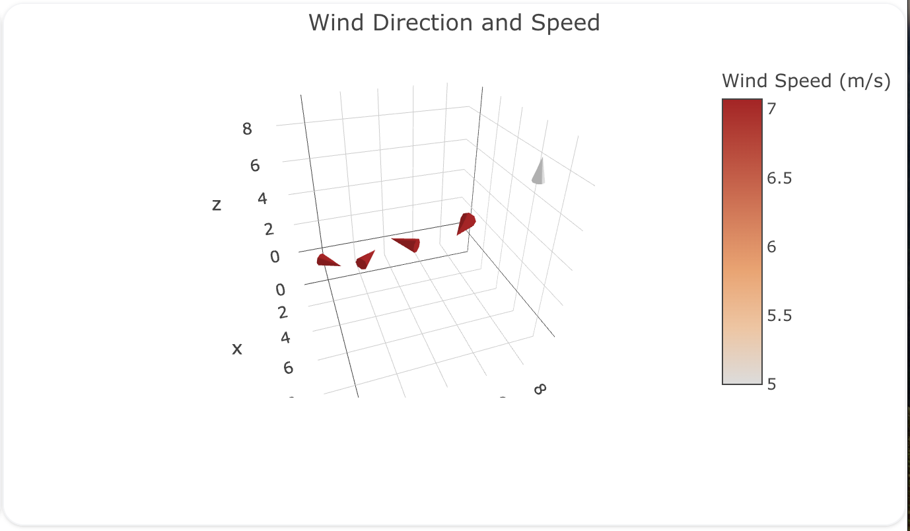

---
search:
  exclude: true
---

<!--start-->

## Overview

The `cone` insight type is used to create 3D cone plots, which are useful for visualizing vector fields or directional data in three-dimensional space. Each cone represents a vector, with its position, size, and orientation conveying information about the vector's magnitude and direction.

Cone plots are particularly useful in scientific and engineering applications, such as fluid dynamics, electromagnetic field visualization, or wind direction and speed mapping.

!!! tip "Common Uses"

    - **Vector Field Visualization**: Displaying 3D vector fields in physics or engineering.
    - **Wind Data Representation**: Showing wind direction and speed in meteorology.
    - **Fluid Flow Analysis**: Visualizing fluid dynamics in simulations or experiments.

_**Check out the [Attributes](../../configuration/Insight/Props/Cone/#attributes) for the full set of configuration options**_

## Examples


!!! example "Common Configurations"

    === "Simple Cone Plot"

        Here's a simple `cone` plot showing a basic vector field:

        

        ```yaml
        models:
          - name: vector-field-data
            args:
              - echo
              - |
                x,y,z,u,v,w
                0,0,0,1,0,0
                0,1,0,0,1,0
                1,0,0,0,0,1
                1,1,0,1,1,1
                0,0,1,-1,0,0
                0,1,1,0,-1,0
                1,0,1,0,0,-1
                1,1,1,-1,-1,-1
        insights:
          - name: Simple Cone Plot
            model: ${ref(vector-field-data)}
            columns:
              x: ?{x}
              y: ?{y}
              z: ?{z}
              u: ?{u}
              v: ?{v}
              w: ?{w}
            props:
              type: cone
              x: ${columns.x}
              y: ${columns.y}
              z: ${columns.z}
              u: ${columns.u}
              v: ${columns.v}
              w: ${columns.w}
              colorscale: "Viridis"
              sizemode: "absolute"
              sizeref: 0.5
        charts:
          - name: Simple Cone Plot Chart
            insights:
              - ${ref(Simple Cone Plot)}
            layout:
              title:
                text: Simple 3D Vector Field
              scene:
                camera:
                  eye:
                    x: 1.5
                    y: 1.5
                    z: 1.5
        ```

    === "Wind Direction Cone Plot"

        Here's a `cone` plot showing wind direction and speed:

        

        ```yaml
        models:
          - name: wind-data
            args:
              - echo
              - |
                x,y,z,u,v,w,speed
                0,0,0,5,5,0,7.07
                1,1,0,-5,5,0,7.07
                2,2,0,-5,-5,0,7.07
                3,3,0,5,-5,0,7.07
                4,4,0,0,0,5,5.00
        insights:
          - name: Wind Direction Cone Plot
            model: ${ref(wind-data)}
            columns:
              x: ?{x}
              y: ?{y}
              z: ?{z}
              u: ?{u}
              v: ?{v}
              w: ?{w}
              speed: ?{speed}
            props:
              type: cone
              x: ${columns.x}
              y: ${columns.y}
              z: ${columns.z}
              u: ${columns.u}
              v: ${columns.v}
              w: ${columns.w}
              colorscale: "Viridis"
              colorbar:
                title: "Wind Speed (m/s)"
              hoverinfo: "text"
              text: ${columns.speed}
        charts:
          - name: Wind Direction Cone Plot Chart
            insights:
              - ${ref(Wind Direction Cone Plot)}
            layout:
              title:
                text: Wind Direction and Speed
              scene:
                camera:
                  eye:
                    x: 1.5
                    y: -.5
                    z: 1.1
              margin:
                l: 90
                r: 0
                t: 40
                b: 90
        ```



<!--end-->
