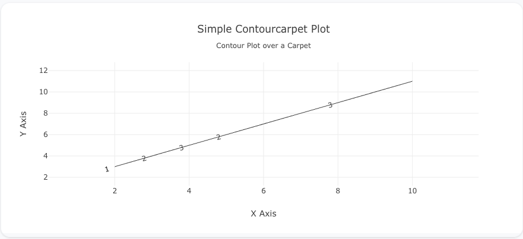
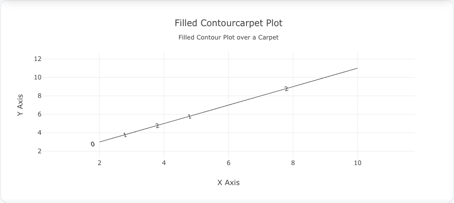
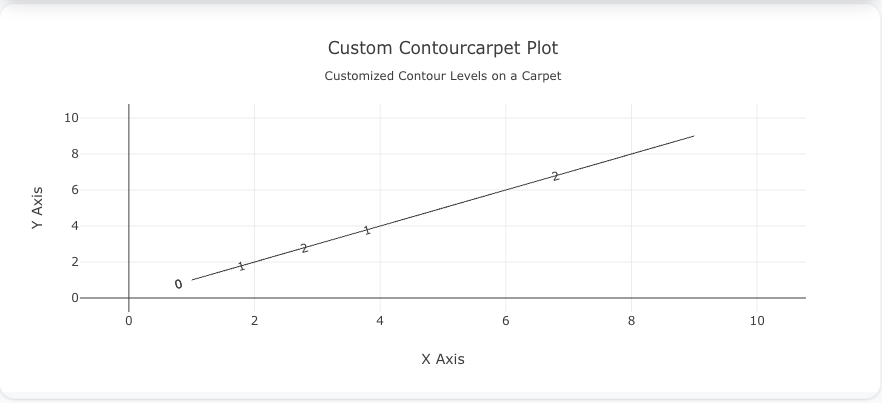

---
search:
  exclude: true
---

<!--start-->

## Overview

The `contourcarpet` insight type is used to create contour plots over a carpet plot. It combines the advantages of contour plots with the flexible grid system of carpet plots. This insight is useful for visualizing 3D data on non-uniform or irregular grids, often seen in engineering, physics, or other technical applications.

You can control contour levels, colors, and other properties to display data patterns over an underlying carpet plot.

!!! tip "Common Uses" - **Distorted Grids**: Visualizing data over irregular grids or non-linear spaces. - **Engineering Data**: Representing data that spans across irregular dimensions. - **Multivariate Visualization**: Handling data with multiple independent variables.

_**Check out the [Attributes](../../configuration/Insight/Props/Contourcarpet/#attributes) for the full set of configuration options**_

## Examples


!!! example "Common Configurations"

    === "Simple Contourcarpet Insight"

        Here's a simple `contourcarpet` insight showing a contour over a basic carpet plot:

        

        ```yaml
        insights:
          - name: Simple Contourcarpet
            description: "Contour plot over a carpet plot"
            props:
              type: contourcarpet
              carpet:
                type: carpet
                a: ?{${ref(contourcarpet-data).a}}
                b: ?{${ref(contourcarpet-data).b}}
                x: ?{${ref(contourcarpet-data).x}}
                y: ?{${ref(contourcarpet-data).y}}
              z: ?{${ref(contourcarpet-data).z}}
              colorscale: "Viridis"
        ```

    === "Filled Contourcarpet Insight"

        This example shows a filled contourcarpet insight, where the contours are filled with colors:

        

        ```yaml
        insights:
          - name: Filled Contourcarpet
            description: "Filled contourcarpet with heatmap coloring"
            props:
              type: contourcarpet
              carpet:
                type: carpet
                a: ?{${ref(contourcarpet-data-filled).a}}
                b: ?{${ref(contourcarpet-data-filled).b}}
                x: ?{${ref(contourcarpet-data-filled).x}}
                y: ?{${ref(contourcarpet-data-filled).y}}
              z: ?{${ref(contourcarpet-data-filled).z}}
              colorscale: "Earth"
              contours:
                coloring: "heatmap"
                showlines: true
        ```

    === "Custom Contour Levels"

        This example demonstrates how to customize contour levels and coloring in a `contourcarpet` insight:

        

        ```yaml
        insights:
          - name: Custom Contourcarpet
            description: "Customized contour levels on a carpet plot"
            props:
              type: contourcarpet
              carpet:
                type: carpet
                a: ?{${ref(contourcarpet-data-custom).a}}
                b: ?{${ref(contourcarpet-data-custom).b}}
                x: ?{${ref(contourcarpet-data-custom).x}}
                y: ?{${ref(contourcarpet-data-custom).y}}
              z: ?{${ref(contourcarpet-data-custom).z}}
              colorscale: "Jet"
              contours:
                start: 10
                end: 90
                size: 10
        ```



<!--end-->
