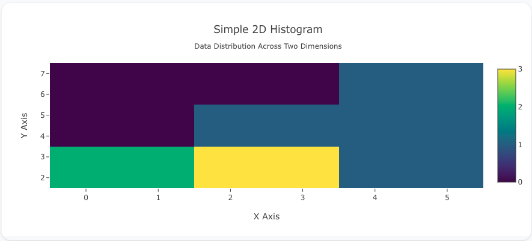
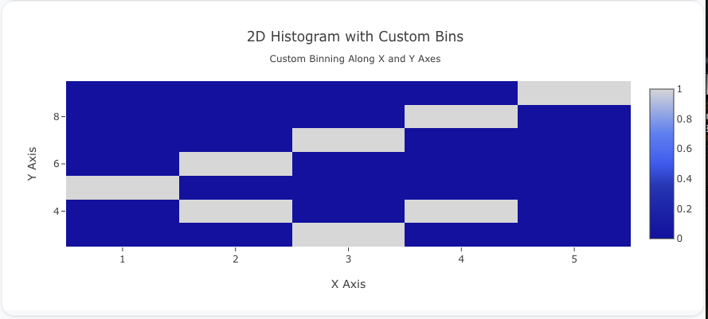
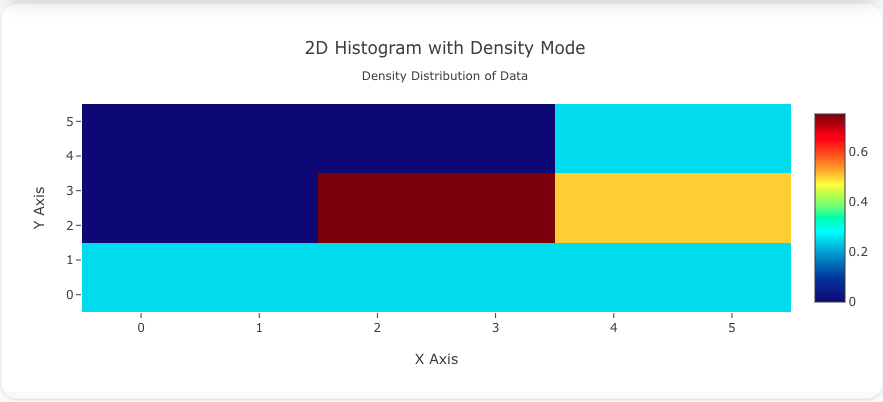

---
search:
  exclude: true
---

<!--start-->

## Overview

The `histogram2d` insight type is used to create 2D histograms, where data is binned along both the x and y axes, producing a heatmap-like visualization. This allows you to visualize the relationship between two numerical variables by counting how many data points fall into each bin.

You can customize the binning along both axes, as well as the colorscale and aggregation method, to better represent your data.

!!! tip "Common Uses" - **Joint Distributions**: Visualizing the relationship between two variables. - **Density Plots**: Showing the density of data points across two dimensions. - **Statistical Analysis**: Identifying patterns, correlations, or anomalies in bivariate data.

_**Check out the [Attributes](../../configuration/Insight/Props/Histogram2d/#attributes) for the full set of configuration options**_

## Examples


!!! example "Common Configurations"

    === "Simple 2D Histogram Plot"

        Here's a simple `histogram2d` insight showing how data is distributed across two dimensions:

        

        ```yaml
        models:
          - name: histogram2d-data
            args:
              - echo
              - |
                x,y
                1,2
                2,3
                3,4
                2,2
                1,3
                3,2
                4,4
                5,6
                4,2
        insights:
          - name: Simple 2D Histogram Plot
            model: ${ref(histogram2d-data)}
            columns:
              x: ?{x}
              y: ?{y}
            props:
              type: histogram2d
              x: ?{columns.x}
              y: ?{columns.y}
              colorscale: "Viridis"
        charts:
          - name: Simple 2D Histogram Chart
            insights:
              - ${ref(Simple 2D Histogram Plot)}
            layout:
              title:
                text: Simple 2D Histogram<br><sub>Data Distribution Across Two Dimensions</sub>
              xaxis:
                title:
                  text: "X Axis"
              yaxis:
                title:
                  text: "Y Axis"
        ```

    === "2D Histogram with Custom Bins"

        Example with custom binning along both axes:

        

        ```yaml
        models:
          - name: histogram2d-data-bins
            args:
              - echo
              - |
                x,y
                1,5
                2,6
                3,7
                2,4
                1,5
                3,3
                4,8
                5,9
                4,4
        insights:
          - name: 2D Histogram with Custom Bins
            model: ${ref(histogram2d-data-bins)}
            columns:
              x: ?{x}
              y: ?{y}
            props:
              type: histogram2d
              x: ?{columns.x}
              y: ?{columns.y}
              xbins:
                size: 1
              ybins:
                size: 1
              colorscale: "Blues"
        charts:
          - name: 2D Histogram with Custom Bins
            insights:
              - ${ref(2D Histogram with Custom Bins)}
            layout:
              title:
                text: 2D Histogram with Custom Bins<br><sub>Custom Binning Along X and Y Axes</sub>
              xaxis:
                title:
                  text: "X Axis"
              yaxis:
                title:
                  text: "Y Axis"
        ```

    === "2D Histogram with Density Mode"

        Example with relative density:

        

        ```yaml
        models:
          - name: histogram2d-data-density
            args:
              - echo
              - |
                x,y
                1,1
                2,2
                3,3
                2,1
                3,2
                4,3
                5,4
                4,1
                5,2
        insights:
          - name: 2D Histogram with Density Mode
            model: ${ref(histogram2d-data-density)}
            columns:
              x: ?{x}
              y: ?{y}
            props:
              type: histogram2d
              x: ?{columns.x}
              y: ?{columns.y}
              histnorm: "density"
              colorscale: "Jet"
        charts:
          - name: 2D Histogram with Density Mode
            insights:
              - ${ref(2D Histogram with Density Mode)}
            layout:
              title:
                text: 2D Histogram with Density Mode<br><sub>Density Distribution of Data</sub>
              xaxis:
                title:
                  text: "X Axis"
              yaxis:
                title:
                  text: "Y Axis"
        ```



<!--end-->
