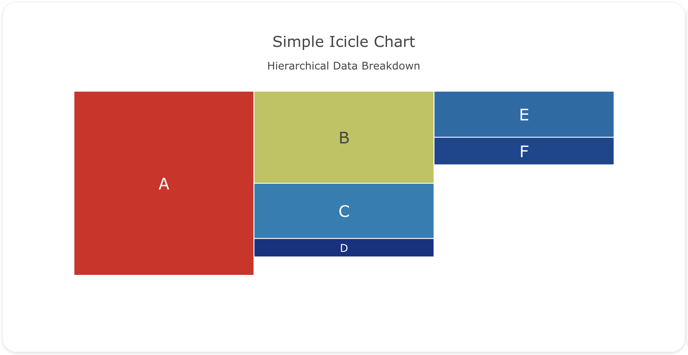
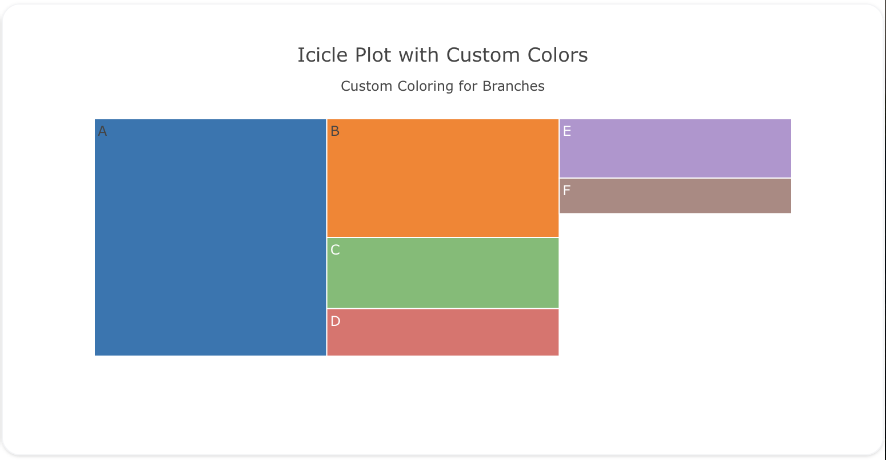
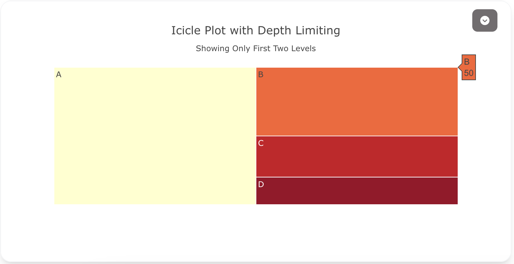

---
search:
  exclude: true
---

<!--start-->

## Overview

The `icicle` insight type is used to create icicle charts, which are a variation of treemap charts but arranged vertically. Icicle charts are useful for visualizing hierarchical data, where each branch represents a part of the whole, and you can drill down into sub-categories.

You can customize the colors, labels, and depth of the icicle chart to represent your hierarchical data effectively.

!!! tip "Common Uses"

    - **Hierarchical Data Representation**: Visualizing categories and subcategories in a hierarchy.
    - **Part-to-Whole Relationships**: Showing how parts relate to the whole, with breakdowns for subcategories.
    - **Drill-Down Analysis**: Allowing users to explore different levels of data.

_**Check out the [Attributes](../../configuration/Insight/Props/Icicle/#attributes) for the full set of configuration options**_

## Examples


!!! example "Common Configurations"

    === "Simple Icicle Plot"

        Here's a simple `icicle` insight showing hierarchical data, with branches representing categories:

        

        ```yaml
        sources:
          - name: icicle-data-source
            type: duckdb
            database: target/seeds/icicle_data.duckdb
            seeds:
              - table_name: model
                args:
                  - echo
                  - |
                    category,parent,value
                    A,,100
                    B,A,50
                    C,A,30
                    D,A,10
                    E,B,25
                    F,B,15
        models:
          - name: icicle-data
            source: ${ref(icicle-data-source)}
            sql: select * from model
        insights:
          - name: Simple Icicle Plot
            props:
              type: icicle
              labels: ?{${ref(icicle-data).category}}
              parents: ?{${ref(icicle-data).parent}}
              values: ?{${ref(icicle-data).value}}
              branchvalues: "total"
              marker:
                colorscale: "Portland"
              textposition: "middle center"
              textfont:
                size: 18
        charts:
          - name: Simple Icicle Chart
            insights:
              - ${ref(Simple Icicle Plot)}
            layout:
              title:
                text: Simple Icicle Chart<br><sub>Hierarchical Data Breakdown</sub>
        ```

    === "Icicle Plot with Custom Colors"

        This example demonstrates an `icicle` insight with custom colors for each branch and leaf node:

        

        ```yaml
        sources:
          - name: icicle-data-custom-source
            type: duckdb
            database: target/seeds/icicle_data_custom.duckdb
            seeds:
              - table_name: model
                args:
                  - echo
                  - |
                    category,parent,value,color
                    A,,100,"#1f77b4"
                    B,A,50,"#ff7f0e"
                    C,A,30,"#2ca02c"
                    D,A,20,"#d62728"
                    E,B,25,"#9467bd"
                    F,B,15,"#8c564b"
        models:
          - name: icicle-data-custom
            source: ${ref(icicle-data-custom-source)}
            sql: select * from model
        insights:
          - name: Custom Colors Icicle Plot
            props:
              type: icicle
              labels: ?{${ref(icicle-data-custom).category}}
              parents: ?{${ref(icicle-data-custom).parent}}
              values: ?{${ref(icicle-data-custom).value}}
              marker:
                colors: ?{${ref(icicle-data-custom).color}}
              branchvalues: "total"
        charts:
          - name: Custom Colors Icicle Chart
            insights:
              - ${ref(Custom Colors Icicle Plot)}
            layout:
              title:
                text: Icicle Plot with Custom Colors<br><sub>Custom Coloring for Branches</sub>
        ```

    === "Icicle Plot with Depth Limiting"

        This example shows an `icicle` insight with depth limiting, allowing the user to only see the first two levels of the hierarchy:

        

        ```yaml
        sources:
          - name: icicle-data-depth-source
            type: duckdb
            database: target/seeds/icicle_data_depth.duckdb
            seeds:
              - table_name: model
                args:
                  - echo
                  - |
                    category,parent,value
                    A,,100
                    B,A,50
                    C,A,30
                    D,A,20
                    E,B,25
                    F,B,15
        models:
          - name: icicle-data-depth
            source: ${ref(icicle-data-depth-source)}
            sql: select * from model
        insights:
          - name: Icicle Plot with Depth Limiting
            props:
              type: icicle
              labels: ?{${ref(icicle-data-depth).category}}
              parents: ?{${ref(icicle-data-depth).parent}}
              values: ?{${ref(icicle-data-depth).value}}
              maxdepth: 2
              branchvalues: "total"
              marker:
                colorscale: "YlOrRd"
        charts:
          - name: Icicle Plot with Depth Limiting Chart
            insights:
              - ${ref(Icicle Plot with Depth Limiting)}
            layout:
              title:
                text: Icicle Plot with Depth Limiting<br><sub>Showing Only First Two Levels</sub>
        ```



<!--end-->
