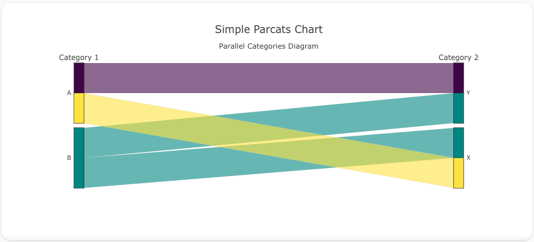
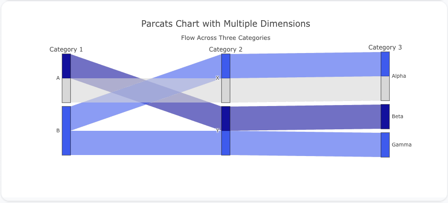
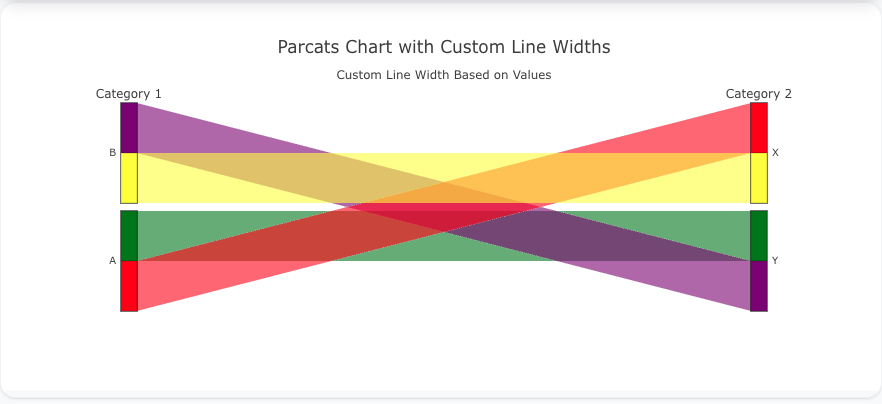

---
search:
  exclude: true
---

<!--start-->

## Overview

The `parcats` insight type is used to create parallel categories diagrams, which are useful for visualizing categorical data across multiple dimensions. It allows you to see how data flows through different categories and compare the distribution of values across them.

You can customize the colors, line widths, and category order to represent your data and patterns effectively.

!!! tip "Common Uses" - **Categorical Data Visualization**: Visualizing relationships between different categorical variables. - **Flow Analysis**: Showing how data is distributed across multiple dimensions and comparing those paths. - **Segmentation**: Visualizing how different segments of data flow through categories.

_**Check out the [Attributes](../../configuration/Insight/Props/Parcats/#attributes) for the full set of configuration options**_

## Examples


!!! example "Common Configurations"

    === "Simple Parcats Insight"

        Here's a simple `parcats` insight showing how data flows across two categorical variables:

        

        ```yaml
        models:
          - name: parcats-data
            args:
              - echo
              - |
                category_1,category_2,value
                A,X,30
                A,Y,20
                B,X,25
                B,Y,25

        insights:
          - name: Simple Parcats Plot
            description: "Parallel Categories Diagram with two categorical variables"
            model: ${ref(parcats-data)}
            columns:
              category_1: ?{ category_1 }
              category_2: ?{ category_2 }
              value: ?{ value }
            props:
              type: parcats
              dimensions:
                - label: "Category 1"
                  values: ?{columns.category_1}
                - label: "Category 2"
                  values: ?{columns.category_2}
              line:
                color: ?{columns.value}
                colorscale: "Viridis"
            interactions:
              - split: ?{category_1}
              - split: ?{category_2}
              - sort: ?{value DESC}

        charts:
          - name: Simple Parcats Chart
            insights:
              - ${ref(Simple Parcats Plot)}
            layout:
              title:
                text: Simple Parcats Chart<br><sub>Parallel Categories Diagram</sub>
        ```

    === "Parcats with Multiple Dimensions"

        This example demonstrates a `parcats` insight with multiple categorical dimensions, showing how data flows across three categories:

        

        ```yaml
        models:
          - name: parcats-data-multi
            args:
              - echo
              - |
                category_1,category_2,category_3,value
                A,X,Alpha,30
                A,Y,Beta,20
                B,X,Alpha,25
                B,Y,Gamma,25

        insights:
          - name: Parcats Plot with Multiple Dimensions
            description: "Flow across three categorical variables"
            model: ${ref(parcats-data-multi)}
            columns:
              category_1: ?{ category_1 }
              category_2: ?{ category_2 }
              category_3: ?{ category_3 }
              value: ?{ value }
            props:
              type: parcats
              dimensions:
                - label: "Category 1"
                  values: ?{columns.category_1}
                - label: "Category 2"
                  values: ?{columns.category_2}
                - label: "Category 3"
                  values: ?{columns.category_3}
              line:
                color: ?{columns.value}
                colorscale: "Blues"
            interactions:
              - split: ?{category_1}
              - split: ?{category_2}
              - split: ?{category_3}
              - sort: ?{value DESC}

        charts:
          - name: Parcats Chart with Multiple Dimensions
            insights:
              - ${ref(Parcats Plot with Multiple Dimensions)}
            layout:
              title:
                text: Parcats Chart with Multiple Dimensions<br><sub>Flow Across Three Categories</sub>
        ```

    === "Parcats with Custom Line Widths"

        This example shows a `parcats` insight with custom line widths based on a value, allowing the thickness of the lines to represent the volume of data:

        

        ```yaml
        models:
          - name: parcats-data-linewidth
            args:
              - echo
              - |
                category_1,category_2,value
                A,X,50
                A,Y,30
                B,X,40
                B,Y,20

        insights:
          - name: Parcats Plot with Custom Line Widths
            description: "Custom line widths based on values"
            model: ${ref(parcats-data-linewidth)}
            columns:
              category_1: ?{ category_1 }
              category_2: ?{ category_2 }
              value: ?{ value }
            props:
              type: parcats
              dimensions:
                - label: "Category 1"
                  values: ?{columns.category_1}
                - label: "Category 2"
                  values: ?{columns.category_2}
              line:
                color: ?{columns.value}
                width: ?{columns.value}
                colorscale: "Jet"
            interactions:
              - split: ?{category_1}
              - split: ?{category_2}
              - sort: ?{value DESC}

        charts:
          - name: Parcats Chart with Custom Line Widths
            insights:
              - ${ref(Parcats Plot with Custom Line Widths)}
            layout:
              title:
                text: Parcats Chart with Custom Line Widths<br><sub>Custom Line Width Based on Values</sub>
        ```



<!--end-->
