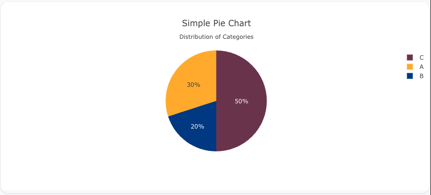
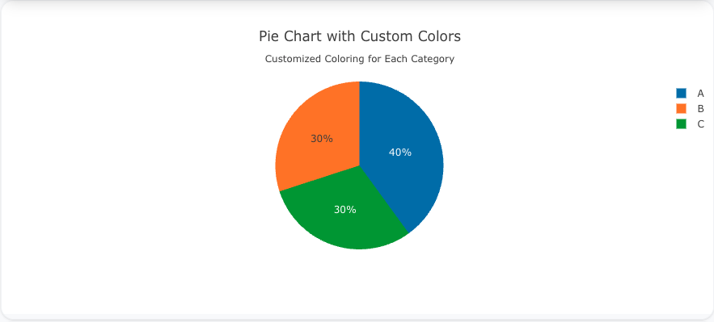
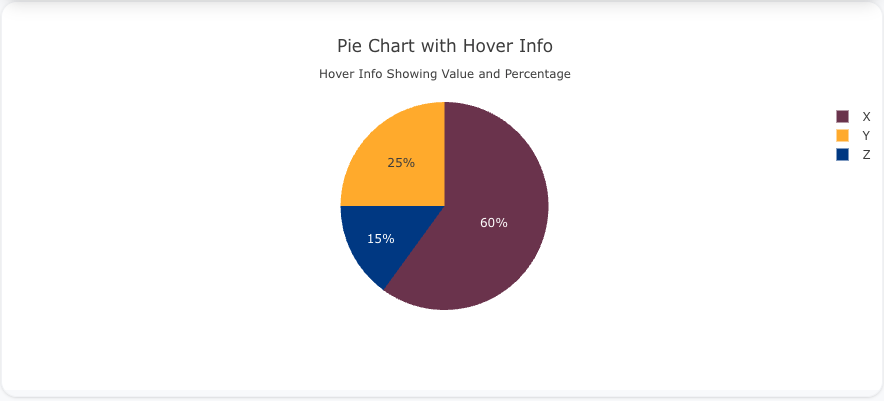

---
search:
  exclude: true
---

<!--start-->

## Overview

The `pie` insight type is used to create pie charts, which are circular charts divided into sectors representing proportions of a whole. Each sector’s arc length is proportional to the quantity it represents. Pie charts are great for visualizing part-to-whole relationships.

You can customize the colors, labels, and hover information to display your data effectively.

!!! tip "Common Uses"

    - **Part-to-Whole Relationships**: Visualizing how different parts contribute to the whole.
    - **Categorical Data**: Showing the proportions of different categories in a dataset.
    - **Survey Data**: Visualizing how responses are distributed among categories.

_**Check out the [Attributes](../../configuration/Insight/Props/Pie/#attributes) for the full set of configuration options**_

## Examples


!!! example "Common Configurations"

    === "Simple Pie Chart"

        Here's a simple `pie` insight showing the distribution of categories:

        

        ```yaml
        sources:
          - name: pie-data-source
            type: duckdb
            database: target/seeds/pie_data.duckdb
            seeds:
              - table_name: model
                args:
                  - echo
                  - |
                    category,value
                    A,30
                    B,20
                    C,50
        models:
          - name: pie-data
            source: ${ref(pie-data-source)}
            sql: select * from model
        insights:
          - name: Simple Pie Chart
            props:
              type: pie
              labels: ?{${ref(pie-data).category}}
              values: ?{${ref(pie-data).value}}
        ```

    === "Pie Chart with Custom Colors"

        This example demonstrates a `pie` insight with custom colors for each category:

        

        ```yaml
        sources:
          - name: pie-data-colors-source
            type: duckdb
            database: target/seeds/pie_data_colors.duckdb
            seeds:
              - table_name: model
                args:
                  - echo
                  - |
                    category,value,color
                    A,40,#1f77b4
                    B,30,#ff7f0e
                    C,30,#2ca02c
        models:
          - name: pie-data-colors
            source: ${ref(pie-data-colors-source)}
            sql: select * from model
        insights:
          - name: Pie Chart with Custom Colors
            props:
              type: pie
              labels: ?{${ref(pie-data-colors).category}}
              values: ?{${ref(pie-data-colors).value}}
              marker:
                colors: ?{${ref(pie-data-colors).color}}
        ```

    === "Pie Chart with Hover Info"

        This example shows a `pie` insight with hover information that displays both the percentage and the value for each category:

        

        ```yaml
        sources:
          - name: pie-data-hover-source
            type: duckdb
            database: target/seeds/pie_data_hover.duckdb
            seeds:
              - table_name: model
                args:
                  - echo
                  - |
                    category,value
                    X,60
                    Y,25
                    Z,15
        models:
          - name: pie-data-hover
            source: ${ref(pie-data-hover-source)}
            sql: select * from model
        insights:
          - name: Pie Chart with Hover Info
            props:
              type: pie
              labels: ?{${ref(pie-data-hover).category}}
              values: ?{${ref(pie-data-hover).value}}
              hoverinfo: "label+value+percent"
        ```



<!--end-->
