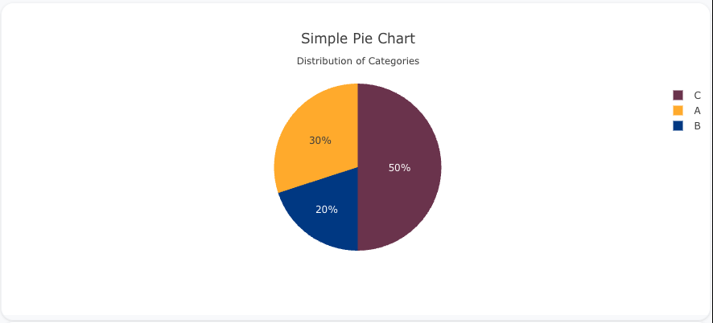

---
search:
  exclude: true
---

<!--start-->

## Overview

The `pie` insight type is used to create pie charts, which are circular charts divided into sectors representing proportions of a whole. Each sector’s arc length is proportional to the quantity it represents. Pie charts are great for visualizing part-to-whole relationships.

You can customize the colors, labels, and hover information to display your data effectively.

!!! tip "Common Uses" - **Part-to-Whole Relationships**: Visualizing how different parts contribute to the whole. - **Categorical Data**: Showing the proportions of different categories in a dataset. - **Survey Data**: Visualizing how responses are distributed among categories.

_**Check out the [Attributes](../../configuration/Insight/Props/Pie/#attributes) for the full set of configuration options**_

## Examples


!!! example "Common Configurations"

    === "Simple Pie Chart"

        Here's a simple `pie` insight showing the distribution of categories:

        

        ```yaml
        models:
          - name: pie-data
            args:
              - echo
              - |
                category,value
                A,30
                B,20
                C,50
        insights:
          - name: Simple Pie Chart
            model: ${ref(pie-data)}
            columns:
              category: ?{category}
              value: ?{value}
            props:
              type: pie
              labels: ?{columns.category}
              values: ?{columns.value}
        ```

    === "Pie Chart with Custom Colors"

        This example demonstrates a `pie` insight with custom colors for each category:

        

        ```yaml
        models:
          - name: pie-data-colors
            args:
              - echo
              - |
                category,value,color
                A,40,#1f77b4
                B,30,#ff7f0e
                C,30,#2ca02c
        insights:
          - name: Pie Chart with Custom Colors
            model: ${ref(pie-data-colors)}
            columns:
              category: ?{category}
              value: ?{value}
              color: ?{color}
            props:
              type: pie
              labels: ?{columns.category}
              values: ?{columns.value}
              marker:
                colors: ?{columns.color}
        ```

    === "Pie Chart with Hover Info"

        This example shows a `pie` insight with hover information that displays both the percentage and the value for each category:

        

        ```yaml
        models:
          - name: pie-data-hover
            args:
              - echo
              - |
                category,value
                X,60
                Y,25
                Z,15
        insights:
          - name: Pie Chart with Hover Info
            model: ${ref(pie-data-hover)}
            columns:
              category: ?{category}
              value: ?{value}
            props:
              type: pie
              labels: ?{columns.category}
              values: ?{columns.value}
              hoverinfo: "label+value+percent"
        ```



<!--end-->
