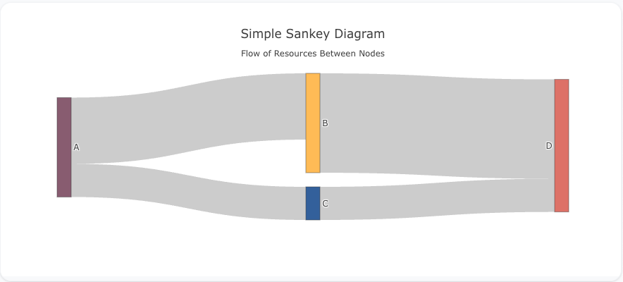
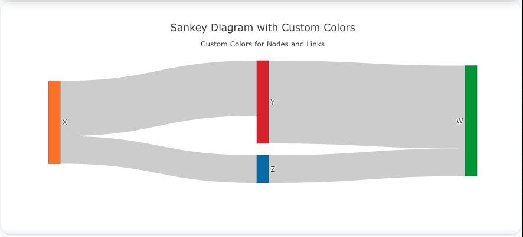
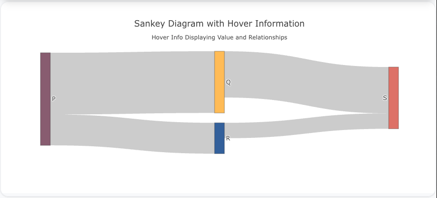

---
search:
  exclude: true
---

<!--start-->

## Overview

The `sankey` insight type is used to create Sankey diagrams, which visualize the flow of quantities between different nodes (or categories). Sankey diagrams are commonly used to show the transfer of resources or values, with the width of the flow lines being proportional to the size of the flow.

You can customize the colors, labels, and flow paths to represent your data and flows effectively.

!!! tip "Common Uses" - **Flow of Resources**: Visualizing how resources (e.g., money, energy, or materials) move between stages. - **Part-to-Part Relationships**: Displaying how parts contribute to other parts rather than the whole. - **Energy or Supply Chains**: Showing energy transfers or supply chain processes.

_**Check out the [Attributes](../../configuration/Insight/Props/Sankey/#attributes) for the full set of configuration options**_

## Examples


!!! example "Common Configurations"

    === "Simple Sankey Diagram"

        Here's a simple `sankey` insight showing how values flow between different categories:

        

        ```yaml
        models:
          - name: sankey-data
            args:
              - echo
              - |
                source,target,value
                0,1,10
                0,2,5
                1,3,15
                2,3,5
        insights:
          - name: Simple Sankey Diagram
            props:
              type: sankey
              node:
                label: ["A", "B", "C", "D"]
              link:
                source: ?{${ref(sankey-data).source}}
                target: ?{${ref(sankey-data).target}}
                value: ?{${ref(sankey-data).value}}
        ```

    === "Sankey Diagram with Custom Colors"

        This example demonstrates a `sankey` insight with custom node and link colors:

        

        ```yaml
        models:
          - name: sankey-data-colors
            args:
              - echo
              - |
                source,target,value,color
                0,1,10,#1f77b4
                0,2,5,#ff7f0e
                1,3,15,#2ca02c
                2,3,5,#d62728
        insights:
          - name: Sankey Diagram with Custom Colors
            props:
              type: sankey
              node:
                label: ["X", "Y", "Z", "W"]
                color: ?{${ref(sankey-data-colors).color}}
              link:
                source: ?{${ref(sankey-data-colors).source}}
                target: ?{${ref(sankey-data-colors).target}}
                value: ?{${ref(sankey-data-colors).value}}
        ```

    === "Sankey Diagram with Hover Information"

        This example shows a `sankey` insight where hover information displays both the value and the source-target relationship:

        

        ```yaml
        models:
          - name: sankey-data-hover
            args:
              - echo
              - |
                source,target,value
                0,1,20
                0,2,10
                1,3,15
                2,3,5
        insights:
          - name: Sankey Diagram with Hover Information
            props:
              type: sankey
              node:
                label: ["P", "Q", "R", "S"]
              link:
                source: ?{${ref(sankey-data-hover).source}}
                target: ?{${ref(sankey-data-hover).target}}
                value: ?{${ref(sankey-data-hover).value}}
                hoverinfo: "source+target+value"
        ```



<!--end-->
