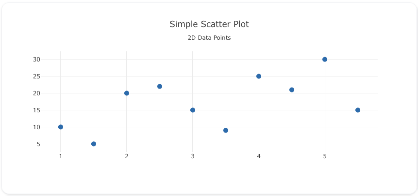
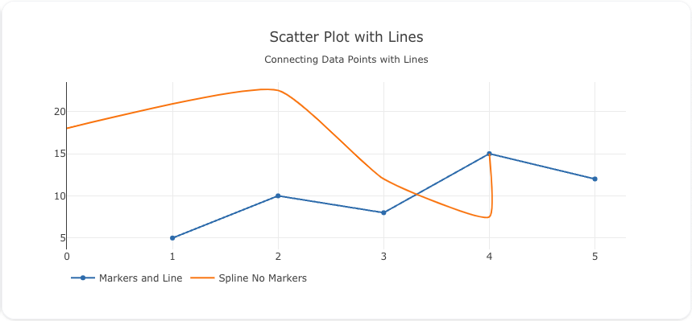
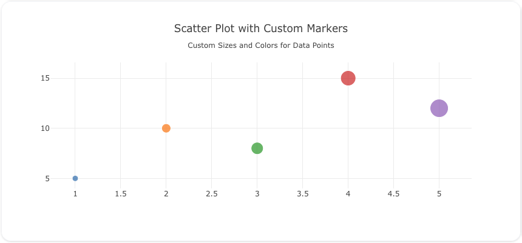
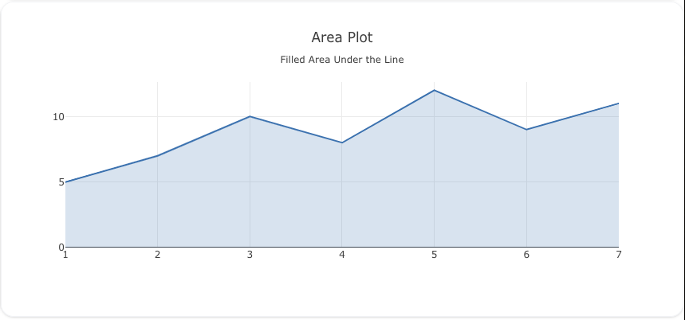

---
search:
  exclude: true
---

<!--start-->

## Overview

The `scatter` insight type is used to create scatter plots, which visualize data points based on two numerical variables. Scatter plots are widely used for analyzing relationships between variables, identifying trends, and detecting outliers.

!!! note "Gotchas"

    1. Scatter insights are also used to **generate area and line insights**.
    2. The line connections of a scatter insight are determined by the `interactions.sort` attribute. Make sure to set that to get a deterministic insight for lines and area permutations.

You can customize the marker size, color, and add lines to connect the points to represent the data in various forms like scatter plots, line charts, and more.

!!! tip "Common Uses" - **Relationship Analysis**: Exploring the relationship between two variables. - **Trend Detection**: Identifying trends or patterns in data. - **Outlier Identification**: Spotting outliers in data distributions.

_**Check out the [Attributes](../../configuration/Insight/Props/Scatter/#attributes) for the full set of configuration options**_

## Examples


!!! example "Common Configurations"

    === "Simple Scatter"

        Here's a simple `scatter` insight showing data points on a 2D plane:

        

        ```yaml
        models:
          - name: scatter-data
            args:
              - echo
              - |
                x,y
                1,10
                2,20
                3,15
                4,25
                5,30
                1.5,5
                2.5,22
                3.5,9
                4.5,21
                5.5,15

        insights:
          - name: Simple Scatter Plot
            props:
              type: scatter
              x: ?{${ref(scatter-data).x}}
              y: ?{${ref(scatter-data).y}}
              mode: "markers"
              marker:
                size: 10
            interactions:
              - sort: ?{x ASC}
        ```

    === "Lines"

        This example demonstrates a `scatter` insight with lines connecting the data points to show trends:

        

        ```yaml
        models:
          - name: scatter-data-lines
            args:
              - echo
              - |
                x,y
                1,5
                2,10
                3,8
                4,15
                5,12

        insights:
          - name: Markers and Line
            props:
              type: scatter
              x: ?{${ref(scatter-data-lines).x}}
              y: ?{${ref(scatter-data-lines).y}}
              mode: "lines+markers"
            interactions:
              - sort: ?{x ASC}

          - name: Spline No Markers
            props:
              type: scatter
              x: ?{${ref(scatter-data-lines).x}+3 - (${ref(scatter-data-lines).x}*${ref(scatter-data-lines).x})/3}
              y: ?{${ref(scatter-data-lines).y}*1.5}
              mode: "lines"
              line:
                shape: spline
                smoothing: .5 #Sets spline bend
            interactions:
              - sort: ?{x ASC}
        ```

    === "Scatter Plot with Custom Marker Sizes and Colors"

        Here's a `scatter` insight with custom marker sizes and colors, giving more visual weight to each data point:

        

        ```yaml
        models:
          - name: scatter-data-custom
            args:
              - echo
              - |
                x,y,size,color
                1,5,10,#1f77b4
                2,10,15,#ff7f0e
                3,8,20,#2ca02c
                4,15,25,#d62728
                5,12,30,#9467bd

        insights:
          - name: Scatter Plot with Custom Markers
            props:
              type: scatter
              x: ?{${ref(scatter-data-custom).x}}
              y: ?{${ref(scatter-data-custom).y}}
              mode: "markers"
              marker:
                size: ?{${ref(scatter-data-custom).size}}
                color: ?{${ref(scatter-data-custom).color}}
            interactions:
              - sort: ?{x ASC}
        ```

    === "Area Plot"

        Here's a `scatter` insight used to create an area plot, filling the area under the line:

        

        ```yaml
        models:
          - name: area-plot-data
            args:
              - echo
              - |
                x,y
                1,5
                2,7
                3,10
                4,8
                5,12
                6,9
                7,11

        insights:
          - name: Area Plot
            props:
              type: scatter
              x: ?{${ref(area-plot-data).x}}
              y: ?{${ref(area-plot-data).y}}
              mode: "lines"
              fill: "tozeroy"
              fillcolor: "rgba(55, 126, 184, 0.2)"
              line:
                color: "rgb(55, 126, 184)"
                width: 2
            interactions:
              - sort: ?{x ASC}
        ```



<!--end-->
