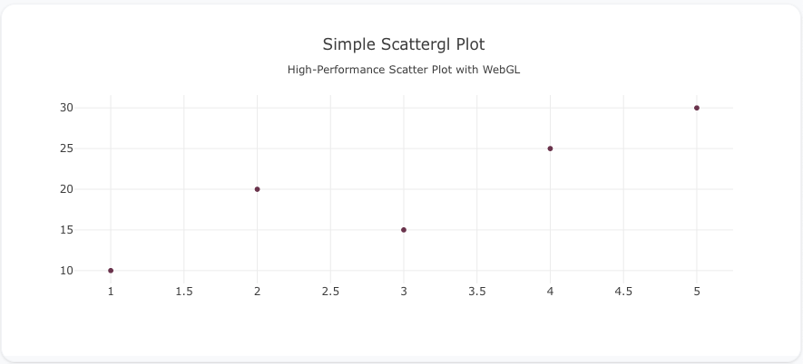
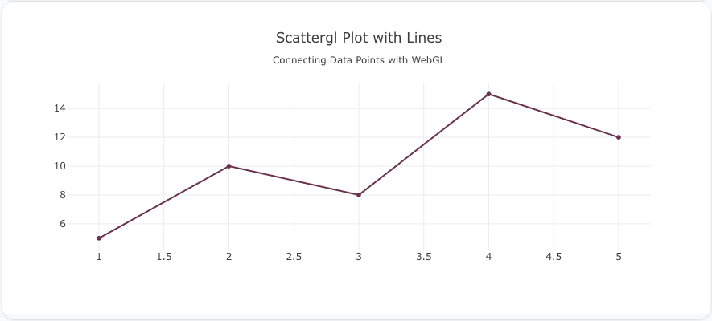
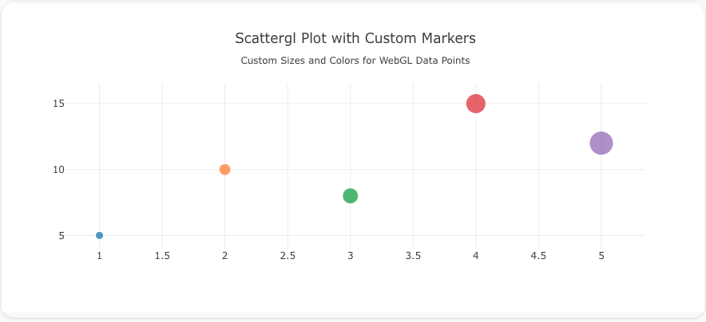

---
search:
  exclude: true
---

<!--start-->

## Overview

The `scattergl` insight type is used to create scatter plots with WebGL rendering, making it ideal for handling large datasets and providing high-performance rendering of millions of data points. It supports the same features as `scatter`, including markers and lines, but with optimized rendering for better performance.

You can customize the marker size, color, and add lines to connect points, similar to the `scatter` insight type, but with WebGL's performance advantages.

!!! tip "Common Uses"

    - **Large Datasets**: Efficiently visualizing datasets with thousands or millions of points.
    - **Performance Optimization**: Use when scatter plots with standard rendering struggle with performance.
    - **Real-Time Data**: Useful for real-time visualizations with large or dynamic datasets.

_**Check out the [Attributes](../../configuration/Insight/Props/Scattergl/#attributes) for the full set of configuration options**_

## Examples


!!! example "Common Configurations"

    === "Simple Scattergl Insight"

        Here's a simple `scattergl` insight showing data points using WebGL rendering:

        

        ```yaml
        sources:
          - name: scattergl-data-source
            type: duckdb
            database: target/seeds/scattergl_data.duckdb
            seeds:
              - table_name: model
                args:
                  - echo
                  - |
                    x,y
                    1,10
                    2,20
                    3,15
                    4,25
                    5,30
        models:
          - name: scattergl-data
            source: ${ref(scattergl-data-source)}
            sql: select * from model
        insights:
          - name: Simple Scattergl Insight
            props:
              type: scattergl
              x: ?{${ref(scattergl-data).x}}
              y: ?{${ref(scattergl-data).y}}
              mode: "markers"
            interactions:
              - split: ?{ x }
              - split: ?{ y }
        charts:
          - name: Simple Scattergl Chart
            insights:
              - ${ref(Simple Scattergl Insight)}
            layout:
              title:
                text: Simple Scattergl Plot<br><sub>High-Performance Scatter Plot with WebGL</sub>
        ```

    === "Scattergl Insight with Lines"

        This example demonstrates a `scattergl` insight with lines connecting the data points using WebGL rendering:

        

        ```yaml
        sources:
          - name: scattergl-data-lines-source
            type: duckdb
            database: target/seeds/scattergl_data_lines.duckdb
            seeds:
              - table_name: model
                args:
                  - echo
                  - |
                    x,y
                    1,5
                    2,10
                    3,8
                    4,15
                    5,12
        models:
          - name: scattergl-data-lines
            source: ${ref(scattergl-data-lines-source)}
            sql: select * from model
        insights:
          - name: Scattergl Insight with Lines
            props:
              type: scattergl
              x: ?{${ref(scattergl-data-lines).x}}
              y: ?{${ref(scattergl-data-lines).y}}
              mode: "lines+markers"
            interactions:
              - split: ?{ x }
              - split: ?{ y }
        charts:
          - name: Scattergl Chart with Lines
            insights:
              - ${ref(Scattergl Insight with Lines)}
            layout:
              title:
                text: Scattergl Plot with Lines<br><sub>Connecting Data Points with WebGL</sub>
        ```

    === "Scattergl Insight with Custom Marker Sizes and Colors"

        Here's a `scattergl` insight with custom marker sizes and colors, giving more visual weight to each data point, all rendered with WebGL:

        

        ```yaml
        sources:
          - name: scattergl-data-custom-source
            type: duckdb
            database: target/seeds/scattergl_data_custom.duckdb
            seeds:
              - table_name: model
                args:
                  - echo
                  - |
                    x,y,size,color
                    1,5,10,#1f77b4
                    2,10,15,#ff7f0e
                    3,8,20,#2ca02c
                    4,15,25,#d62728
                    5,12,30,#9467bd
        models:
          - name: scattergl-data-custom
            source: ${ref(scattergl-data-custom-source)}
            sql: select * from model
        insights:
          - name: Scattergl Insight with Custom Markers
            props:
              type: scattergl
              x: ?{${ref(scattergl-data-custom).x}}
              y: ?{${ref(scattergl-data-custom).y}}
              mode: "markers"
              marker:
                size: ?{${ref(scattergl-data-custom).size}}
                color: ?{${ref(scattergl-data-custom).color}}
            interactions:
              - split: ?{ x }
              - split: ?{ y }
              - split: ?{ color }
        charts:
          - name: Scattergl Chart with Custom Markers
            insights:
              - ${ref(Scattergl Insight with Custom Markers)}
            layout:
              title:
                text: Scattergl Plot with Custom Markers<br><sub>Custom Sizes and Colors for WebGL Data Points</sub>
        ```



<!--end-->
