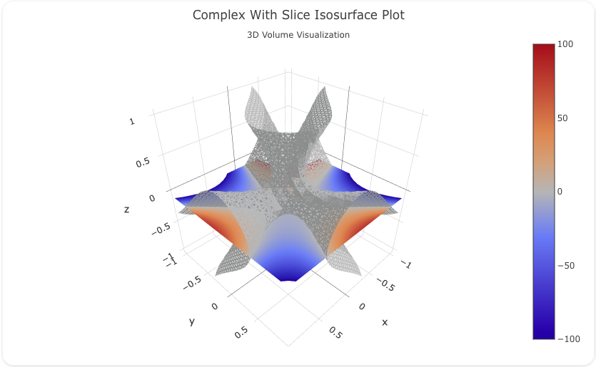

---
search:
  exclude: true
---
<!--start-->
## Overview

The `isosurface` trace type is used to create 3D isosurface visualizations, which represent a 3D volume using surfaces of constant values. Isosurfaces are commonly used in scientific visualization, such as fluid dynamics, medical imaging, or geospatial data, to show regions of interest within a 3D space.

You can customize the colors, opacity, and surface rendering to visualize 3D data effectively.

!!! tip "Common Uses"
    - **Scientific Visualization**: Representing surfaces of constant values in a 3D volume.
    - **Medical Imaging**: Displaying 3D representations of structures, such as in MRI or CT scans.
    - **Geospatial and Engineering Data**: Visualizing 3D volumes and their properties.

_**Check out the [Attributes](../configuration/Trace/Props/Isosurface/#attributes) for the full set of configuration options**_

## Examples


!!! example "Common Configurations"

    === "Simple Isosurface Plot"

        Here's a simple `isosurface` plot showing a constant value surface within a 3D grid:

        

        You can copy this code below to create this chart in your project:

        ```yaml
        models:
          - name: isosurface-data-simple
            args:
              - echo
              - |
                idx,x,y,z,value
                0,0,0,1,1
                1,0,1,1,2
                2,0,0,0,3
                3,0,1,0,4
                4,1,0,1,5
                5,1,1,1,6
                6,1,0,0,7
                7,1,1,0,8

        traces:
          - name: Simple Isosurface Plot Trace
            model: ref(isosurface-data-simple)
            props:
              type: isosurface
              x: ?{x}
              y: ?{y}
              z: ?{z}
              value: ?{value}
              isomin: 2 
              isomax: 6 
              colorscale: "Reds"
            order_by: 
              - ?{ idx asc }
        charts:
          - name: Simple Isosurface Chart
            traces:
              - ref(Simple Isosurface Plot Trace)
            layout:
              title:
                text: Simple Isosurface Plot<br><sub>3D Volume Visualization</sub>
        ```

    === "Complex Isosurface Plot with Slice"

        This example demonstrates a more complex `isosurface` plot with a slice and custom camera angle:

        

        Here's the code:

        ```yaml
        models:
          - name: isosurface-data
            args:
              - curl
              - https://raw.githubusercontent.com/visivo-io/data/refs/heads/main/fractal-cubic.csv

        traces:
          - name: Complex With Slice Isosurface Plot
            model: ref(isosurface-data)
            props:
              type: isosurface
              x: ?{x}
              y: ?{y}
              z: ?{z}
              value: ?{value}
              isomin: -100
              isomax: 100
              surface: 
                show: true 
                count: 1 
                fill: .8
              slices: 
                z: 
                  show: true
                  locations: [-0.1]
              caps: 
                x: 
                  show: false 
                y: 
                  show: false 
                z: 
                  show: false
            order_by: 
              - ?{idx asc}

        charts:
          - name: Complex With Slice Isosurface Chart
            traces:
              - ref(Complex With Slice Isosurface Plot) 
            layout:
              title:
                text: Complex With Slice Isosurface Plot<br><sub>3D Volume Visualization</sub>
              margin: 
                t: 50
                b: 20
              camera: 
                eye: 
                  x: 1.86
                  y: 0.61
                  z: 0.98
        ```


<!--end-->