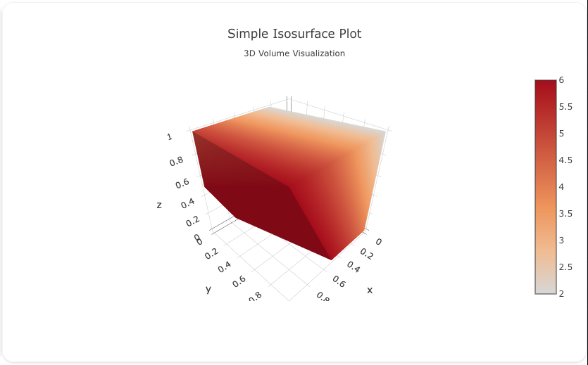

## Overview

The `isosurface` trace type is used to create 3D isosurface visualizations, which represent a 3D volume using surfaces of constant values. Isosurfaces are commonly used in scientific visualization, such as fluid dynamics, medical imaging, or geospatial data, to show regions of interest within a 3D space.

You can customize the colors, opacity, and surface rendering to visualize 3D data effectively.

!!! tip "Common Uses"
    - **Scientific Visualization**: Representing surfaces of constant values in a 3D volume.
    - **Medical Imaging**: Displaying 3D representations of structures, such as in MRI or CT scans.
    - **Geospatial and Engineering Data**: Visualizing 3D volumes and their properties.

_**Check out the [Attributes](../configuration/Trace/Props/Isosurface/#attributes) for the full set of configuration options**_

## Examples


!!! example "Common Configurations"

    === "Simple Isosurface Plot"

        Here's a simple `isosurface` plot showing a constant value surface within a 3D grid:

        

        You can copy this code below to create this chart in your project:

        ```yaml
        models:
          - name: isosurface-data
            args:
              - echo
              - |
                x,y,z,value
                1,1,1,10
                2,2,2,15
                3,3,3,20
                4,4,4,25
                5,5,5,30
        traces:
          - name: Simple Isosurface Plot
            model: ref(isosurface-data)
            props:
              type: isosurface
              x: query(x)
              y: query(y)
              z: query(z)
              value: query(value)
              isomin: 10
              isomax: 30
        charts:
          - name: Simple Isosurface Chart
            traces:
              - ref(Simple Isosurface Plot)
            layout:
              title:
                text: Simple Isosurface Plot<br><sub>3D Volume Visualization</sub>
        ```

    === "Isosurface Plot with Custom Colors"

        This example demonstrates an `isosurface` plot with a custom colorscale for the surface rendering:

        

        Here's the code:

        ```yaml
        models:
          - name: isosurface-data-custom
            args:
              - echo
              - |
                x,y,z,value
                1,1,1,0.5
                2,2,2,1.0
                3,3,3,1.5
                4,4,4,2.0
                5,5,5,2.5
        traces:
          - name: Isosurface Plot with Custom Colors
            model: ref(isosurface-data-custom)
            props:
              type: isosurface
              x: query(x)
              y: query(y)
              z: query(z)
              value: query(value)
              colorscale: "Viridis"
              isomin: 0.5
              isomax: 2.5
        charts:
          - name: Isosurface Plot with Custom Colors
            traces:
              - ref(Isosurface Plot with Custom Colors)
            layout:
              title:
                text: Isosurface Plot with Custom Colors<br><sub>Custom Colors for 3D Volume</sub>
        ```

    === "Isosurface Plot with Opacity"

        This example shows an `isosurface` plot with varying opacity to give a translucent view of the 3D surface:

        

        Here's the code:

        ```yaml
        models:
          - name: isosurface-data-opacity
            args:
              - echo
              - |
                x,y,z,value
                1,1,1,100
                2,2,2,200
                3,3,3,300
                4,4,4,400
                5,5,5,500
        traces:
          - name: Isosurface Plot with Opacity
            model: ref(isosurface-data-opacity)
            props:
              type: isosurface
              x: query(x)
              y: query(y)
              z: query(z)
              value: query(value)
              isomin: 100
              isomax: 500
              opacity: 0.6
        charts:
          - name: Isosurface Plot with Opacity
            traces:
              - ref(Isosurface Plot with Opacity)
            layout:
              title:
                text: Isosurface Plot with Opacity<br><sub>Translucent 3D Surface Rendering</sub>
        ```


