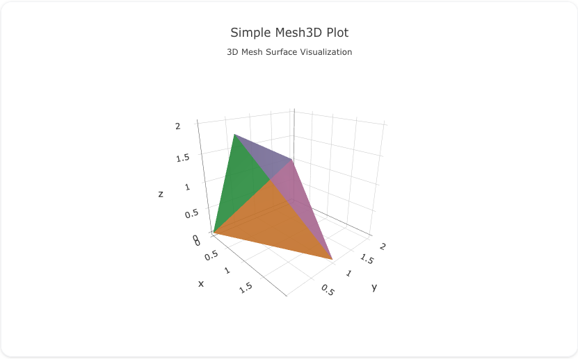

## Overview

The `mesh3d` trace type is used to create 3D mesh plots, which visualize 3D surfaces defined by vertices and connections between them. Mesh plots are commonly used in 3D data visualization to represent geometric shapes, surfaces, and volumes.

You can customize the colors, vertex positions, and opacity to represent 3D data and geometries effectively.

!!! tip "Common Uses"
    - **3D Geometries**: Visualizing surfaces and volumes in 3D space.
    - **Scientific Visualization**: Representing complex 3D data in fields like physics, engineering, and geology.
    - **3D Surface Rendering**: Displaying 3D surfaces from a set of points and connectivity information.

_**Check out the [Attributes](../configuration/Trace/Props/Mesh3D/#attributes) for the full set of configuration options**_

## Examples


!!! example "Common Configurations"

    === "Simple Mesh3D Plot"

        Here's a simple `mesh3d` plot visualizing a 3D mesh structure with vertices and connections:

        

        You can copy this code below to create this chart in your project:

        ```yaml
        models:
          - name: mesh3d-data
            args:
              - echo
              - |
                x,y,z,i,j,k
                0,0,0,0,1,2
                1,0,0,1,2,0
                1,1,0,2,0,1
                0,1,0,0,1,2
                0,0,1,1,2,0
        traces:
          - name: Simple Mesh3D Plot
            model: ref(mesh3d-data)
            props:
              type: mesh3d
              x: query(x)
              y: query(y)
              z: query(z)
              i: query(i)
              j: query(j)
              k: query(k)
              opacity: 0.7
        charts:
          - name: Simple Mesh3D Chart
            traces:
              - ref(Simple Mesh3D Plot)
            layout:
              title:
                text: Simple Mesh3D Plot<br><sub>3D Mesh Surface Visualization</sub>
        ```

    === "Mesh3D Plot with Custom Colors"

        This example demonstrates a `mesh3d` plot with custom vertex colors to highlight the 3D structure:

        

        Here's the code:

        ```yaml
        models:
          - name: mesh3d-data-custom
            args:
              - echo
              - |
                x,y,z,i,j,k,color
                0,0,0,0,1,2,#1f77b4
                1,0,0,1,2,0,#ff7f0e
                1,1,0,2,0,1,#2ca02c
                0,1,0,0,1,2,#d62728
                0,0,1,1,2,0,#9467bd
        traces:
          - name: Mesh3D Plot with Custom Colors
            model: ref(mesh3d-data-custom)
            props:
              type: mesh3d
              x: query(x)
              y: query(y)
              z: query(z)
              i: query(i)
              j: query(j)
              k: query(k)
              facecolor: query(color)
        charts:
          - name: Mesh3D Chart with Custom Colors
            traces:
              - ref(Mesh3D Plot with Custom Colors)
            layout:
              title:
                text: Mesh3D Plot with Custom Colors<br><sub>Colored 3D Surface Visualization</sub>
        ```

    === "Mesh3D Plot with Opacity"

        This example shows a `mesh3d` plot with custom opacity to render a translucent mesh surface:

        

        Here's the code:

        ```yaml
        models:
          - name: mesh3d-data-opacity
            args:
              - echo
              - |
                x,y,z,i,j,k
                0,0,0,0,1,2
                1,0,0,1,2,0
                1,1,0,2,0,1
                0,1,0,0,1,2
                0,0,1,1,2,0
        traces:
          - name: Mesh3D Plot with Opacity
            model: ref(mesh3d-data-opacity)
            props:
              type: mesh3d
              x: query(x)
              y: query(y)
              z: query(z)
              i: query(i)
              j: query(j)
              k: query(k)
              opacity: 0.4
        charts:
          - name: Mesh3D Plot with Opacity
            traces:
              - ref(Mesh3D Plot with Opacity)
            layout:
              title:
                text: Mesh3D Plot with Opacity<br><sub>Translucent 3D Mesh Surface</sub>
        ```


