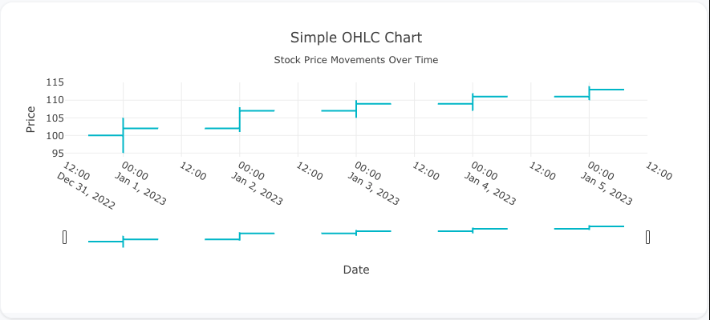
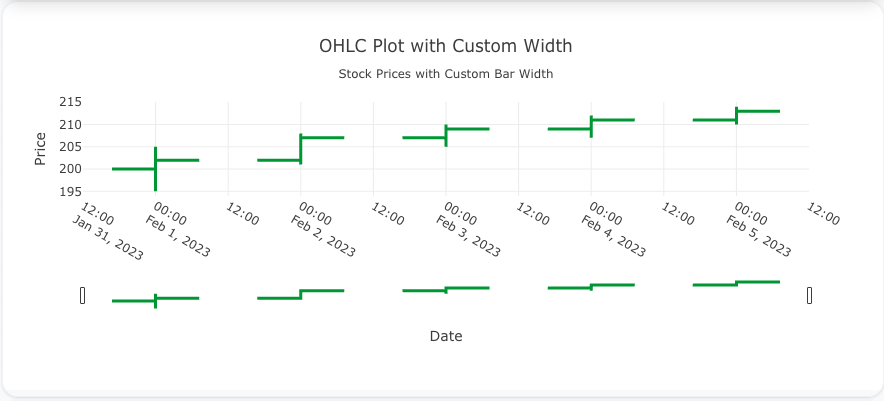
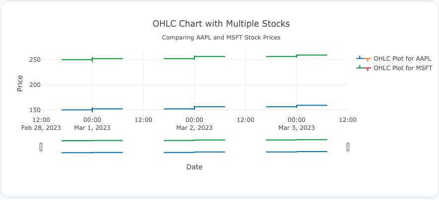

---
search:
  exclude: true
--- 
<!--start-->
## Overview

The `ohlc` trace type is used to create OHLC (Open, High, Low, Close) charts, which are commonly used to visualize stock market data or financial data over time. OHLC charts represent price movements for a given period using vertical bars for high and low prices, and tick marks for open and close prices.

You can customize the colors, bar widths, and date ranges to represent financial data effectively.

!!! tip "Common Uses"
    - **Stock Market Visualization**: Displaying price movement data for stocks, currencies, or commodities.
    - **Financial Time Series**: Visualizing price fluctuations over time.
    - **Trading Analysis**: Understanding market trends through candlestick-like visualizations.

_**Check out the [Attributes](../configuration/Trace/Props/Ohlc/#attributes) for the full set of configuration options**_

## Examples


!!! example "Common Configurations"

    === "Simple OHLC Plot"

        Here's a simple `ohlc` plot showing the Open, High, Low, and Close prices of a stock over time:

        

        You can copy this code below to create this chart in your project:

        ```yaml
        models:
          - name: ohlc-data
            args:
              - echo
              - |
                date,open,high,low,close
                2023-01-01,100,105,95,102
                2023-01-02,102,108,101,107
                2023-01-03,107,110,105,109
                2023-01-04,109,112,107,111
                2023-01-05,111,114,110,113
        traces:
          - name: Simple OHLC Plot
            model: ref(ohlc-data)
            props:
              type: ohlc
              x: ?{date}
              open: ?{open}
              high: ?{high}
              low: ?{low}
              close: ?{close}
              increasing:
                line:
                  color: "#17becf"
              decreasing:
                line:
                  color: "#ff7f0e"
        charts:
          - name: Simple OHLC Chart
            traces:
              - ref(Simple OHLC Plot)
            layout:
              title:
                text: Simple OHLC Chart<br><sub>Stock Price Movements Over Time</sub>
              xaxis:
                title:
                  text: "Date"
              yaxis:
                title:
                  text: "Price"
        ```

    === "OHLC Plot with Custom Bar Width"

        This example demonstrates an `ohlc` plot with custom bar widths to adjust the spacing between the OHLC bars:

        

        Here's the code:

        ```yaml
        models:
          - name: ohlc-data-width
            args:
              - echo
              - |
                date,open,high,low,close
                2023-02-01,200,205,195,202
                2023-02-02,202,208,201,207
                2023-02-03,207,210,205,209
                2023-02-04,209,212,207,211
                2023-02-05,211,214,210,213
        traces:
          - name: OHLC Plot with Custom Width
            model: ref(ohlc-data-width)
            props:
              type: ohlc
              x: ?{date}
              open: ?{open}
              high: ?{high}
              low: ?{low}
              close: ?{close}
              increasing:
                line:
                  color: "#2ca02c"
              decreasing:
                line:
                  color: "#d62728"
              line:
                width: 3
        charts:
          - name: OHLC Chart with Custom Width
            traces:
              - ref(OHLC Plot with Custom Width)
            layout:
              title:
                text: OHLC Plot with Custom Width<br><sub>Stock Prices with Custom Bar Width</sub>
              xaxis:
                title:
                  text: "Date"
              yaxis:
                title:
                  text: "Price"
        ```

    === "OHLC Plot with Multiple Stocks"

        This example shows an `ohlc` plot comparing multiple stocks' Open, High, Low, and Close prices over time:

        

        Here's the code:

        ```yaml
        models:
          - name: ohlc-data-multi
            args:
              - echo
              - |
                stock,date,open,high,low,close
                AAPL,2023-03-01,150,155,145,152
                AAPL,2023-03-02,152,158,150,156
                AAPL,2023-03-03,156,160,154,159
                MSFT,2023-03-01,250,255,245,252
                MSFT,2023-03-02,252,258,250,256
                MSFT,2023-03-03,256,260,254,259
        traces:
          - name: OHLC Plot for AAPL
            model: ref(ohlc-data-multi)
            props:
              type: ohlc
              x: ?{date}
              open: ?{open where stock = "AAPL"}
              high: ?{high where stock = "AAPL"}
              low: ?{low where stock = "AAPL"}
              close: ?{close where stock = "AAPL"}
              increasing:
                line:
                  color: "#1f77b4"
              decreasing:
                line:
                  color: "#ff7f0e"
          - name: OHLC Plot for MSFT
            model: ref(ohlc-data-multi)
            props:
              type: ohlc
              x: ?{date}
              open: ?{open where stock = "MSFT"}
              high: ?{high where stock = "MSFT"}
              low: ?{low where stock = "MSFT"}
              close: ?{close where stock = "MSFT"}
              increasing:
                line:
                  color: "#2ca02c"
              decreasing:
                line:
                  color: "#d62728"
        charts:
          - name: OHLC Chart with Multiple Stocks
            traces:
              - ref(OHLC Plot for AAPL)
              - ref(OHLC Plot for MSFT)
            layout:
              title:
                text: OHLC Chart with Multiple Stocks<br><sub>Comparing AAPL and MSFT Stock Prices</sub>
              xaxis:
                title:
                  text: "Date"
              yaxis:
                title:
                  text: "Price"
        ```


<!--end-->