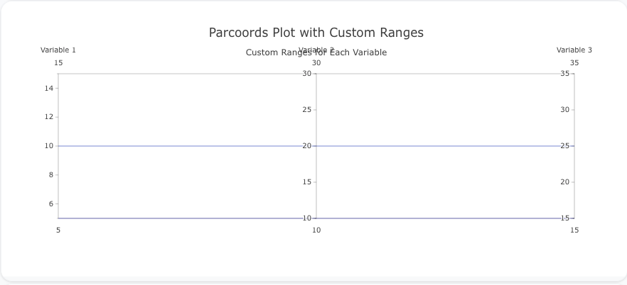
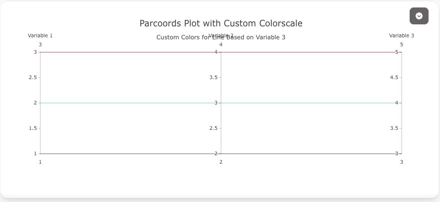

## Overview

The `parcoords` trace type is used to create parallel coordinates plots, which are useful for visualizing multi-dimensional numerical data. In parallel coordinates plots, each variable is represented as a vertical axis, and each data point is a line connecting its values across the different axes.

You can customize the axis scaling, color mapping, and line properties to represent your data effectively.

!!! tip "Common Uses"
    - **Multivariate Data Analysis**: Visualizing relationships between multiple variables.
    - **Data Exploration**: Exploring patterns and outliers in high-dimensional datasets.
    - **Decision Making**: Identifying optimal points or anomalies in multi-variable data.

_**Check out the [Attributes](../configuration/Trace/Props/Parcoords/#attributes) for the full set of configuration options**_

## Examples


!!! example "Common Configurations"

    === "Simple Parcoords Plot"

        Here's a simple `parcoords` plot visualizing three numerical variables:

        

        You can copy this code below to create this chart in your project:

        ```yaml
        models:
          - name: parcoords-data
            args:
              - echo
              - |
                variable_1,variable_2,variable_3
                1,4,7
                2,5,8
                3,6,9
        traces:
          - name: Simple Parcoords Plot
            model: ref(parcoords-data)
            props:
              type: parcoords
              dimensions:
                - label: "Variable 1"
                  values: query(variable_1)
                - label: "Variable 2"
                  values: query(variable_2)
                - label: "Variable 3"
                  values: query(variable_3)
              line:
                color: query(variable_3)
                colorscale: "Viridis"
        charts:
          - name: Simple Parcoords Chart
            traces:
              - ref(Simple Parcoords Plot)
            layout:
              title:
                text: Simple Parcoords Plot<br><sub>Parallel Coordinates with Three Variables</sub>
        ```

    === "Parcoords with Custom Ranges"

        This example demonstrates a `parcoords` plot with custom axis ranges, allowing you to focus on specific data ranges:

        

        Here's the code:

        ```yaml
        models:
          - name: parcoords-data-ranges
            args:
              - echo
              - |
                variable_1,variable_2,variable_3
                5,10,15
                10,20,25
                15,30,35
        traces:
          - name: Parcoords Plot with Custom Ranges
            model: ref(parcoords-data-ranges)
            props:
              type: parcoords
              dimensions:
                - label: "Variable 1"
                  values: query(variable_1)
                  range: [5, 15]
                - label: "Variable 2"
                  values: query(variable_2)
                  range: [10, 30]
                - label: "Variable 3"
                  values: query(variable_3)
                  range: [15, 35]
              line:
                color: query(variable_3)
                colorscale: "Blues"
        charts:
          - name: Parcoords Chart with Custom Ranges
            traces:
              - ref(Parcoords Plot with Custom Ranges)
            layout:
              title:
                text: Parcoords Plot with Custom Ranges<br><sub>Custom Ranges for Each Variable</sub>
        ```

    === "Parcoords Plot with Custom Colorscale"

        Here's a `parcoords` plot with a custom colorscale for the lines, highlighting the variations across the third variable:

        

        Here's the code:

        ```yaml
        models:
          - name: parcoords-data-colorscale
            args:
              - echo
              - |
                variable_1,variable_2,variable_3
                1,2,3
                2,3,4
                3,4,5
        traces:
          - name: Parcoords Plot with Custom Colorscale
            model: ref(parcoords-data-colorscale)
            props:
              type: parcoords
              dimensions:
                - label: "Variable 1"
                  values: query(variable_1)
                - label: "Variable 2"
                  values: query(variable_2)
                - label: "Variable 3"
                  values: query(variable_3)
              line:
                color: query(variable_3)
                colorscale: "Jet"
        charts:
          - name: Parcoords Chart with Custom Colorscale
            traces:
              - ref(Parcoords Plot with Custom Colorscale)
            layout:
              title:
                text: Parcoords Plot with Custom Colorscale<br><sub>Custom Colors for Line Based on Variable 3</sub>
        ```


