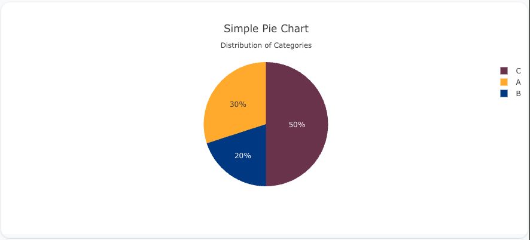
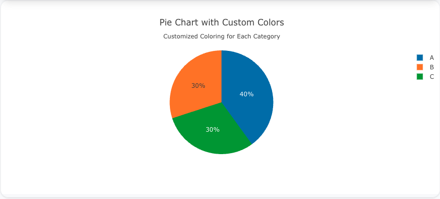
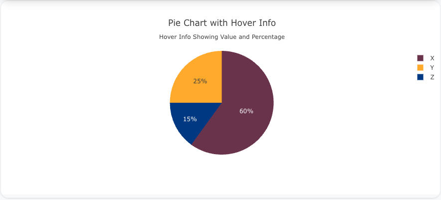

---
search:
  exclude: true
---
<!--start-->
## Overview

The `pie` trace type is used to create pie charts, which are circular charts divided into sectors representing proportions of a whole. Each sector’s arc length is proportional to the quantity it represents. Pie charts are great for visualizing part-to-whole relationships.

You can customize the colors, labels, and hover information to display your data effectively.

!!! tip "Common Uses"
    - **Part-to-Whole Relationships**: Visualizing how different parts contribute to the whole.
    - **Categorical Data**: Showing the proportions of different categories in a dataset.
    - **Survey Data**: Visualizing how responses are distributed among categories.

_**Check out the [Attributes](../configuration/Trace/Props/Pie/#attributes) for the full set of configuration options**_

## Examples


!!! example "Common Configurations"

    === "Simple Pie Chart"

        Here's a simple `pie` chart showing the distribution of categories:

        

        You can copy this code below to create this chart in your project:

        ```yaml
        models:
          - name: pie-data
            args:
              - echo
              - |
                category,value
                A,30
                B,20
                C,50
        traces:
          - name: Simple Pie Chart Trace
            model: ref(pie-data)
            props:
              type: pie
              labels: ?{category}
              values: ?{value}
        charts:
          - name: Simple Pie Chart
            traces:
              - ref(Simple Pie Chart Trace)
            layout:
              title:
                text: Simple Pie Chart<br><sub>Distribution of Categories</sub>
        ```

    === "Pie Chart with Custom Colors"

        This example demonstrates a `pie` chart with custom colors for each category:

        

        Here's the code:

        ```yaml
        models:
          - name: pie-data-colors
            args:
              - echo
              - |
                category,value,color
                A,40,#1f77b4
                B,30,#ff7f0e
                C,30,#2ca02c
        traces:
          - name: Pie Chart with Custom Colors Trace
            model: ref(pie-data-colors)
            props:
              type: pie
              labels: ?{category}
              values: ?{value}
              marker:
                colors: ?{color}
        charts:
          - name: Pie Chart with Custom Colors
            traces:
              - ref(Pie Chart with Custom Colors Trace)
            layout:
              title:
                text: Pie Chart with Custom Colors<br><sub>Customized Coloring for Each Category</sub>
        ```

    === "Pie Chart with Hover Info"

        This example shows a `pie` chart with hover information that displays both the percentage and the value for each category:

        

        Here's the code:

        ```yaml
        models:
          - name: pie-data-hover
            args:
              - echo
              - |
                category,value
                X,60
                Y,25
                Z,15
        traces:
          - name: Pie Chart with Hover Info Trace
            model: ref(pie-data-hover)
            props:
              type: pie
              labels: ?{category}
              values: ?{value}
              hoverinfo: "label+value+percent"
        charts:
          - name: Pie Chart with Hover Info
            traces:
              - ref(Pie Chart with Hover Info Trace)
            layout:
              title:
                text: Pie Chart with Hover Info<br><sub>Hover Info Showing Value and Percentage</sub>
        ```


<!--end-->