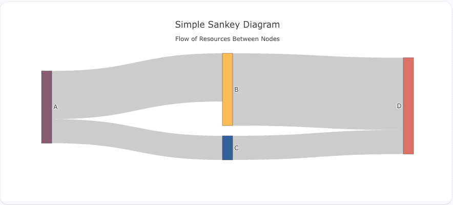
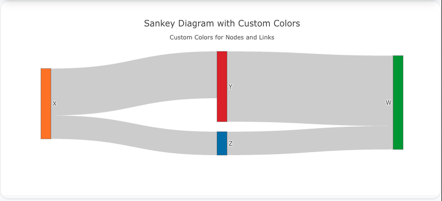
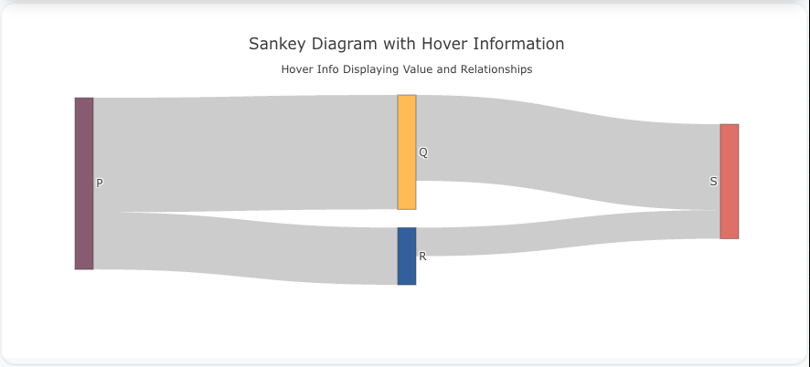

## Overview

The `sankey` trace type is used to create Sankey diagrams, which visualize the flow of quantities between different nodes (or categories). Sankey diagrams are commonly used to show the transfer of resources or values, with the width of the flow lines being proportional to the size of the flow.

You can customize the colors, labels, and flow paths to represent your data and flows effectively.

!!! tip "Common Uses"
    - **Flow of Resources**: Visualizing how resources (e.g., money, energy, or materials) move between stages.
    - **Part-to-Part Relationships**: Displaying how parts contribute to other parts rather than the whole.
    - **Energy or Supply Chains**: Showing energy transfers or supply chain processes.

_**Check out the [Attributes](../configuration/Trace/Props/Sankey/#attributes) for the full set of configuration options**_

## Examples


!!! example "Common Configurations"

    === "Simple Sankey Diagram"

        Here's a simple `sankey` diagram showing how values flow between different categories:

        

        You can copy this code below to create this chart in your project:

        ```yaml
        models:
          - name: sankey-data
            args:
              - echo
              - |
                source,target,value
                A,B,10
                A,C,5
                B,D,15
                C,D,5
        traces:
          - name: Simple Sankey Diagram
            model: ref(sankey-data)
            props:
              type: sankey
              node:
                label: query(unique([source, target]))
              link:
                source: query(source)
                target: query(target)
                value: query(value)
        charts:
          - name: Simple Sankey Diagram
            traces:
              - ref(Simple Sankey Diagram)
            layout:
              title:
                text: Simple Sankey Diagram<br><sub>Flow of Resources Between Nodes</sub>
        ```

    === "Sankey Diagram with Custom Colors"

        This example demonstrates a `sankey` diagram with custom node and link colors:

        

        Here's the code:

        ```yaml
        models:
          - name: sankey-data-colors
            args:
              - echo
              - |
                source,target,value,color
                X,Y,10,#1f77b4
                X,Z,5,#ff7f0e
                Y,W,15,#2ca02c
                Z,W,5,#d62728
        traces:
          - name: Sankey Diagram with Custom Colors
            model: ref(sankey-data-colors)
            props:
              type: sankey
              node:
                label: query(unique([source, target]))
                color: query(color)
              link:
                source: query(source)
                target: query(target)
                value: query(value)
        charts:
          - name: Sankey Diagram with Custom Colors
            traces:
              - ref(Sankey Diagram with Custom Colors)
            layout:
              title:
                text: Sankey Diagram with Custom Colors<br><sub>Custom Colors for Nodes and Links</sub>
        ```

    === "Sankey Diagram with Hover Information"

        This example shows a `sankey` diagram where hover information displays both the value and the source-target relationship:

        

        Here's the code:

        ```yaml
        models:
          - name: sankey-data-hover
            args:
              - echo
              - |
                source,target,value
                P,Q,20
                P,R,10
                Q,S,15
                R,S,5
        traces:
          - name: Sankey Diagram with Hover Information
            model: ref(sankey-data-hover)
            props:
              type: sankey
              node:
                label: query(unique([source, target]))
              link:
                source: query(source)
                target: query(target)
                value: query(value)
                hoverinfo: "source+target+value"
        charts:
          - name: Sankey Diagram with Hover Information
            traces:
              - ref(Sankey Diagram with Hover Information)
            layout:
              title:
                text: Sankey Diagram with Hover Information<br><sub>Hover Info Displaying Value and Relationships</sub>
        ```


