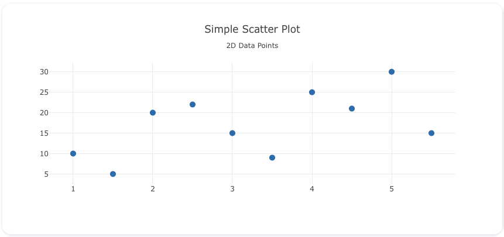
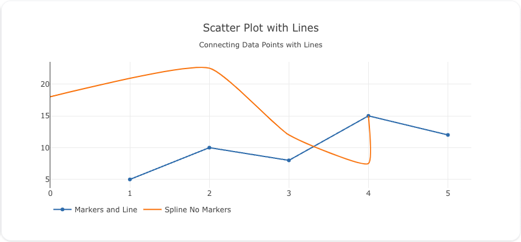
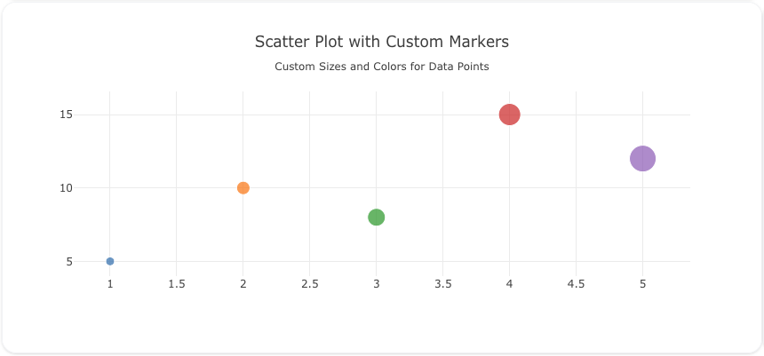
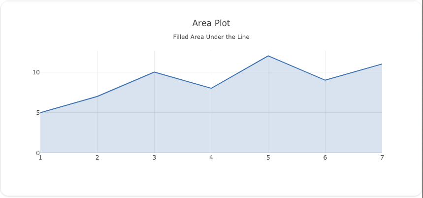

---
search:
  exclude: true
---
<!--start-->
## Overview

The `scatter` trace type is used to create scatter plots, which visualize data points based on two numerical variables. Scatter plots are widely used for analyzing relationships between variables, identifying trends, and detecting outliers.

!!! note "Gotchas"

    1. Scatter traces are also used to **generate area and line traces**.
    2. The line connections of a scatter trace are determined by the `trace.order_by` attribute. Make sure to set that to get a deterministic trace for lines and area permutations. 

You can customize the marker size, color, and add lines to connect the points to represent the data in various forms like scatter plots, line charts, and more.

!!! tip "Common Uses"
    - **Relationship Analysis**: Exploring the relationship between two variables.
    - **Trend Detection**: Identifying trends or patterns in data.
    - **Outlier Identification**: Spotting outliers in data distributions.

_**Check out the [Attributes](../configuration/Trace/Props/Scatter/#attributes) for the full set of configuration options**_

## Examples


!!! example "Common Configurations"

    === "Simple Scatter"

        Here's a simple `scatter` plot showing data points on a 2D plane:

        

        You can copy this code below to create this chart in your project:

        ```yaml
        models:
          - name: scatter-data
            args:
              - echo
              - |
                x,y
                1,10
                2,20
                3,15
                4,25
                5,30
                1.5,5
                2.5,22
                3.5,9
                4.5,21
                5.5,15

        traces:
          - name: Simple Scatter Plot
            model: ref(scatter-data)
            props:
              type: scatter
              x: ?{x}
              y: ?{y}
              mode: "markers"
              marker: 
                size: 10
            order_by: 
              - ?{x asc}
        charts:
          - name: Simple Scatter Chart
            traces:
              - ref(Simple Scatter Plot)
            layout:
              title:
                text: Simple Scatter Plot<br><sub>2D Data Points</sub>
        ```

    === "Lines"

        This example demonstrates a `scatter` plot with lines connecting the data points to show trends:

        

        Here's the code:

        ```yaml
        models:
          - name: scatter-data-lines
            args:
              - echo
              - |
                x,y
                1,5
                2,10
                3,8
                4,15
                5,12
        traces:
          - name: Markers and Line
            model: ref(scatter-data-lines)
            props:
              type: scatter
              x: ?{x}
              y: ?{y}
              mode: "lines+markers"
            order_by: 
              - ?{x asc}
          - name: Spline No Markers
            model: ref(scatter-data-lines)
            props:
              type: scatter
              x: ?{x+3 - (x*x)/3}
              y: ?{y*1.5}
              mode: "lines"
              line: 
                shape: spline
                smoothing: .5 #Sets spline bend
            order_by: 
              - ?{x+3 - (x*x)/3}
        charts:
          - name: Scatter Chart with Lines
            traces:
              - ref(Markers and Line)
              - ref(Spline No Markers)
            layout:
              title:
                text: Scatter Plot with Lines<br><sub>Connecting Data Points with Lines</sub>
              legend: 
                orientation: h
        ```

    === "Scatter Plot with Custom Marker Sizes and Colors"

        Here's a `scatter` plot with custom marker sizes and colors, giving more visual weight to each data point:

        

        Here's the code:

        ```yaml
        models:
          - name: scatter-data-custom
            args:
              - echo
              - |
                x,y,size,color
                1,5,10,#1f77b4
                2,10,15,#ff7f0e
                3,8,20,#2ca02c
                4,15,25,#d62728
                5,12,30,#9467bd
        traces:
          - name: Scatter Plot with Custom Markers
            model: ref(scatter-data-custom)
            props:
              type: scatter
              x: ?{x}
              y: ?{y}
              mode: "markers"
              marker:
                size: ?{size}
                color: ?{color}
            order_by: 
              - ?{x asc}
        charts:
          - name: Scatter Chart with Custom Markers
            traces:
              - ref(Scatter Plot with Custom Markers)
            layout:
              title:
                text: Scatter Plot with Custom Markers<br><sub>Custom Sizes and Colors for Data Points</sub>
        ```

    === "Area Plot"

        Here's a `scatter` plot used to create an area plot, filling the area under the line:

        

        Here's the code:

        ```yaml
        models:
          - name: area-plot-data
            args:
              - echo
              - |
                x,y
                1,5
                2,7
                3,10
                4,8
                5,12
                6,9
                7,11
        traces:
          - name: Area Plot
            model: ref(area-plot-data)
            props:
              type: scatter
              x: ?{x}
              y: ?{y}
              mode: "lines"
              fill: "tozeroy"
              fillcolor: "rgba(55, 126, 184, 0.2)"
              line:
                color: "rgb(55, 126, 184)"
                width: 2
            order_by: 
              - ?{x asc}
        charts:
          - name: Area Plot Chart
            traces:
              - ref(Area Plot)
            layout:
              title:
                text: Area Plot<br><sub>Filled Area Under the Line</sub>
        ```


<!--end-->