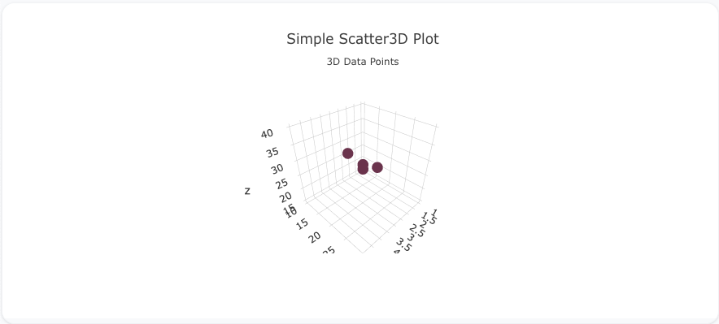
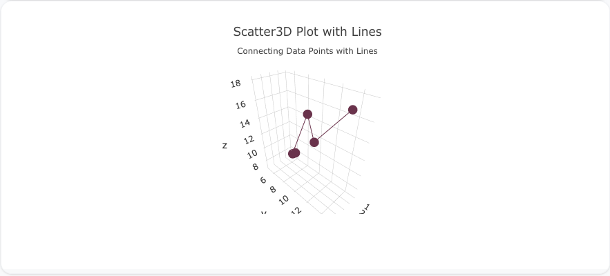
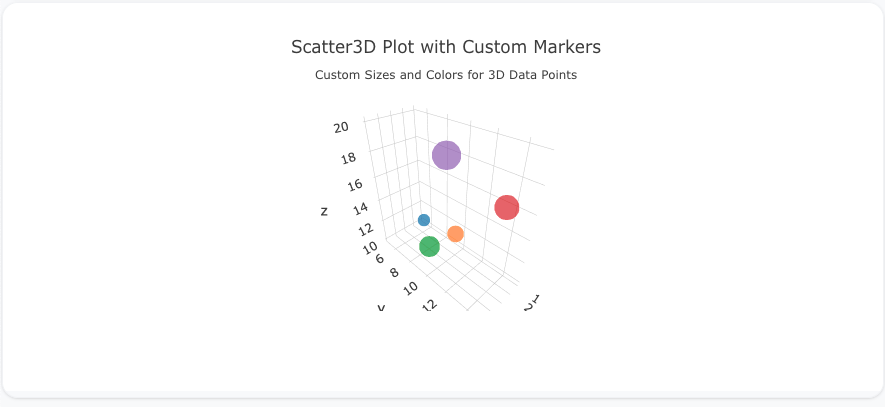

---
search:
  exclude: true
---
<!--start-->
## Overview

The `scatter3d` trace type is used to create 3D scatter plots, which visualize data points based on three numerical variables (x, y, and z axes). 3D scatter plots are useful for exploring relationships between three variables and detecting patterns or outliers in higher-dimensional data.

You can customize the marker size, color, and add lines to connect points in 3D space to represent the data effectively.

!!! tip "Common Uses"
    - **3D Relationship Analysis**: Exploring the relationship between three numerical variables.
    - **Pattern Detection**: Identifying trends and clusters in three dimensions.
    - **High-Dimensional Data**: Visualizing higher-dimensional datasets.

_**Check out the [Attributes](../configuration/Trace/Props/Scatter3D/#attributes) for the full set of configuration options**_

## Examples


!!! example "Common Configurations"

    === "Simple Scatter3D Plot"

        Here's a simple `scatter3d` plot showing data points in 3D space:

        

        You can copy this code below to create this chart in your project:

        ```yaml
        models:
          - name: scatter3d-data
            args:
              - echo
              - |
                x,y,z
                1,10,15
                2,20,25
                3,15,30
                4,25,35
                5,30,40
        traces:
          - name: Simple Scatter3D Plot
            model: ref(scatter3d-data)
            props:
              type: scatter3d
              x: query(x)
              y: query(y)
              z: query(z)
              mode: "markers"
        charts:
          - name: Simple Scatter3D Chart
            traces:
              - ref(Simple Scatter3D Plot)
            layout:
              title:
                text: Simple Scatter3D Plot<br><sub>3D Data Points</sub>
        ```

    === "Scatter3D Plot with Lines"

        This example demonstrates a `scatter3d` plot with lines connecting the data points in 3D space:

        

        Here's the code:

        ```yaml
        models:
          - name: scatter3d-data-lines
            args:
              - echo
              - |
                x,y,z
                1,5,7
                2,10,12
                3,8,10
                4,15,18
                5,12,17
        traces:
          - name: Scatter3D Plot with Lines
            model: ref(scatter3d-data-lines)
            props:
              type: scatter3d
              x: query(x)
              y: query(y)
              z: query(z)
              mode: "lines+markers"
        charts:
          - name: Scatter3D Chart with Lines
            traces:
              - ref(Scatter3D Plot with Lines)
            layout:
              title:
                text: Scatter3D Plot with Lines<br><sub>Connecting Data Points with Lines</sub>
        ```

    === "Scatter3D Plot with Custom Marker Sizes and Colors"

        Here's a `scatter3d` plot with custom marker sizes and colors, giving more visual weight to each data point in 3D space:

        

        Here's the code:

        ```yaml
        models:
          - name: scatter3d-data-custom
            args:
              - echo
              - |
                x,y,z,size,color
                1,5,10,15,#1f77b4
                2,10,12,20,#ff7f0e
                3,8,10,25,#2ca02c
                4,15,18,30,#d62728
                5,12,20,35,#9467bd
        traces:
          - name: Scatter3D Plot with Custom Markers
            model: ref(scatter3d-data-custom)
            props:
              type: scatter3d
              x: query(x)
              y: query(y)
              z: query(z)
              mode: "markers"
              marker:
                size: query(size)
                color: query(color)
        charts:
          - name: Scatter3D Chart with Custom Markers
            traces:
              - ref(Scatter3D Plot with Custom Markers)
            layout:
              title:
                text: Scatter3D Plot with Custom Markers<br><sub>Custom Sizes and Colors for 3D Data Points</sub>
        ```


<!--end-->