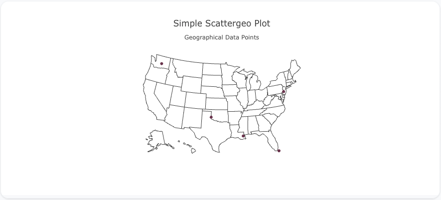
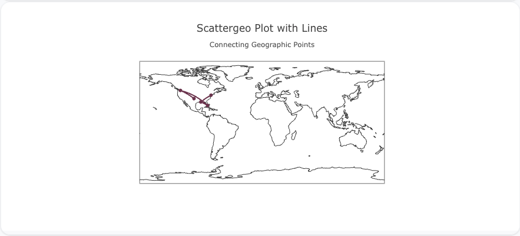
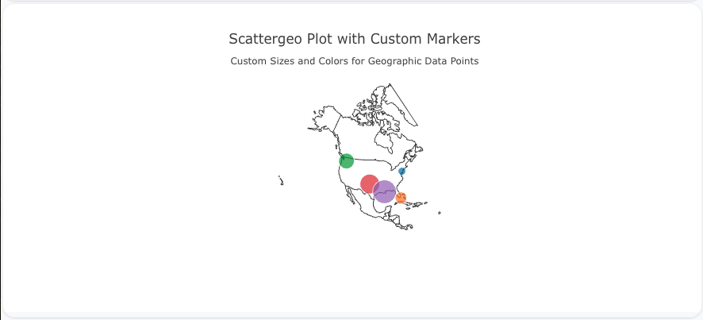

---
search:
  exclude: true
---
<!--start-->
## Overview

The `scattergeo` trace type is used to create scatter plots on a geographic map. This type of plot is ideal for visualizing data points with geographic coordinates, allowing for the exploration of patterns, distributions, or trends over geographical areas.

You can customize the marker size, color, and geo-coordinates (longitude and latitude) to effectively represent the geographic data.

!!! tip "Common Uses"
    - **Geospatial Data**: Visualizing points or patterns on a geographic map.
    - **Location-Based Analysis**: Exploring the distribution of data points across different locations.
    - **Mapping**: Plotting geographical points such as cities, events, or regions.

_**Check out the [Attributes](../configuration/Trace/Props/Scattergeo/#attributes) for the full set of configuration options**_

## Examples


!!! example "Common Configurations"

    === "Simple Scattergeo Plot"

        Here's a simple `scattergeo` plot showing data points at various geographic locations:

        

        You can copy this code below to create this chart in your project:

        ```yaml
        models:
          - name: scattergeo-data
            args:
              - echo
              - |
                lon,lat
                -75,40
                -80,25
                -120,47
                -100,35
                -90,30
        traces:
          - name: Simple Scattergeo Plot
            model: ${ref(scattergeo-data)}
            props:
              type: scattergeo
              lon: ?{lon}
              lat: ?{lat}
              mode: "markers"
        charts:
          - name: Simple Scattergeo Chart
            traces:
              - ${ref(Simple Scattergeo Plot)}
            layout:
              title:
                text: Simple Scattergeo Plot<br><sub>Geographical Data Points</sub>
              geo:
                scope: "usa"
        ```

    === "Scattergeo Plot with Lines"

        This example demonstrates a `scattergeo` plot with lines connecting geographic points:

        

        Here's the code:

        ```yaml
        models:
          - name: scattergeo-data-lines
            args:
              - echo
              - |
                lon,lat
                -75,40
                -80,25
                -120,47
                -100,35
                -90,30
        traces:
          - name: Scattergeo Plot with Lines
            model: ${ref(scattergeo-data-lines)}
            props:
              type: scattergeo
              lon: ?{lon}
              lat: ?{lat}
              mode: "lines+markers"
        charts:
          - name: Scattergeo Chart with Lines
            traces:
              - ${ref(Scattergeo Plot with Lines)}
            layout:
              title:
                text: Scattergeo Plot with Lines<br><sub>Connecting Geographic Points</sub>
              geo:
                scope: "world"
        ```

    === "Scattergeo Plot with Custom Marker Sizes and Colors"

        Here's a `scattergeo` plot with custom marker sizes and colors, giving more visual weight to each geographic data point:

        

        Here's the code:

        ```yaml
        models:
          - name: scattergeo-data-custom
            args:
              - echo
              - |
                lon,lat,size,color
                -75,40,10,#1f77b4
                -80,25,15,#ff7f0e
                -120,47,20,#2ca02c
                -100,35,25,#d62728
                -90,30,30,#9467bd
        traces:
          - name: Scattergeo Plot with Custom Markers
            model: ${ref(scattergeo-data-custom)}
            props:
              type: scattergeo
              lon: ?{lon}
              lat: ?{lat}
              mode: "markers"
              marker:
                size: ?{size}
                color: ?{color}
        charts:
          - name: Scattergeo Chart with Custom Markers
            traces:
              - ${ref(Scattergeo Plot with Custom Markers)}
            layout:
              title:
                text: Scattergeo Plot with Custom Markers<br><sub>Custom Sizes and Colors for Geographic Data Points</sub>
              geo:
                scope: "north america"
        ```


<!--end-->