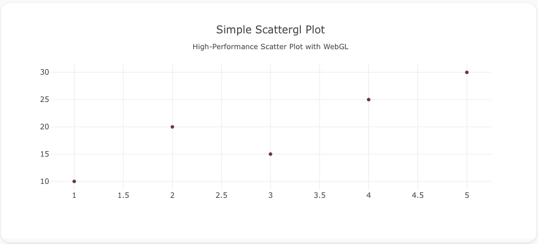
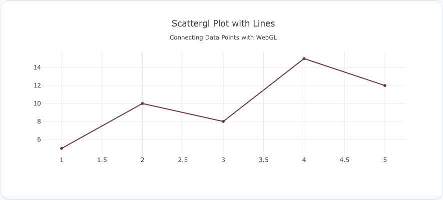
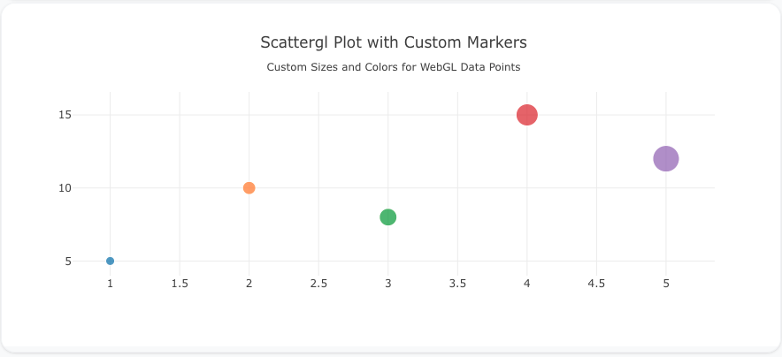

---
search:
  exclude: true
---
<!--start-->
## Overview

The `scattergl` trace type is used to create scatter plots with WebGL rendering, making it ideal for handling large datasets and providing high-performance rendering of millions of data points. It supports the same features as `scatter`, including markers and lines, but with optimized rendering for better performance.

You can customize the marker size, color, and add lines to connect points, similar to the `scatter` trace type, but with WebGL's performance advantages.

!!! tip "Common Uses"
    - **Large Datasets**: Efficiently visualizing datasets with thousands or millions of points.
    - **Performance Optimization**: Use when scatter plots with standard rendering struggle with performance.
    - **Real-Time Data**: Useful for real-time visualizations with large or dynamic datasets.

_**Check out the [Attributes](../configuration/Trace/Props/Scattergl/#attributes) for the full set of configuration options**_

## Examples


!!! example "Common Configurations"

    === "Simple Scattergl Plot"

        Here's a simple `scattergl` plot showing data points using WebGL rendering:

        

        You can copy this code below to create this chart in your project:

        ```yaml
        models:
          - name: scattergl-data
            args:
              - echo
              - |
                x,y
                1,10
                2,20
                3,15
                4,25
                5,30
        traces:
          - name: Simple Scattergl Plot
            model: ${ref(scattergl-data)}
            props:
              type: scattergl
              x: ?{x}
              y: ?{y}
              mode: "markers"
        charts:
          - name: Simple Scattergl Chart
            traces:
              - ${ref(Simple Scattergl Plot)}
            layout:
              title:
                text: Simple Scattergl Plot<br><sub>High-Performance Scatter Plot with WebGL</sub>
        ```

    === "Scattergl Plot with Lines"

        This example demonstrates a `scattergl` plot with lines connecting the data points using WebGL rendering:

        

        Here's the code:

        ```yaml
        models:
          - name: scattergl-data-lines
            args:
              - echo
              - |
                x,y
                1,5
                2,10
                3,8
                4,15
                5,12
        traces:
          - name: Scattergl Plot with Lines
            model: ${ref(scattergl-data-lines)}
            props:
              type: scattergl
              x: ?{x}
              y: ?{y}
              mode: "lines+markers"
        charts:
          - name: Scattergl Chart with Lines
            traces:
              - ${ref(Scattergl Plot with Lines)}
            layout:
              title:
                text: Scattergl Plot with Lines<br><sub>Connecting Data Points with WebGL</sub>
        ```

    === "Scattergl Plot with Custom Marker Sizes and Colors"

        Here's a `scattergl` plot with custom marker sizes and colors, giving more visual weight to each data point, all rendered with WebGL:

        

        Here's the code:

        ```yaml
        models:
          - name: scattergl-data-custom
            args:
              - echo
              - |
                x,y,size,color
                1,5,10,#1f77b4
                2,10,15,#ff7f0e
                3,8,20,#2ca02c
                4,15,25,#d62728
                5,12,30,#9467bd
        traces:
          - name: Scattergl Plot with Custom Markers
            model: ${ref(scattergl-data-custom)}
            props:
              type: scattergl
              x: ?{x}
              y: ?{y}
              mode: "markers"
              marker:
                size: ?{size}
                color: ?{color}
        charts:
          - name: Scattergl Chart with Custom Markers
            traces:
              - ${ref(Scattergl Plot with Custom Markers)}
            layout:
              title:
                text: Scattergl Plot with Custom Markers<br><sub>Custom Sizes and Colors for WebGL Data Points</sub>
        ```


<!--end-->