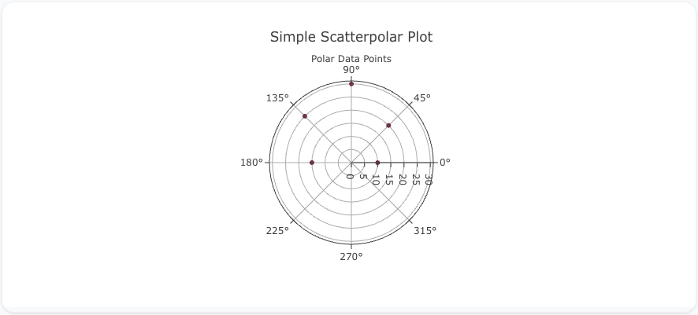
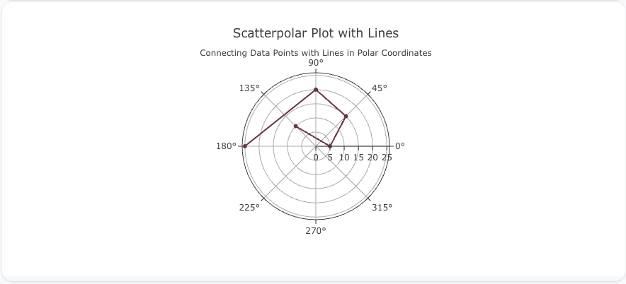
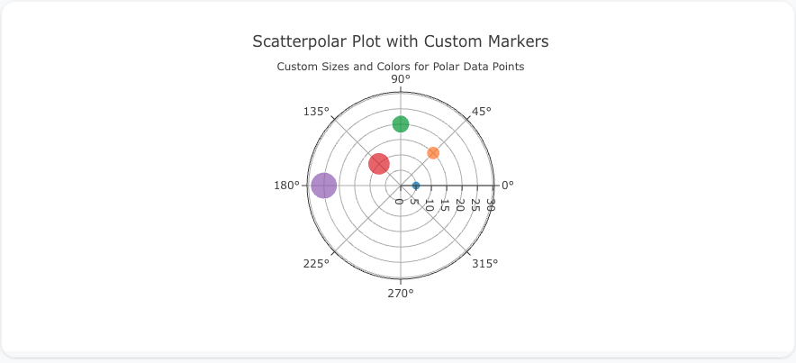

---
search:
  exclude: true
---
<!--start-->
## Overview

The `scatterpolar` trace type is used to create scatter plots on polar coordinates, which is ideal for visualizing data in a circular format. This type of plot allows data to be represented using angles and radial distances, making it useful for cyclic or directional data.

You can customize the marker size, color, and lines to connect points, similar to standard scatter plots, but within a polar coordinate system.

!!! tip "Common Uses"
    - **Cyclic Data Visualization**: Representing cyclic data such as time of day, seasonality, or wind direction.
    - **Directional Data**: Visualizing data with directional components, such as angular measurements.
    - **Circular Data Analysis**: Useful for data where radial distance and angle are key factors.

_**Check out the [Attributes](../configuration/Trace/Props/Scatterpolar/#attributes) for the full set of configuration options**_

## Examples


!!! example "Common Configurations"

    === "Simple Scatterpolar Plot"

        Here's a simple `scatterpolar` plot showing data points on a polar coordinate system:

        

        You can copy this code below to create this chart in your project:

        ```yaml
        models:
          - name: scatterpolar-data
            args:
              - echo
              - |
                theta,r
                0,10
                45,20
                90,30
                135,25
                180,15
        traces:
          - name: Simple Scatterpolar Plot
            model: ref(scatterpolar-data)
            props:
              type: scatterpolar
              theta: ?{theta}
              r: ?{r}
              mode: "markers"
        charts:
          - name: Simple Scatterpolar Chart
            traces:
              - ref(Simple Scatterpolar Plot)
            layout:
              title:
                text: Simple Scatterpolar Plot<br><sub>Polar Data Points</sub>
        ```

    === "Scatterpolar Plot with Lines"

        This example demonstrates a `scatterpolar` plot with lines connecting the data points in polar coordinates:

        

        Here's the code:

        ```yaml
        models:
          - name: scatterpolar-data-lines
            args:
              - echo
              - |
                theta,r
                0,5
                45,15
                90,20
                135,10
                180,25
        traces:
          - name: Scatterpolar Plot with Lines
            model: ref(scatterpolar-data-lines)
            props:
              type: scatterpolar
              theta: ?{theta}
              r: ?{r}
              mode: "lines+markers"
        charts:
          - name: Scatterpolar Chart with Lines
            traces:
              - ref(Scatterpolar Plot with Lines)
            layout:
              title:
                text: Scatterpolar Plot with Lines<br><sub>Connecting Data Points with Lines in Polar Coordinates</sub>
        ```

    === "Scatterpolar Plot with Custom Marker Sizes and Colors"

        Here's a `scatterpolar` plot with custom marker sizes and colors, giving more visual weight to each data point in polar coordinates:

        

        Here's the code:

        ```yaml
        models:
          - name: scatterpolar-data-custom
            args:
              - echo
              - |
                theta,r,size,color
                0,5,10,#1f77b4
                45,15,15,#ff7f0e
                90,20,20,#2ca02c
                135,10,25,#d62728
                180,25,30,#9467bd
        traces:
          - name: Scatterpolar Plot with Custom Markers
            model: ref(scatterpolar-data-custom)
            props:
              type: scatterpolar
              theta: ?{theta}
              r: ?{r}
              mode: "markers"
              marker:
                size: ?{size}
                color: ?{color}
        charts:
          - name: Scatterpolar Chart with Custom Markers
            traces:
              - ref(Scatterpolar Plot with Custom Markers)
            layout:
              title:
                text: Scatterpolar Plot with Custom Markers<br><sub>Custom Sizes and Colors for Polar Data Points</sub>
        ```


<!--end-->