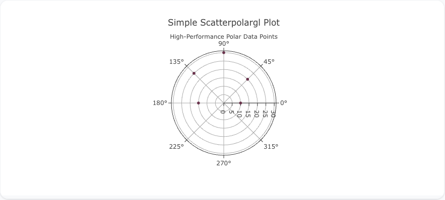
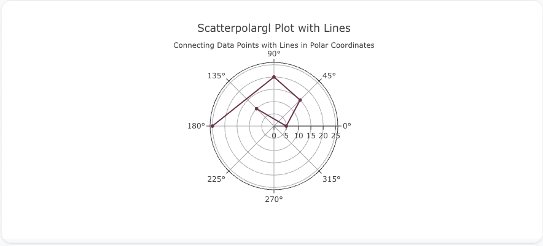
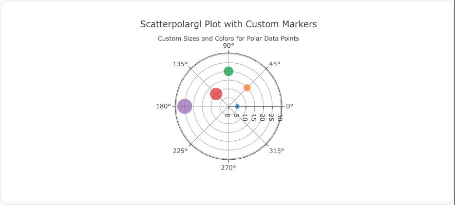

## Overview

The `scatterpolargl` trace type is used to create scatter plots on polar coordinates using WebGL rendering. This allows for high-performance plotting of large datasets in polar coordinates, ideal for scenarios where a large number of data points need to be visualized with speed and efficiency.

You can customize the marker size, color, and lines to connect points, similar to the `scatterpolar` trace, but with WebGL performance benefits.

!!! tip "Common Uses"
    - **Large Datasets in Polar Coordinates**: Efficiently visualizing datasets with many data points in polar coordinates.
    - **Performance Optimization**: Using WebGL for better rendering performance in polar scatter plots.
    - **Circular Data with Directional Components**: Ideal for cyclic data where radial distance and angle are key factors.

_**Check out the [Attributes](../configuration/Trace/Props/Scatterpolargl/#attributes) for the full set of configuration options**_

## Examples


!!! example "Common Configurations"

    === "Simple Scatterpolargl Plot"

        Here's a simple `scatterpolargl` plot showing data points on a polar coordinate system using WebGL rendering:

        

        You can copy this code below to create this chart in your project:

        ```yaml
        models:
          - name: scatterpolargl-data
            args:
              - echo
              - |
                theta,r
                0,10
                45,20
                90,30
                135,25
                180,15
        traces:
          - name: Simple Scatterpolargl Plot
            model: ref(scatterpolargl-data)
            props:
              type: scatterpolargl
              theta: query(theta)
              r: query(r)
              mode: "markers"
        charts:
          - name: Simple Scatterpolargl Chart
            traces:
              - ref(Simple Scatterpolargl Plot)
            layout:
              title:
                text: Simple Scatterpolargl Plot<br><sub>High-Performance Polar Data Points</sub>
        ```

    === "Scatterpolargl Plot with Lines"

        This example demonstrates a `scatterpolargl` plot with lines connecting the data points in polar coordinates, rendered with WebGL:

        

        Here's the code:

        ```yaml
        models:
          - name: scatterpolargl-data-lines
            args:
              - echo
              - |
                theta,r
                0,5
                45,15
                90,20
                135,10
                180,25
        traces:
          - name: Scatterpolargl Plot with Lines
            model: ref(scatterpolargl-data-lines)
            props:
              type: scatterpolargl
              theta: query(theta)
              r: query(r)
              mode: "lines+markers"
        charts:
          - name: Scatterpolargl Chart with Lines
            traces:
              - ref(Scatterpolargl Plot with Lines)
            layout:
              title:
                text: Scatterpolargl Plot with Lines<br><sub>Connecting Data Points with Lines in Polar Coordinates</sub>
        ```

    === "Scatterpolargl Plot with Custom Marker Sizes and Colors"

        Here's a `scatterpolargl` plot with custom marker sizes and colors, giving more visual weight to each data point in polar coordinates using WebGL rendering:

        

        Here's the code:

        ```yaml
        models:
          - name: scatterpolargl-data-custom
            args:
              - echo
              - |
                theta,r,size,color
                0,5,10,#1f77b4
                45,15,15,#ff7f0e
                90,20,20,#2ca02c
                135,10,25,#d62728
                180,25,30,#9467bd
        traces:
          - name: Scatterpolargl Plot with Custom Markers
            model: ref(scatterpolargl-data-custom)
            props:
              type: scatterpolargl
              theta: query(theta)
              r: query(r)
              mode: "markers"
              marker:
                size: query(size)
                color: query(color)
        charts:
          - name: Scatterpolargl Chart with Custom Markers
            traces:
              - ref(Scatterpolargl Plot with Custom Markers)
            layout:
              title:
                text: Scatterpolargl Plot with Custom Markers<br><sub>Custom Sizes and Colors for Polar Data Points</sub>
        ```


