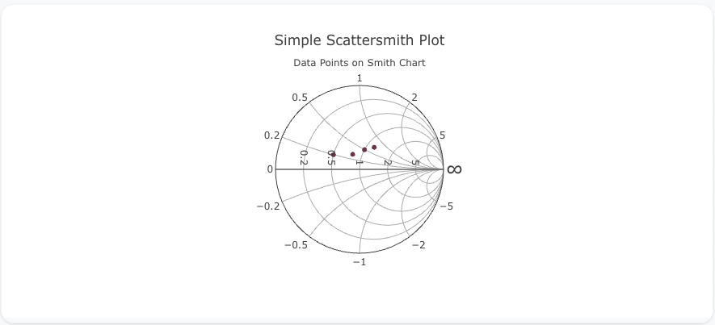
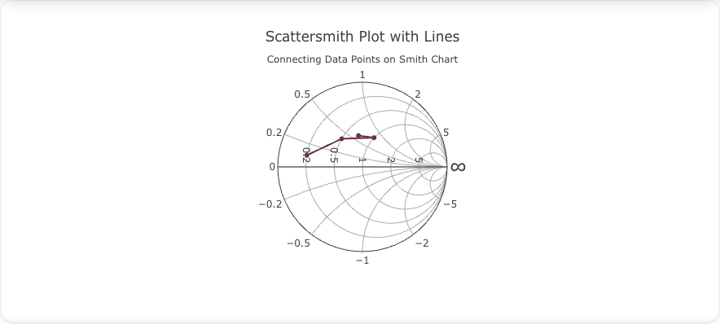
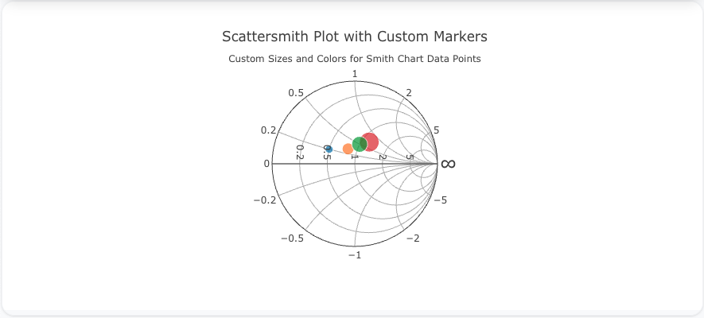

---
search:
  exclude: true
---
<!--start-->
## Overview

The `scattersmith` trace type is used to create scatter plots on a Smith chart, which is typically used in electrical engineering to represent complex impedance and reflection coefficients in transmission lines. It allows for plotting data in terms of complex numbers (real and imaginary components), making it ideal for analyzing electrical circuits.

You can customize the marker size, color, and lines to connect points, similar to scatter plots, but specifically tailored for Smith charts.

!!! tip "Common Uses"
    - **Impedance and Reflection Coefficients**: Visualizing electrical properties in transmission lines.
    - **Complex Data Visualization**: Representing data points in terms of complex numbers in a specialized format.
    - **Electrical Engineering Analysis**: Ideal for RF and microwave engineering applications.

_**Check out the [Attributes](../configuration/Trace/Props/Scattersmith/#attributes) for the full set of configuration options**_

## Examples


!!! example "Common Configurations"

    === "Simple Scattersmith Plot"

        Here's a simple `scattersmith` plot showing data points on a Smith chart:

        

        You can copy this code below to create this chart in your project:

        ```yaml
        models:
          - name: scattersmith-data
            args:
              - echo
              - |
                real,imaginary
                0.5,0.2
                0.8,0.3
                1.0,0.5
                1.2,0.7
        traces:
          - name: Simple Scattersmith Plot
            model: ${ref(scattersmith-data)}
            props:
              type: scattersmith
              real: ?{real}
              imag: ?{imaginary}
              mode: "markers"
        charts:
          - name: Simple Scattersmith Chart
            traces:
              - ${ref(Simple Scattersmith Plot)}
            layout:
              title:
                text: Simple Scattersmith Plot<br><sub>Data Points on Smith Chart</sub>
        ```

    === "Scattersmith Plot with Lines"

        This example demonstrates a `scattersmith` plot with lines connecting the data points on a Smith chart:

        

        Here's the code:

        ```yaml
        models:
          - name: scattersmith-data-lines
            args:
              - echo
              - |
                real,imaginary
                0.2,0.1
                0.5,0.4
                0.7,0.6
                1.0,0.8
        traces:
          - name: Scattersmith Plot with Lines
            model: ${ref(scattersmith-data-lines)}
            props:
              type: scattersmith
              real: ?{real}
              imag: ?{imaginary}
              mode: "lines+markers"
        charts:
          - name: Scattersmith Chart with Lines
            traces:
              - ${ref(Scattersmith Plot with Lines)}
            layout:
              title:
                text: Scattersmith Plot with Lines<br><sub>Connecting Data Points on Smith Chart</sub>
        ```

    === "Scattersmith Plot with Custom Marker Sizes and Colors"

        Here's a `scattersmith` plot with custom marker sizes and colors, giving more visual weight to each data point on a Smith chart:

        

        Here's the code:

        ```yaml
        models:
          - name: scattersmith-data-custom
            args:
              - echo
              - |
                real,imaginary,size,color
                0.5,0.2,10,#1f77b4
                0.8,0.3,15,#ff7f0e
                1.0,0.5,20,#2ca02c
                1.2,0.7,25,#d62728
        traces:
          - name: Scattersmith Plot with Custom Markers
            model: ${ref(scattersmith-data-custom)}
            props:
              type: scattersmith
              real: ?{real}
              imag: ?{imaginary}
              mode: "markers"
              marker:
                size: ?{size}
                color: ?{color}
        charts:
          - name: Scattersmith Chart with Custom Markers
            traces:
              - ${ref(Scattersmith Plot with Custom Markers)}
            layout:
              title:
                text: Scattersmith Plot with Custom Markers<br><sub>Custom Sizes and Colors for Smith Chart Data Points</sub>
        ```


<!--end-->