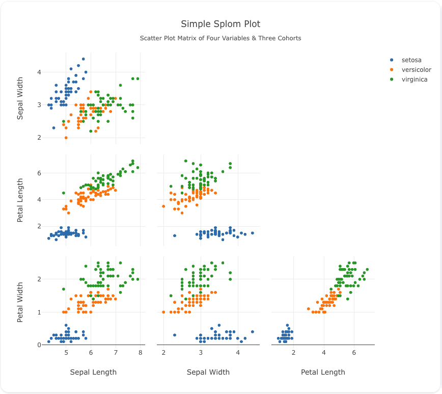
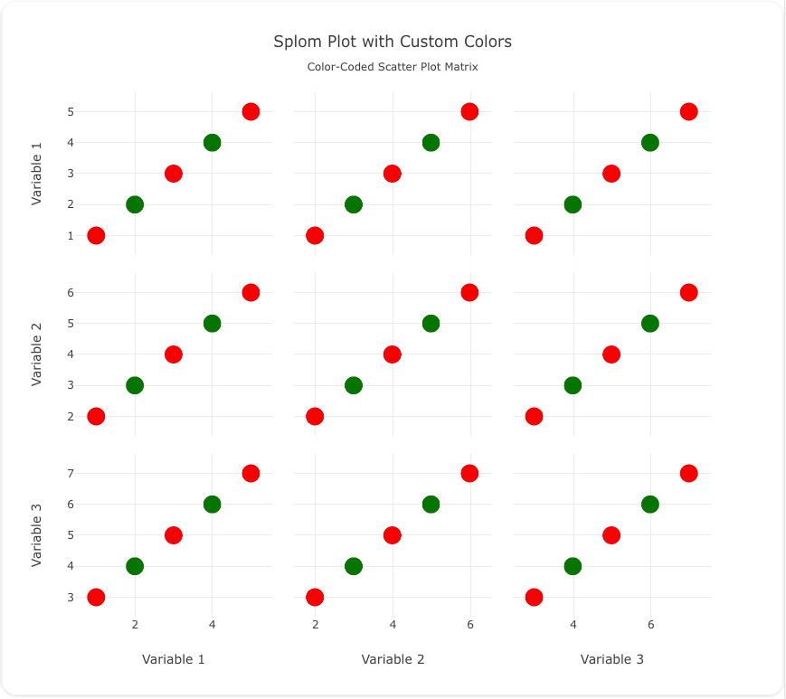
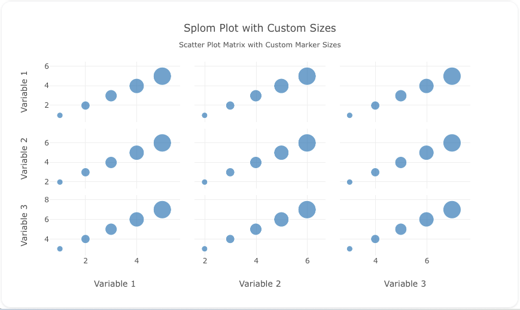

## Overview

The `splom` trace type is used to create scatter plot matrices, which are useful for visualizing pairwise relationships between multiple variables. A scatter plot matrix shows scatter plots for each pair of variables, making it a great tool for exploring correlations and patterns in multi-dimensional data.

You can customize the marker size, color, and lines, similar to scatter plots, but for each pair of variables in the matrix.

!!! tip "Common Uses"
    - **Pairwise Relationship Analysis**: Exploring relationships between multiple variables simultaneously.
    - **Correlation Visualization**: Identifying patterns, clusters, or outliers in high-dimensional datasets.
    - **Multivariate Data Exploration**: Useful in statistics, machine learning, and data science for analyzing multiple variables at once.

_**Check out the [Attributes](../configuration/Trace/Props/Splom/#attributes) for the full set of configuration options**_

## Examples


!!! example "Common Configurations"

    === "Simple Splom Plot"

        Here's a simple `splom` plot showing pairwise scatter plots between three variables:

        

        You can copy this code below to create this chart in your project:

        ```yaml
        models:
          - name: splom-data
            args:
              - echo
              - |
                var1,var2,var3
                1,2,3
                2,3,4
                3,4,5
                4,5,6
                5,6,7
        traces:
          - name: Simple Splom Plot
            model: ref(splom-data)
            props:
              type: splom
              dimensions:
                - label: "Variable 1"
                  values: query(var1)
                - label: "Variable 2"
                  values: query(var2)
                - label: "Variable 3"
                  values: query(var3)
              diagonal:
                visible: false
        charts:
          - name: Simple Splom Chart
            traces:
              - ref(Simple Splom Plot)
            layout:
              title:
                text: Simple Splom Plot<br><sub>Scatter Plot Matrix of Three Variables</sub>
        ```

    === "Splom Plot with Custom Colors"

        This example demonstrates a `splom` plot where different colors represent different categories:

        

        Here's the code:

        ```yaml
        models:
          - name: splom-data-colors
            args:
              - echo
              - |
                var1,var2,var3,category
                1,2,3,A
                2,3,4,B
                3,4,5,A
                4,5,6,B
                5,6,7,A
        traces:
          - name: Splom Plot with Custom Colors
            model: ref(splom-data-colors)
            props:
              type: splom
              dimensions:
                - label: "Variable 1"
                  values: query(var1)
                - label: "Variable 2"
                  values: query(var2)
                - label: "Variable 3"
                  values: query(var3)
              marker:
                color: query(category)
                colorscale: "Viridis"
        charts:
          - name: Splom Chart with Custom Colors
            traces:
              - ref(Splom Plot with Custom Colors)
            layout:
              title:
                text: Splom Plot with Custom Colors<br><sub>Color-Coded Scatter Plot Matrix</sub>
        ```

    === "Splom Plot with Custom Marker Sizes"

        Here's a `splom` plot where marker sizes are customized based on a fourth variable:

        

        Here's the code:

        ```yaml
        models:
          - name: splom-data-sizes
            args:
              - echo
              - |
                var1,var2,var3,size
                1,2,3,10
                2,3,4,15
                3,4,5,20
                4,5,6,25
                5,6,7,30
        traces:
          - name: Splom Plot with Custom Sizes
            model: ref(splom-data-sizes)
            props:
              type: splom
              dimensions:
                - label: "Variable 1"
                  values: query(var1)
                - label: "Variable 2"
                  values: query(var2)
                - label: "Variable 3"
                  values: query(var3)
              marker:
                size: query(size)
        charts:
          - name: Splom Chart with Custom Sizes
            traces:
              - ref(Splom Plot with Custom Sizes)
            layout:
              title:
                text: Splom Plot with Custom Sizes<br><sub>Scatter Plot Matrix with Custom Marker Sizes</sub>
        ```


